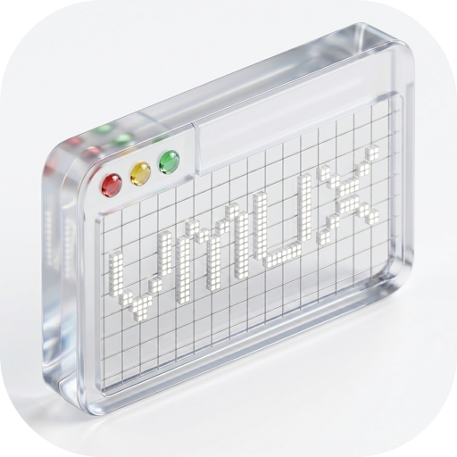

<h1 align="center">Vmux</h1>
<p align="center">Vibe Multiplexer — AI-native workspace combining browser and terminal panes.</p>

<p align="center">
  
</p>

## Features

- **Vibe Driven Development** — Talk to your workspace. browse, run commands, edit files in in one place.
- **Tmux-like tiling window manager** — Split, arrange, and manage browser and terminal panes in a single window. tmux, but with a built-in Chromium browser.
- **Built-in Chromium browser** — Browse the web, read docs, and use web apps right next to your terminal. No more switching between windows.
- **3D workspace** — Powered by Bevy, a game engine with an ECS architecture. Your workspace lives in a GPU-rendered 3D scene.

## Install

```sh
curl -fsSL https://vmux.ai/install | sh
```

Requires macOS 13.0 (Ventura) or later.

## Development

```sh
# Check prerequisites
make doctor

# Run macOS app
make
```

See [Makefile](Makefile) for all targets.

## License

[MIT](LICENSE)
