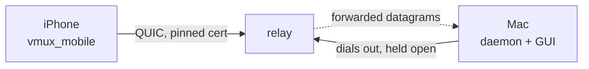

<h1 align="center">Vmux</h1>
<p align="center"><b>One prompt. Anything, done.</b> The browser + IDE that get sh*t done — booking a flight, building a website, opening a PR, all handled by your agents while you watch.</p>

<p align="center">
  
</p>

## Features

- **Co-work with agents** — People and agents build side by side in one shared space — from hands-on pairing to full autonomy, you set the balance.
- **Browser simplicity, tmux power** — Looks like the browser you already know; split, stack, and tile panes like tmux underneath.
- **IDE power underneath** — Keyboard-driven workflows and deep environment control — and agents drive the whole workspace over MCP.
- **3D workspace** — Powered by Bevy. Flip your panes into a live, GPU-rendered 3D scene — same workspace, still interactive.

## Install

```sh
curl -fsSL https://vmux.ai/install | sh
```

Requires macOS 13.0 (Ventura) or later.

## From your phone

The iOS app is the same workspace, one stack at a time. Your Mac is behind NAT,
so it dials a relay and holds the connection open; the phone dials the relay
too, and datagrams are forwarded between them.


```mermaid
flowchart LR
  phone["iPhone<br/>vmux_mobile"] -->|"QUIC, pinned cert"| relay["relay"]
  mac["Mac<br/>daemon + GUI"] -->|"dials out, held open"| relay
  relay -.->|"forwarded datagrams"| mac
```

The inner QUIC session terminates on the Mac — same certificate, same
admission, same dispatch a phone dialling directly would have reached. The
relay only forwards; it holds no key that could decode a payload.

Pairing is a QR code carrying the relay endpoint, a bearer token and the
Mac's certificate fingerprint. The phone pins that fingerprint and trusts
nothing else. A link without one is refused rather than downgraded.

What crosses is deliberately narrow: prompts, approvals and a read-only view
of what is open. The phone can read the layout and mirror a terminal it has no
page for; it cannot drive the desktop.

## Development

```sh
# Check prerequisites
make doctor

# Run macOS app
make
```

The first build through `make` in a linked worktree automatically seeds its build cache from the main worktree.

See [Makefile](Makefile) for all targets.

## License

Copyright (c) 2024-2025 Junichi Sugiura

Licensed under the [GNU General Public License v3.0 or later](LICENSE).
