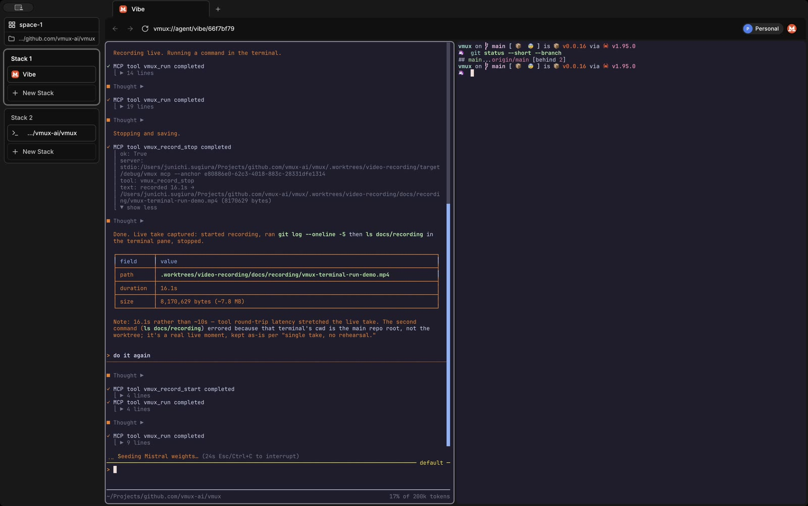

<h1 align="center">Vmux</h1>
<p align="center"><b>One prompt. Anything, done.</b></p>
<p align="center">The browser that gets sh*t done.</p>

<p align="center">
  
</p>

Vmux is an open-source browser, ACP agent harness, and full IDE in one shared workspace.
Work with your team and any ACP-compatible agent across pages, code, terminals, files, Git,
commands, and tools.



## What you can do

- **Stay in one context** — Browse documentation, inspect the running product, edit code, and
  use the terminal without moving the task between applications.
- **Collaborate with agents** — Give any ACP agent a task while you browse, review, and steer
  the work in the same workspace.
- **Work in parallel** — Give projects and agents their own Spaces, then return to the same
  pages, processes, and sessions.
- **Reconnect remotely** — Pair the iPhone app with your Mac and reach the same workspace
  through an end-to-end encrypted connection.

See more [Vmux use cases](https://vmux.ai/use-cases).

## Any stack

Vmux IDE and its ACP agent harness work with existing projects. React, Rust, or anything else:
using Vmux Framework is optional.

Choose [Vmux Framework](https://vmux.ai/framework) when you want to build a cross-platform
application from the same typed feature plugins, contracts, manifests, and platform adapters
that power Vmux itself.

## Status

Vmux is early-access software built in public.

- macOS is the primary host platform.
- iOS is the remote companion.
- Linux builds and tests in CI but is not packaged yet.
- Windows and Android are not supported yet.

Expect rough edges and fast changes before the first stable release.

## Install

```sh
curl -fsSL https://vmux.ai/install | sh
```

Requires macOS 13.0 (Ventura) or later.

## Architecture

```text
feature = state + systems + UI + commands + tools + contracts
runtime = feature plugins + platform adapters
```

Desktop, mobile, the background service, CLI, and MCP server compose the same feature-owned
behavior instead of reimplementing it behind separate APIs. The host ECS owns durable state;
pages render typed projections and emit typed intent.

Read [the architecture](docs/architecture.md) for boundaries, invariants, and change routing.
Exact behavior remains defined by code, tests, typed contracts, and `feature.ron`.

## Development

```sh
make doctor
make
```

The first build through `make` in a linked worktree seeds its build cache from the main
worktree. See [Makefile](Makefile) for all targets and [AGENTS.md](AGENTS.md) for repository
rules.

## License

Copyright (c) 2024-2026 Junichi Sugiura

Licensed under the [GNU General Public License v3.0 or later](LICENSE).
