# Vmux — Architecture

An agent-first workspace that ships with a browser and an IDE.

Vmux is a native **Rust** host. Its own UI runs as native Dioxus components in the host
process; Chromium is embedded through **CEF** as a guest surface for the pages you browse.
That inversion is the whole thesis: instead of the app living inside a web sandbox, the web
lives inside a native host that reaches straight to the OS and the GPU.

The host runs on **Bevy**, a data-oriented ECS. Surfaces composite into a `tmux`-style
tiling tree, and agents drive all of it over **MCP** — the workspace is an API.

---

## Two processes

The window is a client. The work lives somewhere that outlives the window.

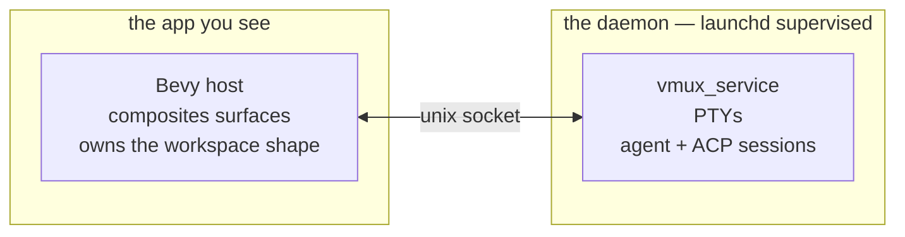

Close the window and the shell keeps reading, the build keeps building, the agent keeps
streaming. Reopen and the app reconnects, re-subscribes, and replays a snapshot.

launchd relaunches the daemon **on crash, not on exit**, and `RunAtLoad` is false — it is
not a login item. The app starts it on demand.

---

## Three roles

Name the roles, not the devices. Every diagram below holds whether the client is a laptop,
a phone, or a watch.

- **Server** — `vmux_service`. One per host machine. Owns the PTYs and the sessions.
- **Client** — anything that renders the workspace and sends intent back. **Local** shares
  the machine with the server; **remote** does not.
- **Relay** — a rendezvous point, and not optional. A host behind NAT cannot be dialled.
  Its internals live in `vmux-cloud`; what matters here is that it forwards packets it
  cannot read.

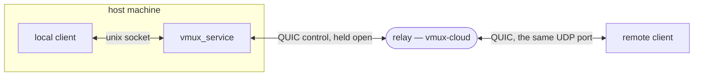

Neither end of the relay listens for the other. Both dial the same UDP port and are told
apart by the hello they open with. The remote client's packets belong to a **second** QUIC
session that terminates on the host, so the relay carries ciphertext — it holds no key and
links no crate that could decode a payload.

Nothing is dialled until Remote is switched on.

### What each link carries

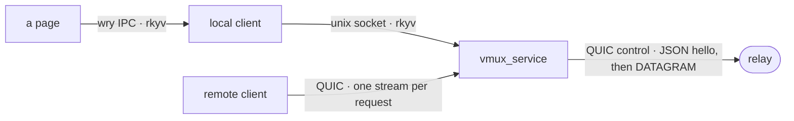

A page reaches its local client over wry's IPC and the `vmux://` protocol, carrying binary
DOM edits one way and rkyv events the other. The unix socket runs `u32`-length-prefixed
rkyv with a 64 MiB cap. A remote client opens one bidirectional QUIC stream per request,
carrying an rkyv `SharedMessage` and `SharedResponse`. The relay's control connection is
the odd one: a JSON hello, then opaque DATAGRAM frames it cannot read.

The hellos are JSON and everything after is rkyv, deliberately. rkyv encodes enum variants
**positionally** — a peer one release behind does not fail to decode a reordered variant,
it decodes the *wrong* one. Fine on the unix socket, where both sides ship together. Not
fine for a phone that updates on its own schedule, so the frame that decides whether to
keep talking is JSON.

---

## The ECS model

Bevy splits the atom of a React component into **data** and **behaviour**, with an id
tying them together.

| ECS | What you already know |
|---|---|
| Entity | a primary key, or a `key` prop — a bare id, no fields, no methods |
| Component | plain data bolted onto an id — one `useState` slice, lifted out |
| System | a function over every entity matching a query — `useEffect` / a reducer |
| World | the single store — one in-memory database |
| Message | `dispatch(action)` — systems never call each other directly |

```rust
#[derive(Component)]
pub struct Terminal;

fn focus_active(panes: Query<&Terminal, With<Active>>) {
    for terminal in &panes { }
}
```

Read the query out loud: *for each entity that has a `Terminal` and is `Active`, do this.*

Capabilities **compose** rather than being inherited. A plain web-view entity *becomes* a
shell the moment a `Terminal` component is added — no subclass, no base class. And because
each system declares the data it touches, Bevy runs non-conflicting systems across cores
for you.

### Plugins

One crate, one capability, one `build()`. A plugin bundles its components, systems,
resources, messages and observers and registers them in one call, so a reader sees the
whole feature in one place.

```rust
app.add_plugins((TerminalPlugin, EditorPlugin, ServicePlugin, BrowserPlugin, ...));
```

Plugins do not call each other. Cross-crate behaviour flows through messages and
components. Composition all the way up: components compose an entity, plugins compose the
app.

---

## The layout tree

Ownership is structural — an element's position in the tree *is* its identity.

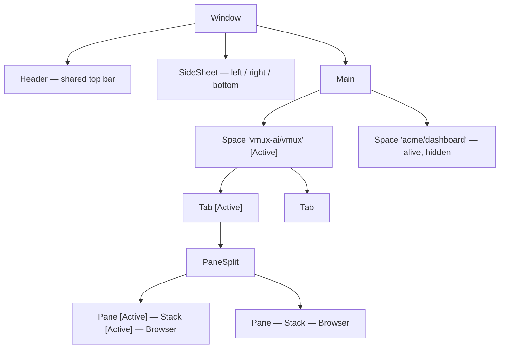

- **Space** — a project container. Exactly one is `Active` and drawn; the rest stay alive.
- **Tab** — a saved pane arrangement.
- **Pane / PaneSplit** — a recursive row/column tree. `tmux`-style tiling.
- **Stack** — several leaves in one pane, cycled like browser tabs.
- **Browser** — the leaf: a web page, a terminal, or an agent.

**The selection invariant: at most one `Active` child per parent.** Focus is found by
walking `Active` down the tree. Small `ensure_active_*` systems check topology every frame,
so if a human or an agent destroys a node the gap heals next frame.

A tab is owned by its Space *entity*, not a loose string key, which sandboxes mutations
inside that Space. Cross-space leaks are impossible by construction — the legacy model
tagged tabs with a detached id and computed selection globally, which let creating a space
corrupt another's panes.

State snapshots to `store.ron` via `moonshine-save`. A schema-version sidecar hard-resets
on an incompatible version rather than loading a broken store.

---

## How it paints

Two engines, and which one draws a surface depends on what the surface *is*.

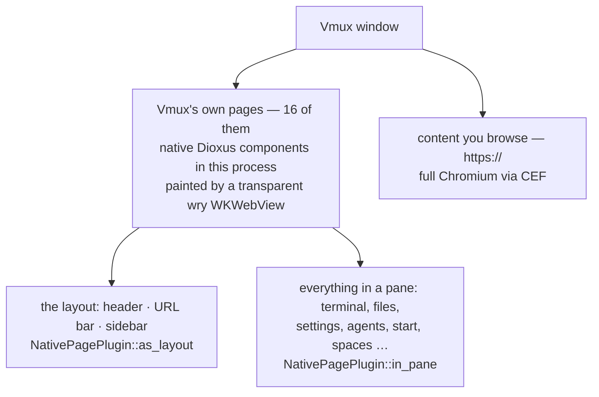

**Vmux's own UI is not a web app any more.** Sixteen pages — the layout overlay included —
run their components as native Dioxus in the host process, each painted by its own
transparent `wry` webview. There is no wasm build of the UI and no `vmux://` page inside
CEF. Even the command bar, which used to be its own webview, is now a panel drawn inside
the layout page; the entity that survives holds only the state thirty-odd readers ask
"is the bar open" through.

**Content pages are still CEF.** `Browser::new` is the leaf that carries them — windowed,
natively focused — so scrolling an `https://` page costs what Chrome costs. CEF also still
backs the extension bridge pages, and the windowless path it paints offscreen.

Dioxus is React-shaped either way — `rsx!` markup, signals and hooks — styled with Tailwind
and shadcn tokens. The content you open is full Chromium; any React or Vue app renders
exactly as it would in Chrome.

The whole workspace lives in a Bevy 3D scene, so Player mode tilts your panes into a
spatial view of the same workspace, pages still live. It was never why we reached for a
game engine.

---

## How a native page works

This is the part that changed most, and the part worth understanding.

A page's components are ordinary Dioxus — the *same* code the phone runs. What differs is
who executes them. There is no renderer and no `dioxus-desktop`: `PageDom` owns a
`VirtualDom` and a `MutationState` and drives them **by hand**. The webview owns only the
document.

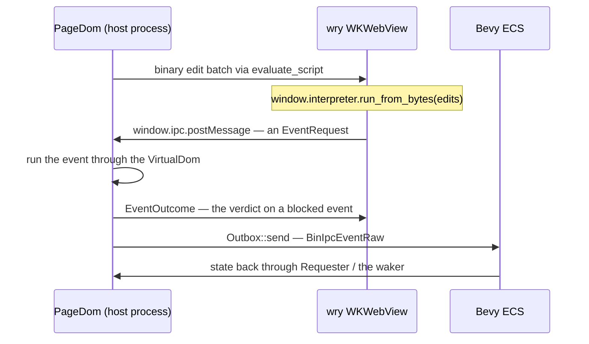

Everything the page loads arrives over a `vmux://` custom protocol registered on **that
webview**: the document, the rendered frames, the verdict on an event it is blocked on, and
every asset any of those reference. `Route` enumerates that list, so adding one is a variant
rather than another branch in a chain of string tests.

A page reaches the app through three channels, gathered once per app rather than per page:

| Channel | Carries |
|---|---|
| `bin_ipc` | the page's emitted events, as `BinIpcEventRaw`, into the ECS |
| `requester` | the page's requests for what the host must answer |
| `waker` | a nudge to the winit event loop so the frame is actually drawn |

One wart worth knowing: `BinIpcEventRaw` and `Requester` are **bevy_cef types**, reused as
the app's bus. Nothing about a native page's messages touches CEF — wry carries them end to
end — but the channel they land in is registered by a CEF plugin, so a wry page will not
build until that plugin has. The transport moved and the channel types did not.

### Who owns ⌘V

macOS hands a menu key equivalent to the menu **before** the key window's responder chain
sees a keyDown. So while the Edit menu's Paste item is enabled, no page can observe ⌘V as a
keystroke — the menu has already eaten it and dispatched `paste:` down the responder chain,
where the WKWebView answers with its own text editing.

That is what most pages want. Two do not: the terminal forwards the chord to a pty, and the
editor binds all five of ⌘C/⌘X/⌘V/⌘Z/⌘A to its own keymap, where the menu's undo would
rewind the wrong buffer. They can only see the raw keyDown if the menu item is disabled
while they hold focus.

A pane says which it is by carrying `BindsEditingChords`, and `sync_edit_menu_items` greys
the Edit menu for exactly those panes. The declaration is on the pane, not in the desktop
crate, because the hosting mechanism cannot answer the question: the composer and the editor
are both native panes, so anything keyed on `HostFocusIntent::NativePane` alone gives one
answer to two pages that want opposite things. Absence of the marker means platform text
editing, which is the default a new page wants.

---

## Pages, and the trust boundary

What fills a pane is decided by its URL scheme.

| Scheme | What it is |
|---|---|
| `https://` | the open web — full Chromium |
| `file://` | a local file or directory, in the editor |
| `vmux://` | Vmux's own pages, served from bundled assets |

`vmux://` pages are not fetched from a server. They are answered from embedded assets by a
custom protocol handler, so a page loads instantly and offline.

"The workspace is an API" invites the obvious question: can a random website drive it?

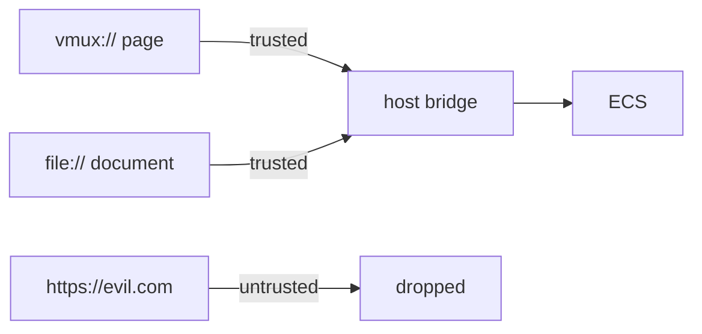

A frame is trusted only when Vmux itself served it. Because `vmux://` and `file://` come
straight from disk, no website can ever *be* at one of those URLs — the boundary is
unforgeable rather than merely checked. On the remaining CEF surfaces it is enforced **per
frame**, so an `evil.com` iframe inside a trusted page is still rejected, in the browser
process with a defence-in-depth check in the renderer.

Native pages get the boundary for free in a different way: their components run in the host
process and their webview is handed only its own `vmux://` protocol, so there is no bridge
for an arbitrary URL to reach in the first place.

A second layer adds least privilege *among* trusted pages: each message type is bound to
the pages that may emit it, so a compromised page cannot pivot to another's handlers. The
full Bevy Remote Protocol is locked to the `debug` page alone.

---

## The daemon's registries

Two maps, and "registering" is inserting into one of them.

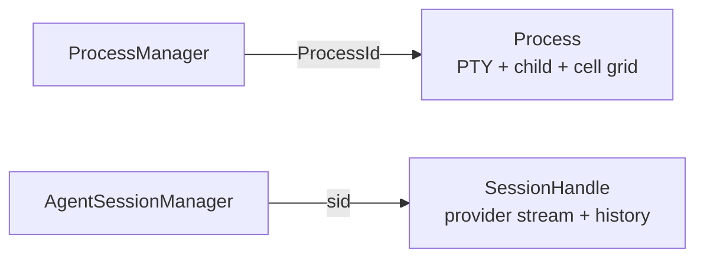

Each exposes the same two surfaces: a **broadcast channel** of updates, and a point-in-time
**snapshot**. Clients hold no state — they subscribe.

**Terminal.** `portable_pty` opens the PTY and spawns the shell; a reader thread pumps its
output through `alacritty_terminal`'s VTE engine into a cell grid. Each poll diffs the grid
by row hash and broadcasts only the **changed lines**. The page applies each patch to
per-row signals, so only those lines repaint. The daemon also owns what should outlive a
frame: OSC 133 command tracking, per-shell integration, copy-mode motions.

**Editor.** `syntect` plus `two-face` — the ~200 grammars from `bat` — highlight line by
line into `StyledSpan`s. The file viewer, the preview and git diffs all emit the same
spans, so code looks identical wherever it appears. No tree-sitter, no LSP. The host ships
only the visible slice of a file and re-slices as you scroll.

---

## Mobile Remote

The desktop is behind NAT, so it dials out and holds the connection open. Three modules own
that on this side; what the relay does in the middle belongs to `vmux-cloud`.

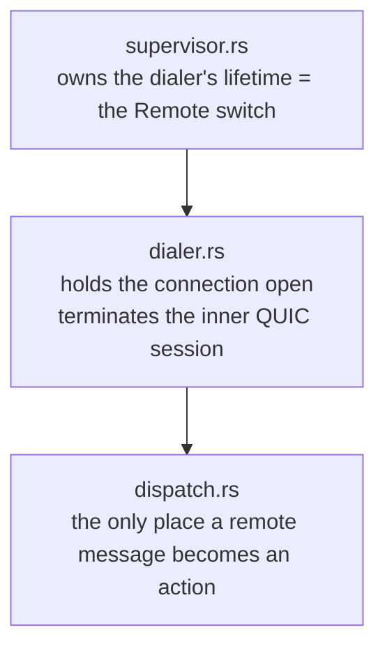

**The switch is a lifetime, not an access check.** Off means no dial, no registration and
nothing to retry. Gating admission alone would leave a desktop registered, retrying
forever, and advertised as one that refuses everyone.

**The dialer** redials on a doubling backoff from one second to thirty. A registration that
stood for a minute restarts the sequence, so a desktop connected for hours reconnects in a
second — and a relay that accepts a registration then tears it down mid-redeploy is not
mistaken for a healthy one. The phone's packets arrive as DATAGRAM frames and are handed to
an inner endpoint that terminates their QUIC session *here*: same certificate, same
`admit()`, same dispatch a phone dialling directly would have reached.

**Dispatch** enforces prompt size, replay dedup and attachment confinement once, rather
than at each of nine handlers.

### Pairing

No CA signs for a Mac, so the host mints its own certificate. The QR deep link carries the
relay endpoint, a 256-bit bearer token, and the certificate's SHA-256. The client pins that
fingerprint and trusts nothing else — narrower than the public root set. A pairing link
without a fingerprint is **refused rather than downgraded**, because there is no unpinned
transport left to fall back to.

Discovery is manual by design. No mDNS, no zeroconf.

### Local and remote are the same client

A page never names a backend. It emits typed payloads under an event id, and a `PageHost`
decides what that physically means.

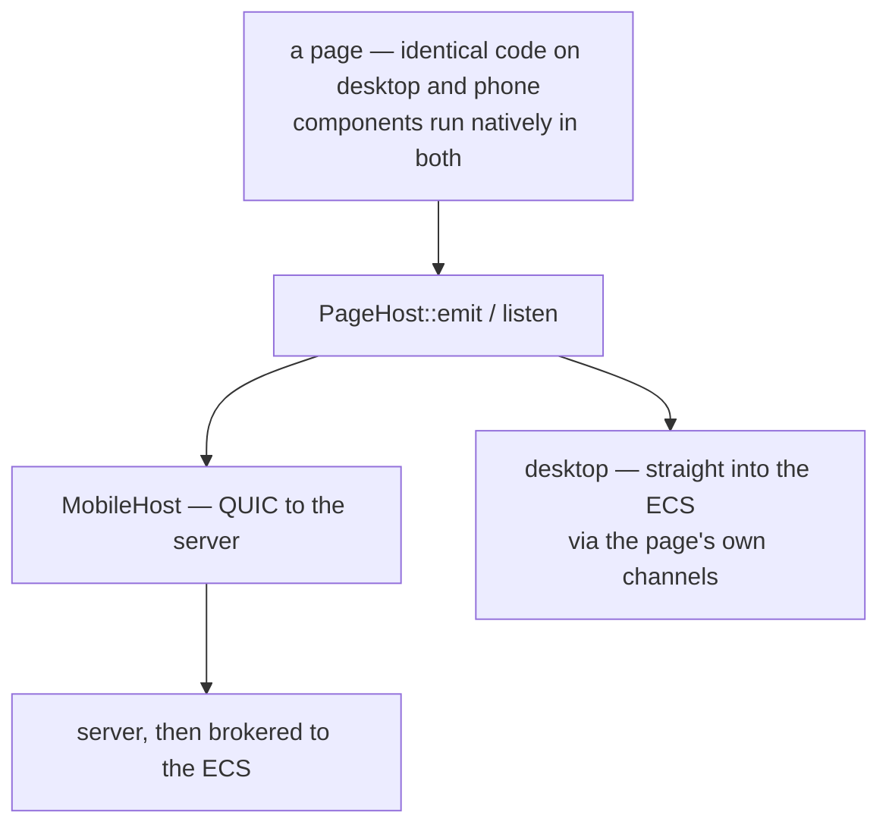

Both ends now run their components natively, so the old asymmetry — wasm in a webview on
the desktop, native on the phone — is gone, and with it `CefHost`. `MobileHost` is the only
`PageHost` implementation left; on the desktop a page reaches the ECS through its embedder's
channels directly.

What remains different is distance. Two current limits: `emit` is one-way on remote clients,
and subscriptions are still polled. `ListAgents` and `ListTeam` are brokered into the local
client's ECS rather than read from the server, so they answer `NoDesktop` until a window is
there to ask.

### Who owns the phone's event loop

`bevy_winit`, exactly as on the desktop. Dioxus is demoted to what diffs a tree. Two things this
needs that the desktop does not: an `UIApplicationDelegate`, because winit deliberately installs
none and a cold-start url arrives before any delegate exists; and an embedder layered in front of
the host a surface would install, or a page mounts and stays empty.

### A screen is a webview

One page, one document, one `UIViewController`. A tab owns its own `UINavigationController`, and
those sit side by side in a plain `UIView` this code owns.

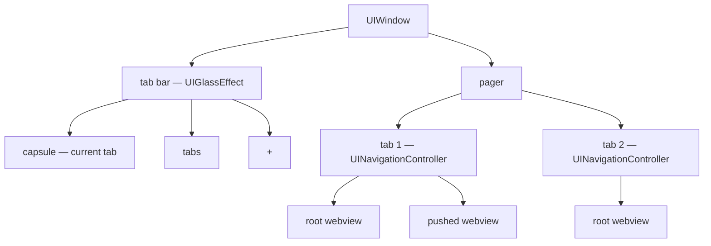

Both neighbours exist, so a pan on the tab bar translates two sibling views. Only the seated tab
and its neighbours are kept: the cost of this design is a WebKit process per screen.

The capsule names one tab, not all of them. Ten tabs across a phone leaves each one a letter
wide.

The tab bar hangs off the **window**. A sheet is presented above the root controller, so a bar
inside it would be buried.

Three UIKit rules, each learned by crashing:

- `setViewControllers:` and `dismissViewController:` call the navigation delegate back
  **synchronously**, into the same `RefCell` the caller holds. Decide inside the borrow, call
  UIKit after it.
- A webview left in the window hierarchy while also serving as a controller's view makes
  `nextResponder` cycle. `removeFromSuperview` first.
- `UIModalPresentationFullScreen` detaches the presenting view — which is winit's — and the event
  loop stops. `fullScreenModal` presents *over* full screen instead.

### The overview is snapshots

`tabs` zooms the pager out into one card per tab, flicked through and tapped to enter.

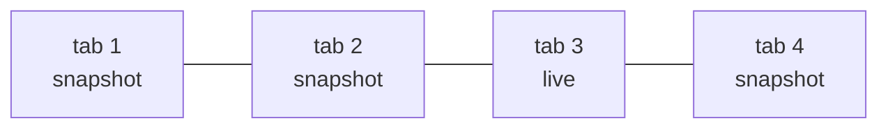

A card is a snapshot because only three tabs have a column to draw. Each is taken while its tab
is still on screen — UIKit snapshots a hidden view to an empty one, so a capture after eviction
would be blank.

Position and tilt are one function of one value, the card's distance from the centre, applied to
every card whenever the row changes. A card that is in the row but never positioned is a stale
card in the middle of the deck.

### The navigator's names are Expo Router's

`Stack`, `Tabs`, `Screen`, `presentation`, `use_router`, `use_route`. Most people meet this
shape in Expo first. How a route arrives is an option on its screen, so a caller only ever says
`push(route)`.

File-based routing is deliberately not borrowed: `_layout.tsx` works because a bundler globs a
directory, and here the nesting is the rsx, which the compiler checks.

`use_route` gives a screen the route **it** was opened for, not whatever is on top — so a pushed
level keeps its title under a sheet, and a tab sliding in draws itself. `use_router` reads that
seat too, which is why `position` can say where a screen sits in the trail: one ECS world serves
every webview, so the world alone cannot know.

---


## Agents

Every action a person can take is also an **MCP tool**. Vmux ships a stdio MCP server —
line-delimited JSON-RPC in `crates/host/vmux_mcp` — so any MCP-capable agent drives the
workspace the way a person does.

The server is a thin front end: it forwards each call to the daemon over the unix socket.
The daemon owns the sessions, so work keeps running even if the agent process exits.

Every agent is launched **anchored to its own Space**. Tool calls resolve relative to that
anchor, so a background agent cannot read or disrupt the space you are looking at.

`read_layout` / `update_layout` are the interesting pair: fetch the pane tree with stable
ids, mutate it, commit it back. Vmux diffs against the live graph and reconciles
React-style, in one atomic transaction.

---

## Platforms

| Platform | Role | Status |
|---|---|---|
| macOS | host | primary — packaged, launchd-managed, shipped |
| Linux | host | builds and tests in CI, not packaged |
| Windows | host | not started |
| iOS | remote client | linked in CI, packaged and shipped via `dx` |
| Android | remote client | configured, no platform code yet |

A remote client is strictly a client — the server half of `vmux_service` is compiled out.

Two cfg aliases decide that split, emitted by `crates/build_platform_cfg.rs`: **`ui`** is
iOS or macOS, the surfaces that run pages; **`host`** is everything that is not iOS, the
desktop app and the daemon. Write `#[cfg(host)]` rather than a negation of target
predicates. Cargo's own `[target.'cfg(...)'.dependencies]` still has to spell the targets
out, because dependency resolution happens before any build script runs.

---

## Where a crate lives

```
crates/
├── app/                    something a user starts
│   ├── vmux_cli
│   ├── vmux_desktop
│   └── vmux_mobile
├── host/                   runtime with no UI, owns state
│   ├── vmux_client
│   ├── vmux_command_mcp
│   ├── vmux_mcp
│   ├── vmux_remote
│   └── vmux_service
├── page/                   answers a URL, one per page
│   ├── vmux_agent
│   ├── vmux_chat
│   ├── vmux_command
│   ├── vmux_editor
│   ├── vmux_history
│   ├── vmux_knowledge
│   ├── vmux_layout
│   ├── vmux_setting
│   ├── vmux_space
│   ├── vmux_start
│   ├── vmux_team
│   └── vmux_terminal
├── vmux_browser            composes pages into the desktop shell
├── vmux_clipboard
├── vmux_core
├── vmux_flex
├── vmux_git
├── vmux_macro
├── vmux_native             the VirtualDom driver and its wry webview
├── vmux_profile
├── vmux_session
├── vmux_ui
└── vmux_wire
```

Everything not in the three directories stays flat: shared libraries, plus `vmux_browser`,
which sits above `page/` and below `app/` — a `page/` crate must never depend on it, and
nothing but `app/vmux_desktop` may.

Two traps. `host/` is **not** a layer above `page/` — `page/vmux_agent` depends on
`host/vmux_service`, because those crates cfg-split and a page links only the non-host half.
And the `host` cfg alias is **not** the directory: `vmux_ui` holds host-gated code while
staying flat.
