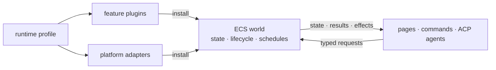
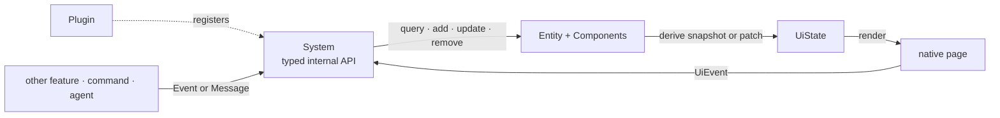
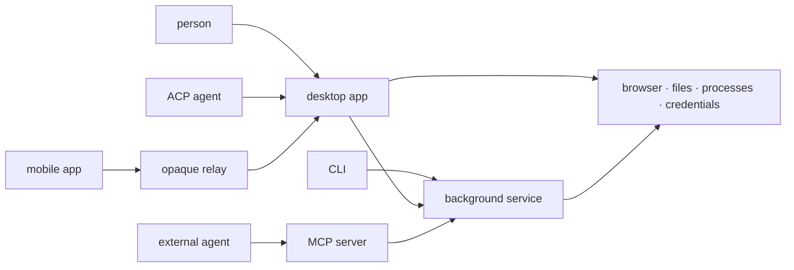
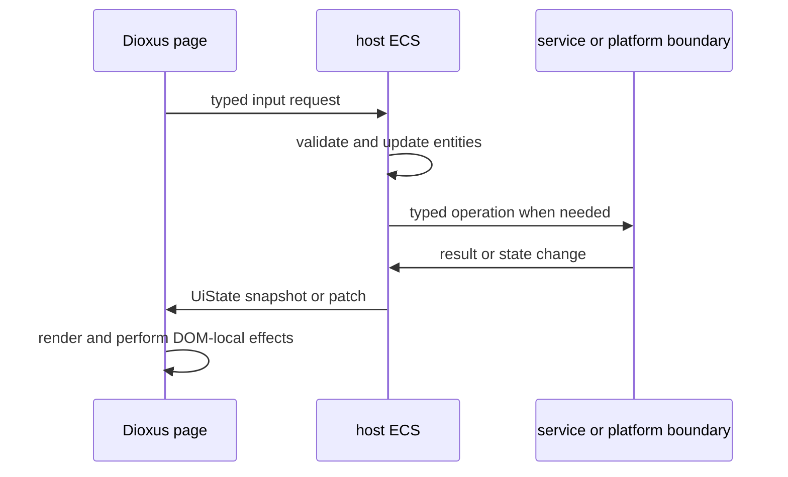
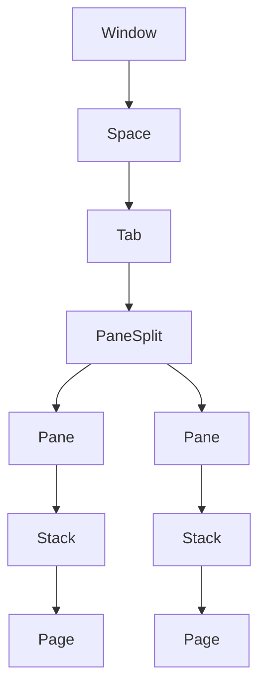

# Vmux architecture

Vmux is a graph of plugins composed around a shared ECS world.

This document is a map. Code, tests, typed contracts, and `feature.ron` are the source of
truth. `AGENTS.md` owns repository workflow and coding rules.

## Plugin and ECS composition

A **plugin** installs one capability: its components, messages, systems, schedule, and any
pages, commands, tools, persistence, or boundary adapters it owns. The **ECS world** is where
those plugins integrate. Systems find typed data and react to typed messages instead of calling
into another feature's internals.

A runtime is a selected plugin graph. Desktop, mobile, the background service, CLI, and MCP
server use the same composition model and differ only in the features and platform adapters they
install.


```mermaid
flowchart LR
    profile["runtime profile"] --> features["feature plugins"]
    profile --> adapters["platform adapters"]
    features -->|install| world["ECS world<br/>state · lifecycle · schedules"]
    adapters -->|install| world
    surfaces["pages · commands · ACP agents"] -->|typed requests| world
    world -->|state · results · effects| surfaces
```

```text
feature = state + systems + UI + commands + tools + contracts
runtime = feature plugins + platform adapters
boundary = typed value + transport adapter
```

`vmux_app` is the platform-neutral composition root. A runtime selects a profile and installs
the feature plugins that profile needs.

```rust
app.add_plugins(
    VmuxPlugin::builder()
        .desktop()
        .git(false)
        .simulator(false)
        .build(),
);
```

Cargo features decide what is compiled. Builder options decide which compiled plugins are
installed. Platform crates then add only their adapters:

| Runtime | Adds |
|---|---|
| `vmux_desktop` | windows, menus, native input, packaging, desktop credentials |
| `vmux_mobile` | mobile lifecycle, pairing, remote transport |
| `vmux_service` | local server, durable processes and sessions |
| `vmux_cli` | argument parsing and one-shot execution |
| `vmux_mcp` | JSON-RPC transport and tool publication |

A feature plugin never installs a sibling feature. Shared composition belongs in `vmux_app`.

### Design vocabulary

These eight building blocks are enough to design most Vmux features.

| Building block | Use it for | Rule |
|---|---|---|
| **Crate** | Ownership | One user-facing capability gets one feature crate. It owns the capability from UI to persistence and external contracts. |
| **Plugin** | Composition | The crate's entry point. It installs the capability's systems, messages, observers, child plugins, manifest, and adapters into an app. |
| **Entity** | Identity and lifecycle | Make something an entity when it must be addressed, related, observed, persisted, or removed independently: a page, pane, file, process, or agent session. |
| **Component** | State or capability | Attach small typed facts to an entity. Compose existing components before creating an aggregate that repeats the same data. |
| **System** | Behavior and internal API | Its typed parameters declare the inputs, dependencies, state access, and outputs of one operation. Keep it private and let the owning plugin register it. |
| **Event** | Transient intent or fact inside ECS | Send an event when behavior should happen once without the sender calling the receiver. Target the entity when the behavior belongs to one identity. Use a queued message when ordered stream processing is required. |
| **UiEvent** | UI → host intent | A typed, permission-checked request from a native page. It asks the host to act; it never becomes the authoritative state. |
| **UiState** | Host → UI projection | A typed snapshot or patch derived from ECS. The page renders it and keeps only immediate DOM-local state. |

Treat a system like an internal API endpoint. An event or message is its request; queries and
resources declare its dependencies; component mutations, emitted events, and `UiState` are its
outputs. The function signature is the interface. Other features call that interface through
typed data, not by making the system public or invoking it directly.

The default feature flow is:


```mermaid
flowchart LR
    plugin["Plugin"] -. registers .-> system["System<br/>typed internal API"]
    page["native page"] -->|UiEvent| system
    caller["other feature · command · agent"] -->|Event or Message| system
    system -->|query · add · update · remove| entity["Entity + Components"]
    entity -->|derive snapshot or patch| state["UiState"]
    state -->|render| page
```

For a new capability:

1. Choose the crate that owns the user-visible behavior; create a feature crate only when no
   existing owner fits.
2. Make its root plugin the complete composition entry point.
3. Identify the entities whose identity or lifecycle must survive individual interactions.
4. Represent their state and capabilities as components.
5. Design each system as one typed operation over that data.
6. Use events or messages to call the operation without coupling senders to its implementation.
7. Add a `UiEvent` only when intent crosses from a native page into the host.
8. Add `UiState` only for the host-owned state the page must render.

## System map


```mermaid
flowchart LR
    person["person"] --> desktop["desktop app"]
    agent["ACP agent"] --> desktop
    external["external agent"] --> mcp["MCP server"]
    cli["CLI"] --> service["background service"]
    desktop --> service
    mcp --> service
    phone["mobile app"] --> relay["opaque relay"]
    relay --> desktop
    desktop --> host["browser · files · processes · credentials"]
    service --> host
```

- **Desktop app** owns windows, layout, input, native integration, and the visible host ECS.
- **Background service** owns work that must survive a window: processes, agent sessions,
  authorization, and local IPC.
- **Pages** render feature state and emit typed intent. They do not own durable product state.
- **Mobile** runs supported pages as a remote client of the desktop.
- **CLI and MCP** are headless compositions of the same feature behavior.
- **Relay** connects a mobile client to a desktop behind NAT. The inner session terminates on
  the desktop, so the relay cannot read workspace traffic.

## Invariants

These rules matter more than the current module tree.

1. **A feature has one owner.** State, behavior, UI, commands, tools, persistence, and
   contracts live in the feature crate that gives them meaning.
2. **The host is authoritative.** Bevy ECS owns product state and decisions. Dioxus renders
   projections and keeps only immediate DOM state such as text entry, focus, scrolling, and
   pointer geometry.
3. **One contract crosses a boundary.** A Rust type may be an ECS message, UI event, IPC
   payload, QUIC payload, CLI operation, or MCP input. Do not create mirror DTOs for each hop.
4. **Runtimes compose features.** Application crates choose plugins and add platform adapters.
   They do not reimplement feature behavior or maintain feature-specific registries.
5. **Features meet through data.** Cross-feature behavior uses typed components, messages,
   entities, and explicit schedule ordering rather than callbacks into another feature's
   internals.
6. **Long work has identity.** Processes, agent sessions, requests, and asynchronous operations
   are entities or components with observable lifecycle, not detached work hidden behind a UI.
7. **Trust ends at the host.** Web content is untrusted. Native pages, tools, remote clients,
   and extensions receive only explicitly registered capabilities.

## Vmux Framework

Vmux Framework is the reusable application architecture that powers Vmux. It is not required
to use Vmux IDE or ACP agents with an existing React, Rust, or other project.

The current framework foundation is:

- typed feature plugins;
- ECS-owned state and lifecycle;
- one contract across UI, IPC, QUIC, CLI, and agent boundaries;
- feature-owned manifests;
- runtime composition profiles;
- platform adapters at the edge.

Vmux is the first complete composition built from that foundation.

The framework boundary is intentionally smaller than the product. It provides application
composition and reusable infrastructure without importing Vmux-specific page or workflow
policy. A third-party feature should be able to own its pages, systems, commands, tools,
contracts, and platform capabilities without modifying an application-wide registry.

A public framework harness, plugin viewer, and composition tooling are direction, not current
API. When they ship, they should inspect and operate the same typed plugin graph rather than
introducing another model beside it.

## Feature ownership

A user-facing capability lives under `crates/feature/`. Its root plugin is the public entry
point and a table of contents for the feature.

```text
crates/feature/vmux_example/
├── src/lib.rs          public plugin
├── src/host.rs         ECS composition
├── src/host/           host-owned behavior
├── src/ui.rs           Dioxus entry point
├── src/ui/             UI-only behavior
├── src/state.rs        host-to-UI state
├── src/event.rs        transient boundary operations
└── src/feature.ron     pages · commands · tools · policy
```

Use only the files a feature needs. Do not create empty layers to match the example.

Split large features by behavior, not by item kind. An approval module should own its
components, messages, systems, and tests together. The root plugin composes those slices.

### Feature manifests

Each feature has one `feature.ron`. It is the static source of truth for the interfaces that
feature publishes:

- native pages;
- application commands;
- CLI commands;
- MCP and agent tools;
- settings and permissions;
- persistence and feature policy.

The shared manifest plugin parses the file once and registers typed metadata in ECS. Runtime
catalogs query that data. Application crates do not enumerate feature-owned commands or tools.

## Host-authoritative state

The normal page path is one direction around a loop.


```mermaid
sequenceDiagram
    participant UI as Dioxus page
    participant Host as host ECS
    participant Boundary as service or platform boundary

    UI->>Host: typed input request
    Host->>Host: validate and update entities
    Host->>Boundary: typed operation when needed
    Boundary->>Host: result or state change
    Host->>UI: UiState snapshot or patch
    UI->>UI: render and perform DOM-local effects
```

The UI may own text editing, selection during a pointer gesture, focus, scrolling, and layout
measurement. It must not own business decisions, retry policy, persistence, process lifecycle,
cross-page coordination, or the canonical selection of a feature entity.

Current values use `UiState`. One-shot notifications use typed events. Versioned effects
cover DOM actions such as focus or scroll when they must be requested by the host.

## ECS lifecycle

Components compose capabilities. A system depends on the data it queries, not on the code that
created that data. This lets a feature extend an existing entity without importing or rewriting
its owner.

Systems stay private beside the plugin that schedules them. Tests install the plugin rather
than registering private systems under a different schedule.

Asynchronous work remains explicit:

- finite work is represented by a task component and a consuming system;
- long-lived I/O belongs to a named boundary actor;
- requests, results, retries, and completion remain observable ECS state;
- blocking filesystem, process, and network work stays outside the schedule.

## Pages and trust

Vmux renders two kinds of page:

- **Web pages** are arbitrary Chromium content.
- **Native pages** are Vmux features rendered through the page host.

Native page URLs and permissions come from feature manifests. The browser accepts native
capabilities only for registered page hosts. A page cannot choose another feature's event or
state channel by constructing a string.

The host validates page identity before decoding a payload. Browser extensions and remote
clients enter through similarly narrow adapters. General browser content never receives the
Bevy world or unrestricted native APIs.

## Layout ownership

The workspace is a tree.


```mermaid
flowchart TB
    window["Window"] --> space["Space"]
    space --> tab["Tab"]
    tab --> split["PaneSplit"]
    split --> paneA["Pane"]
    split --> paneB["Pane"]
    paneA --> stackA["Stack"]
    paneB --> stackB["Stack"]
    stackA --> pageA["Page"]
    stackB --> pageB["Page"]
```

Position in the tree defines ownership. Each native window owns a complete tree. Spaces
identify projects; tabs preserve arrangements; splits tile panes; stacks hold page history.
Global actions resolve through the focused window and then through active descendants.

Agents receive a Space anchor. Relative tool operations resolve from that anchor, so
background work does not accidentally act on whichever window the user is viewing.

## Processes and persistence

The service owns terminals and agent sessions because their lifetime is longer than any page
or window. Clients subscribe to snapshots and updates; reconnecting does not recreate the
work.

Feature crates own their persistent data and migrations. Shared persistence infrastructure
provides atomic storage, versioning, and reconstruction. Application crates choose storage
paths and compose persistence plugins but do not interpret feature data.

Secrets use the platform credential store. Plain configuration may live in the profile
directory. A feature does not invent another storage root or secret format.

## Agents, commands, and tools

ACP agents run as sessions owned by the agent feature and background service. Their output is
projected into the same chat and workspace state a person sees.

Commands and tools follow one path:

```text
manifest definition
        ↓
typed feature-owned request
        ↓
feature ECS systems
        ↓
typed result or UiState update
```

The command bar, shortcuts, native menus, CLI, MCP, and in-app agents consume these
definitions. They do not maintain parallel command enums or callback tables.

MCP is a headless Bevy runtime over the same tool plugins. The transport understands JSON-RPC;
feature plugins understand the operation. The agent feature carries generic ACP and tool
envelopes but does not enumerate browser, Git, layout, vault, or editor behavior.

## Local and remote

Desktop pages talk directly to the host ECS. Mobile pages use the same typed contracts through
a remote `PageHost`.

The desktop dials out to the relay, so no inbound port is required. Pairing pins the desktop
certificate. The relay forwards encrypted packets and sees connection metadata, but not
session contents.

Remote is a lifecycle switch: when disabled, the desktop does not register or retry. Revoking
one paired client does not change other clients or the desktop registration.

Relay registry, admission, and deployment internals belong to `vmux-cloud`, not this
repository.

## Repository map

```text
crates/
├── app/       executables and platform composition
├── feature/   user-facing capabilities and their vertical slices
└── util/      reusable infrastructure without product ownership
```

Important boundaries:

- `vmux_app` composes feature plugins.
- `vmux_api` owns shared serialized contracts, not feature behavior.
- `vmux_browser` owns generic browser and page-host infrastructure.
- `vmux_native` owns native Dioxus rendering infrastructure.
- `vmux_transport` owns framing and connections, not payload meaning.
- `vmux_profile` owns profile identity and filesystem locations.
- `vmux_ecs` owns reusable ECS primitives, not a second home for features.

Directory placement follows ownership, not dependency depth. A utility may support every
feature without becoming the owner of their behavior.

## Change routing

Before changing a feature, answer:

1. Which feature owns the user-visible behavior?
2. What entity has the relevant identity and lifecycle?
3. Which components represent its state and capabilities?
4. Which typed request starts the behavior?
5. Which `UiState`, result, or event makes the outcome observable?
6. Does the published interface belong in `feature.ron`?
7. Which runtimes compose the feature?
8. Which platform adapters are actually required?

If an answer requires an application-wide enum, callback registry, mirror DTO, UI-owned
workflow, or one feature importing another feature's internals, the boundary is probably
wrong.

Update this document only when user behavior, a public contract, or one of these durable
boundaries changes. Record plans and history in GitHub and Linear. Let code and behavior tests
describe everything else.
