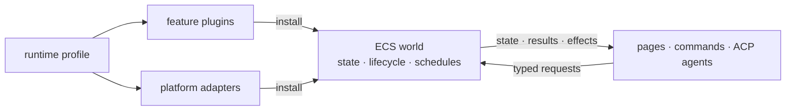
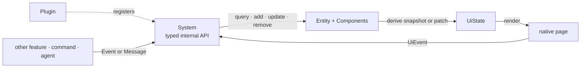
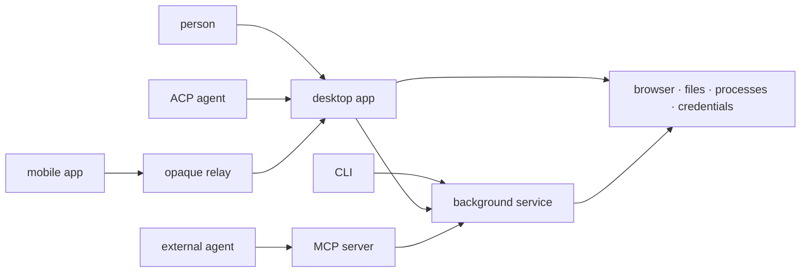
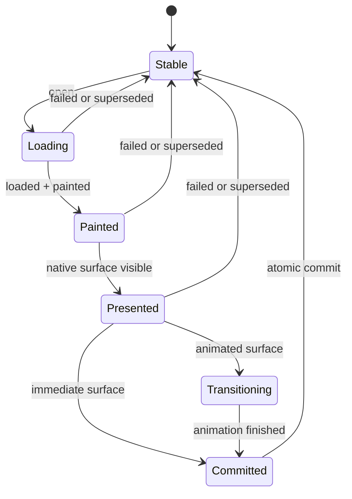
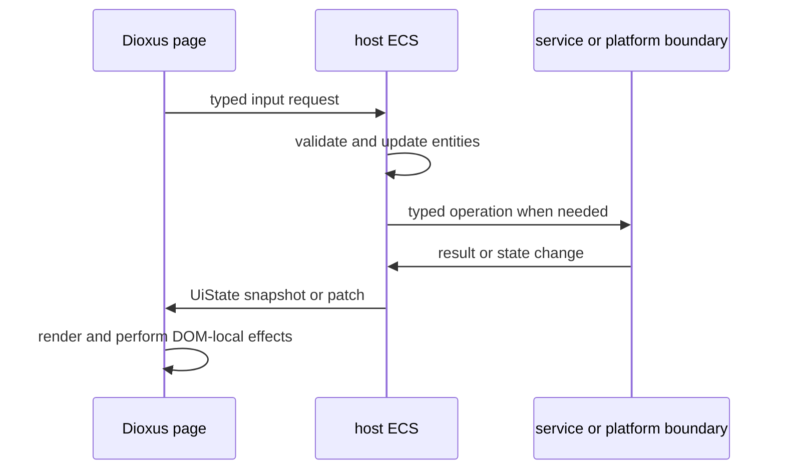
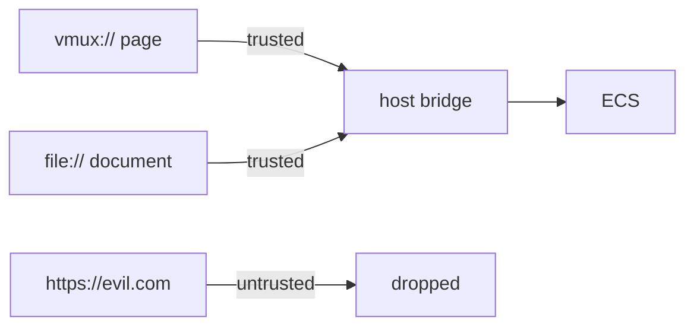
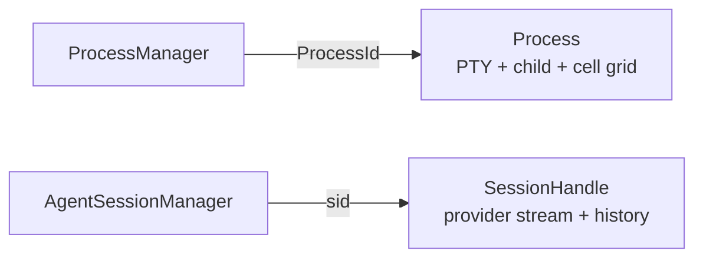
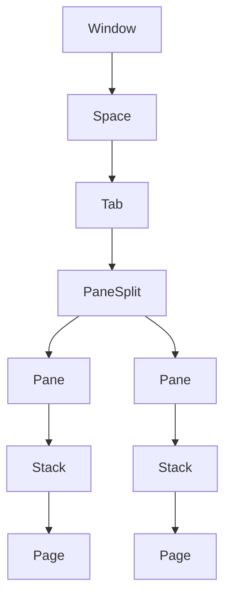

# Vmux architecture

> Flexible by composition. Predictable by design.

Vmux is a composition architecture for cross-platform applications. Features are typed plugins
installed into an ECS world, so a browser, IDE, agent harness, service, and mobile client can
share one model without becoming one tightly coupled program.

This document is a map. Code, tests, typed contracts, and `feature.ron` are the source of
truth. `AGENTS.md` owns repository workflow and coding rules.

## Why Vmux architecture?

### Rich applications, fragmented architecture

Products that span browser content, native UI, files, processes, agents, services, and mobile
clients tend to grow a separate registry, callback layer, state model, and integration path for
each new capability. Flexibility increases, but so does the number of architectures a developer
must understand.

Vmux narrows feature design to one composition model and eight building blocks. New behavior
extends the graph instead of adding another switchboard beside it.

## Applications as plugin graphs

A **plugin** installs one capability: its components, messages, systems, schedule, and any
pages, commands, tools, persistence, or boundary adapters it owns. The **ECS world** is where
those plugins integrate. Systems find typed data and react to typed messages instead of calling
into another feature's internals.

A runtime is a selected plugin graph. Desktop, mobile, the background service, CLI, and MCP
server use the same composition model and differ only in the features and platform adapters they
install.


```mermaid
flowchart LR
    profile["runtime profile"] --> features["feature plugins"]
    profile --> adapters["platform adapters"]
    features -->|install| world["ECS world<br/>state · lifecycle · schedules"]
    adapters -->|install| world
    surfaces["pages · commands · ACP agents"] -->|typed requests| world
    world -->|state · results · effects| surfaces
```

```text
feature = state + systems + UI + commands + tools + contracts
runtime = feature plugins + platform adapters
boundary = typed value + transport adapter
```

`vmux_app` is the platform-neutral composition root. A runtime selects a profile and installs
the feature plugins that profile needs.

```rust
app.add_plugins(
    VmuxPlugin::builder()
        .desktop()
        .git(false)
        .simulator(false)
        .build(),
);
```

Cargo features decide what is compiled. Builder options decide which compiled plugins are
installed. The facade exposes `desktop()`, `mobile()`, `daemon()`, `cli()`, and `mcp()` profiles
when their Cargo profile is selected. `service-daemon` remains an alias for `daemon`, which
installs the shared ECS primitives, service server, and ACP service without the desktop runtime
or window viewport plugin. CLI and MCP share the existing typed tool contributions through
`CliTools`; the CLI host selects the same facade rather than installing a parallel plugin list.
Platform crates then add only their adapters:

| Runtime | Adds |
|---|---|
| `vmux_desktop` | windows, menus, native input, packaging, desktop credentials |
| `vmux_mobile` | mobile lifecycle, pairing, remote transport |
| `vmux_service` | local server, durable processes and sessions |
| `vmux_cli` | argument parsing and one-shot execution |
| `vmux_mcp` | JSON-RPC transport and tool publication |

Profiles select features; they do not choose a runner or create IO handles. Hosts install runners
with Bevy's `App::set_runner`, provide their own sockets/runtime/wake inputs, and finish and
clean up plugins before the first update. The daemon retains its wake-driven runner and existing
shutdown schedules; CLI retains its argument parsing and result-driven exit. Product identity,
paths, packaging, and platform support remain host concerns. The optional `vmux_app::host`
namespace exposes Profile paths and immutable `Product` metadata without installing a renderer.
`VMUX_HOST_NAME` and `VMUX_HOST_NAMESPACE` select a distinct product together; the Profile
build adapter validates names and assets and compiles the accepted identity into the host.
Data/configuration paths, service and credential namespaces, native display names, media
capability limits, and update endpoints consume that identity. Custom hosts default to no
media capabilities and no Vmux update endpoints. Per-origin permissions and update checks
stay with their existing ECS owners; product metadata adds no runtime Resources.
Packaging consumes the same build metadata; host binaries must be built and packaged from
the same product inputs. Compiled window/menu and packaged bundle titles use the accepted product
name and the same local/dev source label; release titles retain the product name alone.
DX native IO reuses the compiler's accepted product metadata for bundle names, selected assets,
service plists and signing inputs. Host consumer probes clear environment and `.env` product
overrides before compiling each namespace, so one configured checkout cannot contaminate another probe.
Custom data/configuration and runtime paths derive from the namespace,
even when two hosts share a display name. Changing product identity never imports Vmux data or
credentials. `examples/host-consumer` exercises the explicit host facade without a renderer;
its native credential calls retain the desktop-process access restriction. The default SDK
consumer continues to omit Profile. Future Windows, web, game, and spatial profiles are not
supported presets.

A feature plugin never installs a sibling feature. Shared composition belongs in `vmux_app`.
Plugin boundaries represent independently configurable, reusable, platform-gated, or
lifecycle-owned capabilities, not wrappers around a few systems. An internal ECS lifecycle
does not require a public crate: expose a boundary when a consumer or renderer/IO dependency
justifies it, and keep smaller lifecycles in their owning feature. Platform-specific behavior
enters through a platform plugin or adapter at the composition edge.

### Out of the box

| Property | What it means |
|---|---|
| **Runtime composition** | Desktop, mobile, service, CLI, and MCP select plugins and adapters instead of rebuilding features. |
| **Feature ownership** | One crate owns a user capability from UI and state through persistence and published contracts. |
| **Typed boundaries** | Events, messages, and shared values replace callback registries and mirror DTOs. |
| **Observable lifecycle** | Long work has identity and state that systems, UI, tests, and agents can inspect. |
| **Host-authoritative UI** | ECS owns product decisions; pages render projections and emit typed intent. |
| **Predictable changes** | The same small vocabulary tells a human or agent where a change belongs. |

### Built for the agent era

When agents write more code, the bottleneck moves from producing a diff to trusting its design.
Vmux makes ownership, state, operations, UI flow, and runtime composition explicit before the
first line is written. Humans and agents get the same constraints and should produce PRs that
fit the system without inventing a surprising second architecture.

## Learning path

Read this document in order once, then use it as a change map.

1. [Understand Plugin + ECS composition](#applications-as-plugin-graphs).
2. [Learn the eight design primitives](#design-vocabulary).
3. [Trace the default feature flow](#feature-design-flow).
4. [Learn runtime and state boundaries](#system-map).
5. [Apply the durable rules](#invariants).
6. [Route a concrete change](#change-routing).

## Design vocabulary

These eight building blocks are enough to design most Vmux features.

| Building block | Use it for | Rule |
|---|---|---|
| **Crate** | Ownership | One user-facing capability gets one feature crate. It owns the capability from UI to persistence and external contracts. |
| **Plugin** | Composition | The crate's entry point. It installs the capability's systems, messages, observers, child plugins, manifest, and adapters into an app. |
| **Entity** | Identity and lifecycle | Make something an entity when it must be addressed, related, observed, persisted, or removed independently: a page, pane, file, process, or agent session. |
| **Component** | State or capability | Attach small typed facts to an entity. Compose existing components before creating an aggregate that repeats the same data. |
| **System** | Behavior and internal API | Its typed parameters declare the inputs, dependencies, state access, and outputs of one operation. Keep it private and let the owning plugin register it. |
| **Event** | Transient intent or fact inside ECS | Send an event when behavior should happen once without the sender calling the receiver. Target the entity when the behavior belongs to one identity. Use a queued message when ordered stream processing is required. |
| **UiEvent** | UI → host intent | A typed, permission-checked request from a native page. It asks the host to act; it never becomes the authoritative state. |
| **UiState** | Host → UI projection | A typed snapshot or patch derived from ECS. The page renders it and keeps only immediate DOM-local state. |

Treat a system like an internal API endpoint. An event or message is its request; queries and
resources declare its dependencies; component mutations, emitted events, and `UiState` are its
outputs. The function signature is the interface. Other features call that interface through
typed data, not by making the system public or invoking it directly.

### Feature design flow

The default feature flow is:


```mermaid
flowchart LR
    plugin["Plugin"] -. registers .-> system["System<br/>typed internal API"]
    page["native page"] -->|UiEvent| system
    caller["other feature · command · agent"] -->|Event or Message| system
    system -->|query · add · update · remove| entity["Entity + Components"]
    entity -->|derive snapshot or patch| state["UiState"]
    state -->|render| page
```

For a new capability:

1. Choose the crate that owns the user-visible behavior; create a feature crate only when no
   existing owner fits.
2. Make its root plugin the complete composition entry point.
3. Identify the entities whose identity or lifecycle must survive individual interactions.
4. Represent their state and capabilities as components.
5. Design each system as one typed operation over that data.
6. Use events or messages to call the operation without coupling senders to its implementation.
7. Add a `UiEvent` only when intent crosses from a native page into the host.
8. Add `UiState` only for the host-owned state the page must render.

## System map


```mermaid
flowchart LR
    person["person"] --> desktop["desktop app"]
    agent["ACP agent"] --> desktop
    external["external agent"] --> mcp["MCP server"]
    cli["CLI"] --> service["background service"]
    desktop --> service
    mcp --> service
    phone["mobile app"] --> relay["opaque relay"]
    relay --> desktop
    desktop --> host["browser · files · processes · credentials"]
    service --> host
```

- **Desktop app** owns windows, layout, input, native integration, and the visible host ECS.
- **Background service** owns work that must survive a window: processes, agent sessions,
  authorization, and local IPC.
- **Pages** render feature state and emit typed intent. They do not own durable product state.
- **Mobile** runs supported pages as a remote client of the desktop.
- **CLI and MCP** are headless compositions of the same feature behavior.
- **Relay** connects a mobile client to a desktop behind NAT. The inner session terminates on
  the desktop, so the relay cannot read workspace traffic.

## Invariants

These rules matter more than the current module tree.

1. **A feature has one owner.** State, behavior, UI, commands, tools, persistence, and
   contracts live in the feature crate that gives them meaning.
2. **The host is authoritative.** Bevy ECS owns product state and decisions. Dioxus renders
   projections and keeps only immediate DOM state such as uncommitted text drafts, focus, scrolling, and
   pointer geometry.
   Controlled-field edits cross `UiEvent`; rendered values come from `UiState`.
3. **One contract crosses a boundary.** A Rust type may be an ECS message, UI event, IPC
   payload, QUIC payload, CLI operation, or MCP input. Do not create mirror DTOs for each hop.
4. **Runtimes compose features.** Application crates choose plugins and add platform adapters.
   They do not reimplement feature behavior or maintain feature-specific registries.
5. **Features meet through data.** Cross-feature behavior uses typed components, messages,
   entities, and explicit schedule ordering rather than callbacks into another feature's
   internals.
6. **Long work has identity.** Processes, agent sessions, requests, and asynchronous operations
   are entities or components with observable lifecycle, not detached work hidden behind a UI.
7. **Trust ends at the host.** Web content is untrusted. Native pages, tools, remote clients,
   and extensions receive only explicitly registered capabilities.

## Runtime composition

Name the roles, not the devices. Every diagram below holds whether the client is a laptop,
a phone, or a watch.

- **Server** — `vmux_service`. One per host machine. Owns the PTYs and the sessions.
- **Client** — anything that renders the workspace and sends intent back. **Local** shares
  the machine with the server; **remote** does not.
- **Relay** — a rendezvous point, and not optional. A host behind NAT cannot be dialled.
  Its internals live in `vmux-cloud`; what matters here is that it forwards packets it
  cannot read.


```mermaid
flowchart LR
    subgraph host["host machine"]
        local["local client"] <-->|unix socket| server["vmux_service"]
    end
    server <-->|QUIC control, held open| relay(["relay — vmux-cloud"])
    relay <-->|QUIC, the same UDP port| remote["remote client"]
```

Neither end of the relay listens for the other. Both dial the same UDP port and are told
apart by the hello they open with. The remote client's packets belong to a **second** QUIC
session that terminates on the host, so the relay carries ciphertext — it holds no key and
links no crate that could decode a payload.

Nothing is dialled until Remote is switched on.

### Safe storage

On macOS, the desktop process is the Keychain boundary. It owns one non-synchronizing
generic-password item labelled `Vmux Safe Storage`, under service `ai.vmux.safe-storage`
and account `root`. The versioned 256-bit root is never passed to a child process. HKDF-SHA256
derives fixed, versioned domains for the browser, MCP OAuth storage, and each Vault:

```text
Vmux Safe Storage root
├── vmux-safe-storage-browser-v1
├── vmux-safe-storage-mcp-v1
└── vmux-safe-storage-vault-wrap-v1 + vault_id
```

MCP credentials live in encrypted Application Support files authenticated to their account
name. Vault keys live there as envelopes authenticated to the Vault ID and encrypted by the
per-Vault wrapping key. Pre-Safe-Storage browser sessions, MCP credentials, and Vault keys are
treated as absent. The CLI asks the desktop for Vault status through the authenticated service
connection and has no credential or Vault-key broker commands.

The macOS CEF patch pinned by `cef/manifest.toml` exports an embedder-only OSCrypt setter. The
desktop supplies the 128-bit browser-derived key in memory before CEF initialization. During
initialization CEF receives only the derived key and new ciphertext uses a distinct `vm1` prefix.
Chromium's existing raw-key IPC carries only this browser-scoped material to sandboxed browser
helpers, never the root or another subsystem's key.

`cef/manifest.toml` pins the CEF, Chromium, and depot_tools source revisions, patch revision,
release asset, and SHA-256 checksum. `.github/workflows/build-cef.yml` builds the macOS ARM64
artifact on the dedicated CEF runner, publishes source metadata and provenance, and
`scripts/install-cef.sh` verifies both the checksum and the custom export before packaging consumes
the framework.

### What each link carries


```mermaid
flowchart LR
    page["a page"] -->|wry IPC · rkyv| localc["local client"]
    localc -->|unix socket · rkyv| server["vmux_service"]
    remote["remote client"] -->|QUIC · one stream per request| server
    server -->|QUIC control · JSON hello, then DATAGRAM| relay(["relay"])
```

A page reaches its local client over wry's IPC and the `vmux://` protocol, carrying binary
DOM edits one way and rkyv events the other. The unix socket runs `u32`-length-prefixed
rkyv with a 64 MiB cap. A remote client opens one bidirectional QUIC stream per request,
carrying an rkyv `SharedMessage` and `SharedResponse`. The relay's control connection is
the odd one: a JSON hello, then opaque DATAGRAM frames it cannot read.

Remote agent operations are flat `SharedMessage` variants rather than a nested request enum.
The QUIC application protocol is `vmux/11`; changing the positional rkyv wire contract requires
another ALPN version.

Agent commands and queries use the same routed `AgentRequest` envelope. Each operation is a
separate `#[vmux_api::agent]` payload identified by its typed protocol ID; there is no aggregate
query enum. Feature crates define those payloads beside their handlers and return the generic
`AgentQueryResult` transport envelope. The service and MCP runtime route that envelope without
knowing which browser, simulator, or other feature produced it.

The hellos are JSON and everything after is rkyv, deliberately. rkyv encodes enum variants
**positionally** — a peer one release behind does not fail to decode a reordered variant,
it decodes the *wrong* one. Fine on the unix socket, where both sides ship together. Not
fine for a phone that updates on its own schedule, so the frame that decides whether to
keep talking is JSON.

---

## The ECS model

Bevy splits the atom of a React component into **data** and **behaviour**, with an id
tying them together.

| ECS | What you already know |
|---|---|
| Entity | a primary key, or a `key` prop — a bare id, no fields, no methods |
| Component | plain data bolted onto an id — one `useState` slice, lifted out |
| System | a function over every entity matching a query — `useEffect` / a reducer |
| World | the single store — one in-memory database |
| Message | `dispatch(action)` — systems never call each other directly |

```rust
#[derive(Component)]
pub struct Terminal;

fn focus_active(panes: Query<&Terminal, With<Active>>) {
    for terminal in &panes { }
}
```

Read the query out loud: *for each entity that has a `Terminal` and is `Active`, do this.*

Capabilities **compose** rather than being inherited. A plain web-view entity *becomes* a
shell the moment a `Terminal` component is added — no subclass, no base class. And because
each system declares the data it touches, Bevy runs non-conflicting systems across cores
for you.

The entity's creator does not need to predict every behavior it may gain. The system adding that
behavior does not need a reference back to the creator. Components are the contract between them,
so either side can be reused, replaced, or omitted independently. Composition changes by changing
data and plugins, not by editing a growing call graph.

That vocabulary also narrows the implementation search space. A new feature cannot hide
state in an arbitrary object graph or invent a private integration mechanism: its data,
behavior, messages, ownership, and composition point have known forms. Code remains
navigable as the number of features and authors grows, including when the author is an
agent generating the implementation.

A custom `SystemParam` names a coherent capability over the world. Use one when related
queries, commands, or message access would exceed Bevy's system-parameter arity or when it
makes a system materially easier to read and follow, especially when lookup and validation
rules are shared by several systems. Its methods may synchronously inspect or update the ECS
data it contains. The calling system still owns request iteration,
lifecycle transitions, asynchronous task boundaries, cross-feature dispatch, and schedule
ordering. A miscellaneous parameter bundle or a large hidden `run`/`dispatch` workflow is not
a capability and stays as ordinary system logic.

Asynchronous work remains explicit ECS state. A finite filesystem, process, or compute operation
is a task component on the entity whose lifecycle it advances; one system starts it and another
consumes its result. Long-lived runtime-specific I/O, streams, retries, and timers belong to a
transport actor that exchanges typed inputs and outputs with ECS. Coroutine runtimes with ambient
world access are not the default because they hide scheduling and lifecycle state from queries.
Use one only for isolated sequential UI choreography where the sequence itself is the behavior,
never for blocking work, transport ownership, or ordinary domain transitions.
The optional `jobs` capability exposes finite blocking work without Profile or a renderer.
`JobsPlugin` installs bounded `BlockingRuntime` lanes; `JobPlugin<J>` schedules typed immutable
`JobRequest<J>` components on operation entities. Submission captures the `ChildOf` owner even
when a full lane delays execution; retries keep that original ownership. Accepted work
publishes `JobResult<J>` and a payload-free `JobReady<J>` message, and leaves the operation
running. The immutable `JobOwner<J>` snapshot survives publication. Consumers check its `accepts`
guard against the current `ChildOf` alongside operation state and domain revisions, including
ownership changes during the apply frame. The consumer applies the result in `JobSet::Apply`, then triggers
`OperationCompleted` after its domain commit. A worker return alone never means domain success.
Reparenting discards accepted work and uncommitted results; removing an owner drops its children.
Terminal operations release job payloads while retaining their shared identity and outcome.
Full lanes retain requests for retry; unavailable lanes and panics publish typed failures.
SDK `try_spawn` registers the host Waker when a queue is full and wakes it when dequeueing frees
capacity, including when existing work has no completion Waker. Full detection and registration
are synchronized with capacity notification. Hosts reuse a stable Waker across retries so waits
coalesce; native `spawn*` adapters retain their completion-only notification behavior.
Low-level adapters can use `vmux_ecs::blocking` directly: bounded worker pools return entity-owned
`BlockingTask` handles, isolate panics, and invoke a standard `Waker` after publishing the result.
Notification panics are isolated from the worker and its queued work. Pools require positive
worker counts and queue capacities; unsupported configurations report unavailable.
The optional native `WakePlugin` binds the event-loop proxy to `JobWake`; another host can supply
its own waker without linking Winit. Short, long, and process lanes remain independently configurable.
Dropping a handle cancels queued work and discards late results; running adapters cooperate with
the cancellation context. Git keeps separate interactive, background, and single-worker mutation
pools and retains shared-read cancellation and rollback scopes. ACP catalog/history reads and
agent installation use independent shared lanes, retaining requests when a queue is full.
Process submissions distinguish a full queue from an unavailable pool; ACP reports an
unavailable installer pool as an error instead of leaving launch pending.

`vmux_task` supplies entity-owned `AsyncTask<T>` components over Bevy's existing `Task` and
task pools. Inserting a task replaces its token and cancels its predecessor. `TaskPlugin<T>`
collects completion and failure into `TaskResult<T>`; feature systems adopt results through a
guarded command that verifies and claims the current token at application time. Cancellation,
owner removal, replacement, and duplicate adoption therefore cannot apply an obsolete result.
Tool operations retain their domain output and Operation lifecycle; Breadcrumb reads also verify
the current document scope. Installing or binding a task waker requests the first collection pass;
completion then wakes the reactive loop after the result is ready. Tool adapters and inventory
scans hold a shared store lease until their synchronous worker returns, including after cancellation.
Stores for the same canonical path share the lease. MCP manifest transactions and rollback await
that lease without blocking the task pool; OAuth interaction does not hold it. Releasing the lease
wakes its registered event loop, and inserting a replacement task wakes an already-bound consumer.
Canceled work cannot start an adapter or revive its operation state. Running synchronous side effects still require
their adapter's own cancellation and timeout behavior; discarding a task does not roll them back.


System names use their module as context. Prefer `open`, `refresh`, `bind`, `project`, or
`request_definition` inside the owning module over names that repeat the feature, module,
transport, and request type. Keep a longer name only when two systems in the same module would
otherwise be ambiguous.

Vmux state and business behavior have one actual ECS owner. Identity, independent mutation,
observation, persistence and removal belong to canonical entities/components; ordering and
cross-system intent use typed events/messages. Systems decide selection, reconciliation,
queueing, retries and commits against those owners. An immutable temporary business model,
boxed policy trait, global/Local state machine, or Resource wrapping a second registry does not
establish ownership. A derive is evidence of a type contract, not evidence that entities and
production systems actually use it.

Plain values are limited to concrete immutable values of canonical ECS/contract owners,
framework registration metadata and actual external-format/IO/native/DOM conversion. Scalar
inputs do not need temporary entities. Separately addressed items or lifecycle-bearing records
need their own canonical ownership; they cannot hide in an aggregate's private model graph.
UiState is a one-way projection. UI intent enters the owning system before selection, mutation
or persistence; rendering code does not feed a normalized snapshot back as business authority.

### ECS ownership boundaries

The DX `Work::NativeInputs` step owns its Git comparison and disposable Cargo/module/syntax
projections. Compiler predicates and token spans only translate external build inputs into CI
output; they do not retain product state. Existing cancellable subprocess execution bounds reads,
and every projection drops before the step completes.

Account local IO boundaries consume root-owned immutable load/write requests and publish bounded
SQLite/file observations or durable receipts. They perform serialization, locks, atomic generation
checks and empty-directory compensation only. Profile selection, names, imports and reconciliation
remain in registered catalog/mutation systems. Stateless Bevy plugin installation, native SQLite
jobs, rollback guards and Team DOM/input adapters have item-specific policy records. Test fixtures
own isolated App/data roots rather than a second product model.

Record serialization owns only immutable schema metadata, scoped JSON records, and write
receipts. The Schema resource registers stateless component/relationship codec pointers;
record request/result components retain received or captured values until materialization,
confirmation, or cancellation. Bevy plugin installation and dynamic tombstone conversion are
explicit framework boundaries. Nested serde compatibility fixtures are test-only adapters
to that schema and do not define a product model. Cached exclusive SystemState parameters
prove the same typed ownership as ordinary registered systems; shadowed wrappers do not.

The UI stylesheet build adapter invokes Tailwind and emits Cargo dependency metadata before
application composition. `VMUX_SKIP_DX_BUILD` omits stylesheet generation and its source watches
for headless checks; locale generation remains active. Cargo tracks the flag so normal builds
restore source watches and regenerate the complete asset bundle when that mode ends.

Boundary input provenance follows the private production systems and observers registered by
that actual Bevy Plugin, then verified SystemParam, Query/Res/On and alias borrow paths. Scheduling
dependencies, unrelated registrations, test-only fields and owned Component/Resource copies cannot
supply that edge. This strengthens connection evidence without making legacy state canonical.

CI runs policy, public SDK, immutable Git SDK, headless profiles and affected crate tests on
separate runners, and the Test gate requires every applicable result. Non-release pull requests
compile the same package features with faster compiler flags and produce a signed app bundle for
the startup check. Release preparation keeps its normal optimization, DMG and notarization path.
Fast packages disable LTO in Cargo's release profile so dependencies contain native objects rather
than linker-plugin bitcode that Apple's linker may not understand. Failed fast package jobs retain
their ref-scoped dependency cache for the next correction.
The package adapter limits fast mode to non-release pull requests and feature-branch preflights;
caches remain scoped by GitHub ref, so branch and pull-request caches do not replace main's cache.

Session's optional preferences plugin owns profile roots, model/mode file entities and independent
agent preference/choice children. AgentId, Selection, SourceUrl and ordered Name/Description choices
are canonical; JSON records are one-shot filesystem codecs. Preference entities remove AgentId's
workspace Save requirement because the two existing agent preference JSON files are their only store.
ACP binds the current profile and consumes scalar selections and one-way menu output without a
second model/mode registry. The core composes with Bevy App/ECS and shared Jobs without CEF.
Retained input entities apply current option snapshots before ordered explicit choices. Loading
cannot lose an early choice or make delayed saved defaults replace an explicit Session selection.
IO operations capture their file/root/revision, use the shared bounded worker lane and hold an OS
file lock through atomic completion. Late reads cannot enter another profile. Failed writes retain
dirty state and retry on later accepted intent or profile activation; idle updates do not resubmit.
An unsuccessful initial read retains queued input and cannot enable replacement writes. Inactive
roots keep accepted input until reactivation or exit. Read and write codecs share a 16 MiB bound.
Native file locking retries with cancellation and a two-second limit. On AppExit, registered ECS
systems cancel older work, read incomplete files, drain file-targeted input through the preference
owner, and capture the latest canonical snapshot. All exit files share a four-second lock budget;
failed reads refuse replacement writes and preserve the existing file.
Initial mode-read errors reach the queued Session's existing error projection. Retained prompts
stay unconsumed; explicit Session retry rearms preference IO, and successful loading removes only
the matching preference block before dispatch. Registered enqueue systems own order compaction
and retained-request creation; each typed registration selects its canonical file kind.

ACP approvals use a renderer-independent core with File roots, Agent and Scope children and
individual Grant entities. Accepted consent Operations retain their captured agent/directory until
scope resolution commits a grant; only current Session bindings authorize automatic replies. Scope
names retain the existing JSON namespace keys. The native adapter publishes repository and directory
facts; the core chooses repository, directory or a Session-only transient scope. ApprovalCount is a
one-way composer display projection and never an authorization source.
Approval JSON records exist only at bounded codec ingress/egress. Initial read failure refuses
replacement writes. File jobs correlate revision acknowledgements, verify the current file fingerprint
under a cancellable lock and perform atomic replacement. Exit re-reads the file after canceling older
work before publishing the latest canonical snapshot within the shared lock budget.

Tests that replace profile HOME/TMPDIR run their existing production-plugin oracle in a named
child test process. The parent test runner keeps its environment; temporary homes and child output
end with that fixture invocation.

Every plain adapter names its external interface, canonical input/output, scope/lifetime,
bounds and cancellation/eviction. Adapters may hold handles, byte cursors, codec scratch and
read-only output caches; they cannot own parallel normalized vmux state or product policy.
Their `ecs-policy.ron` records are executable review metadata, not a second design document.

Pointer selection enters the shared layout core through `SelectRequest`, including nested panes.
Window-owned pointer and capture components retain consumed input; native callbacks retain only
bounded raw samples, native handles and immutable routing hints.

Start pages retain their last published Git result in page-owned `GitProjection` components;
directory changes are read from canonical workspace context. Launcher `Selection` retains a raw
worktree lease wait without restarting IO on every update. Managed destination paths normalize
before lease lookup so alternate path spellings share the same cancellation and adoption scope. Transcript publication timing and
deferred work belong to Session-owned `PushState` components. View-owned `Binding` children use
`EntityTarget<Session>` and `ChildOf` to track initialization and disappear with `SessionView`.
Serialized UI state is produced from those canonical bindings.

Navigation preparation keeps workspace decisions in its registered system. Its scoped
`TransitionProjection` adapter captures only the current page presentation for rollback and
publishes empty/loading UI state; it cannot select a workspace or accept navigation.

Transcript rendering retains only DOM key mappings for the currently rendered section, item and
tool-row members. Each assignment replaces its mappings with the current projected members;
unmount releases them. They preserve DOM anchors and disclosure identity without changing canonical
conversation identities. Sticky prompt excerpts extract display text from the current prompt.
File links encode projected paths and Cwd, and their context menu retains one selected URL per
mounted menu. Tool output previews decode the external envelope only to display its first line;
expanded output remains unchanged. Sidebar disclosure and static SVG icon paths belong to their
mounted rendering adapters. Session-row clicks translate the current projected local/provider ID
and native mouse gesture into existing page-navigation intent; host routing authorizes the result.

Codex readers retain only bounded metadata hints for physical rollout lookup. Provider Source
and Entry entities own native archive observations through shared provider IDs, `ArchivedAt` and
`ArchiveObservedAt`; those observations remain separate from durable `ProviderArchive` user
overrides. Generation-bound archive operations feed registered `ArchivesReceived` and
`ArchiveWritten` receivers. They reject older work, preserve values during database failures and
remove lost entries only after a successful catalog result. No mutable write overlay or cached
provider row can override a newer canonical observation.

`BlockingRuntime` and `GitRuntime` own bounded native executor pools. Their adapters retain
only synchronous work queues, per-task result/cancel handles and native wake/context mechanics;
domain adoption and revision decisions stay in the requesting ECS systems. Pool drop disconnects
the sender and lets workers drain before exiting. Cancellation participation is counted per
token, so dropping one of several tokens from a task does not remove its other live membership.

Conversation materialization consumes typed ingress through registered message readers. Scoped
query capabilities derive event, operation and native-alias lookups from canonical entities;
those indexes are discarded after each ingress item. Event identities, timestamps, snapshot
markers and presentation Order stay on event entities. The private exclusive `execute` system
applies and flushes each mutation before processing the next input, including restored events
without transient delivery state.

Project pages carry their canonical `ProjectId`. Detail metadata and save updates are projected
from registered names, directories and revisions. Page-owned choices retain read-only display
results; current archive membership is applied again during projection. Catalog completions
validate the page revision, identity and live IPC epoch before consuming their result.

Space repository scans retain only path-bound Git metadata. The registered completion projects
the current project rows through `ActiveProjectRows`; identity, nested-project filtering,
deduplication and active selection never run in the background worker. Selection changes during
a scan therefore use the latest canonical context when its result arrives.

| Interface | Canonical input/output | Lifetime and permitted mechanics |
|---|---|---|
| AppKit/winit/CEF/UIKit input | window/surface-bound typed input -> canonical input state; ECS -> immutable native suppression/hit-test output | installed window/adapter generation; bounded raw mailbox, native handles and wake/reentrancy mechanics |
| Provider/ACP/native storage | external records -> typed Session/source ingress; committed state -> protocol/file output | bounded task or explicitly leased provider process/watch; raw IDs, bytes, SDK cursors and response handles only |
| Git/filesystem/persistence | entity-owned immutable IO request -> revision/generation-bound result | one task/store lease; external formats, locks, atomic writes and rollback mechanics, never a second mutable catalog |
| DOM/wry/IPC | declared UiState/effects -> mounted rendering; typed UiEvent -> ECS | page/document/component generation; geometry, IME, listener/scroll/codec state with teardown, never domain mutation decisions |
| QUIC/local socket/MCP | declared authorized request -> canonical operation -> committed response/events | connection/request scope; framing, callback correlations and IO cancellation |
| Keychain/crypto | authorized owner operation -> opaque protected handle/result | named storage/Vault context and explicit release; zeroizing keys stay out of Reflect, Save and UiState |
| Taffy/syntax rendering | canonical node/document/viewport state -> computed layout/render values | derived entity/revision-keyed cache with eviction; no independent layout/document policy |
| Rust/Bevy metadata, build tools and fixtures | source/manifest/CLI/framework registration -> diagnostics, plugins/contracts or build artifacts | compile/registration/fixture scope before a product world; no alternative product implementation |
| Website DOM/HTTP | static page/request -> rendered content/release response | mounted page/request; it has no product ECS world |

The structural ownership gate runs with source policies in CI and pre-push. It inventories
declarations, implementation/field graphs, Local/global state and opaque scripts, verifies actual
ECS use and requires item-specific boundaries/owned values. Missing sources, parse failures and
stale records fail closed. Existing exact fingerprints are frozen migration debt with historical
Git provenance, not permanent adapter exceptions; migrations remove them instead of extending
the baseline. Final acceptance requires no remaining domain debt and a repeated caller/lifecycle
audit. Structural checks supplement ownership review; they cannot prove business semantics.
Embedded scripts connect to their adapters only through literal `include_str!` source edges.
Test-only adapters cannot approve scripts consumed by production code, and shadowed macros or
paths outside the inventoried source tree cannot establish that connection.
Test-only IO and DOM harness helpers may consume an existing adapter's output only through an
actual type reference and a current item-specific boundary with the same canonical endpoint.
Missing, stale, unrelated and cyclic contracts cannot establish that fixture connection; production
declarations still require their own canonical reference.
Canonical `PageRegistration` entities retain immutable page descriptors, placement and framework
reader/component pointers. Native WebView, context-provider and document-script adapters consume
that registration metadata; their IPC epochs, DOM geometry and callback handles end with the
mounted document. Page attribute inputs count only through the actual `vmux_page::page` macro and
its typed `takes` argument. A name, string literal or shadowed macro cannot establish the link.
Pre-world DOM fixture callers prove an actual Dioxus VirtualDom constructor and a test component
that renders a production component. Their explicit helper contracts remain bound to that test
invocation; a fake constructor, literal call text or unrelated renderer cannot establish ownership.
Component lifecycle callbacks belong to their used Component through the actual hook metadata;
unused components, Resource markers, unrelated attributes and test-only hooks cannot establish
a runtime owner. Scoped aliases and generic callback paths resolve to their actual function.
Private helpers belong to one production caller, including qualified imports and callback values;
other-module users cannot silently share that owner. Nested immutable values retain a complete,
referenced chain to one canonical component. Typed app composition follows its actual plugin
payloads, stateless manifest sources bind the real `FeatureManifestSource` interface, and test
mutex metadata checks the complete `Mutex<()>` type outside production configuration. Manifest
markers cannot retain fields, including zero-sized values and callback pointers.
Registered exclusive systems prove typed `SystemState` use; used query capabilities propagate
usage through their nested parameters. Conditional production derives and imported contract
attributes keep their actual bindings. Foreign framework names cannot borrow an unrelated owned
declaration. Owned plain values may be referenced by the canonical type's scoped methods as well
as fields; qualified paths identify the declaration, not only its last name. Plugin boundary
endpoints follow actual production composition. A bounded IO helper may name an exact parent
adapter record only when current code references that helper and the parent proves its canonical
endpoint; missing, stale and cyclic parent records are rejected. These links do not authorize a
parallel normalized catalog or transcript.
Registered systems and used query aliases may reference actually used, unchanged historical
ECS components while their owners migrate. Exact fingerprints remain in the fixed provenance
ledger. This does not classify plain historical models or copies introduced by another component.
Final acceptance still requires the remaining domain debt to be removed.
Module aliases and barrel exports resolve through their actual bindings; ambiguous declarations or
imports fail closed. EntityEvent ownership requires a registered use, and recursion depth is separate
from the number of shallow lookup probes. Lookup caches live only for one parsed inventory.
CEF target relocation accepts staged generated artifacts and source/destination cache paths under
the seed lock. It rewrites only CEF-generated metadata; temporary values drop at invocation end,
and the owning seed command promotes or discards staging.


History query systems rank canonical URL entities from their current VisitCount and LastVisitedAt;
chronological queries join Visit references directly to URL metadata. Only the requested page is
copied into HistoryUiState or suggestion output. Deletion accepts only a History page request and
an existing canonical URL, so a supplied entity ID cannot remove unrelated application state.

Pointer input is owned by each Window's `PointerState` and `PointerCapture`. `PointerPlugin`
drains a 256-sample native mailbox and winit events into ordered `PointerInput`/`PointerUpdated`
messages before browser routing; an overflow cancels captures instead of losing a release.
Window entity generations reject retired native origins. Native monitoring is explicit, so a
standalone input consumer retains winit input. Focus keeps its last consumed motion on the Window;
pane resize keeps its capture there and applies every press, motion and release in order.
Browser region/capture and frame-rate decisions query these entities rather than native exports.
Input materialization and native Window gestures run in PreUpdate. Layout focus and resize run
in Update after current Window/Space selection; browser routing follows their input decisions.
CEF pointer effects drain once in Last after region and hover publication. Native splitter masks
come from the active visible Tab with no owning overlay and include the expanded divider grips.
Press position and modifiers survive a later release in the same update, including quick clicks
and Shift suppression; cancellation releases capture even when there is no further position.

AppKit callbacks retain only raw event handles, pending external suppression and read-only
window/region routing hints. The suppression latch covers native dispatch until the queued down
materializes; it does not own resize, click or zoom policy. Window-owned resize, titlebar click,
zoom and drag-token components decide those operations in registered systems, then an adapter
applies native effects. Completion releases the canonical buttons in the same frame. Handles
expire after delivery; monitor and notification tokens are removed when their adapter drops.
Native drag-region exports are keyed by the originating Window; domain hit tests use the canonical
`WindowDragRegions` query. Input/capture data is transient and never enters workspace persistence.

### Plugins

One crate, one capability, one `build()`. A plugin bundles its components, systems,
resources, messages and observers and registers them in one call, so a reader sees the
whole feature in one place.

```rust
app.add_plugins((TerminalPlugin, EditorPlugin, ServicePlugin, BrowserPlugin, ...));
```

Plugins do not call each other. Cross-crate behaviour flows through messages and
components. Composition all the way up: components compose an entity, plugins compose the
app. Large capabilities follow the same rule internally: their root plugin is a table of
contents that composes lifecycle, interaction, presentation, and persistence plugins. A
system stays private beside the plugin that schedules it, so ordering and run conditions
cannot be bypassed by another module.

`vmux_app` is the platform-neutral composition boundary. Applications select a profile and
override feature availability through one builder; individual feature plugins remain usable
without the facade.

`vmux_ecs` defaults to the renderer-free component, identity, operation, and activation core.
The `contracts` feature adds shared wire values; `store` adds schema registration and store
state; `jobs` adds owned blocking work. These capabilities do not require Profile or CEF.
Blocking pools report unavailable on web targets until a web worker adapter exists.
The native `host` bundle is explicit in Vmux consumers.

The independent `records` feature exposes `vmux_ecs::record` for scoped, versioned JSON
records and metadata-only write receipts. Its plugin reuses shared `Uuid`, `Revision`, and
`Name` components; registered component and relationship codecs preserve nested values and
stable target UUIDs. Restore, dirty-revision detection, capture, and receipt confirmation run
in that order. Dynamic restore/capture are the only exclusive systems in this lifecycle.
Request ownership removes restored roots and descendants; failed restore removes partial
materialization. Confirmation checks the stable entity ID and leaves newer edits dirty.
Features own mutation rules and choose a local or remote IO adapter. The contract has no
Profile, renderer, SQL, transport, or private-repository dependency, and does not replace the
existing reflection-based Workspace store or automatically enable synchronization.

`VmuxEcsPlugin` installs only primitives and operation lifecycle. The optional `flex` selection
installs the renderer-independent `vmux_flex::FlexPlugin`; the product runtime explicitly requires
that core. `VmuxRuntimePlugin` installs the Vmux Profile, page runtime, and optional
`WindowViewportPlugin` adapter; desktop feature dependencies select that composition through
the application builder.

`vmux_flex` defaults to ECS, math, and Taffy without Window, Winit, or Profile. Existing `Node`,
`ChildOf`, `ComputedNode`, and `Visibility` components remain the geometry contract.
`LayoutContext` is the viewport input component: physical size and DPI. A root uses an explicit
`FlexViewport` reference, its own context, or the unique `PrimaryViewport` fallback. Roots under
non-layout lifecycle owners require explicit input; a missing, ambiguous, or invalid viewport
pauses computation. Paused roots invalidate their cache so resuming adopts changes made while
the viewport was unavailable. The optional `window` adapter projects Window resolution and primary state in
`LayoutSystems::Viewport` before `LayoutSystems::Layout`; consumers run after Layout.
Reparenting refreshes inherited DPI through the subtree and releases obsolete root viewports.
Adding `Node` to a lifecycle owner also refreshes existing descendants as they join its
layout context.
Computed geometry remains physical, with `to_logical` applying inverse DPI. Pane, tab, workspace,
and navigation behavior remains owned by the product layout feature until separately extracted.

Core clocks use `web-time` so activation and operation retention also work on
`wasm32-unknown-unknown` without a native runtime.

Reflection-only declarations use `#[vmux_ecs::types(...)]` on the owning plugin or a unit schema
and `app.register_types::<Schema>()` in its normal build method. This registers reflected types
without a store domain, Save requirements, tracking, or hidden lifecycle systems. Store schemas
reuse the declaration parser and explicitly add their own domain and optional tracking.

Shared data components do not imply persistence. Feature-owned markers and store plugins choose
what is saved: Workspace storage registers its shared fields and includes pages owned by Stacks,
while History explicitly marks its URL and visit records. The same `Cwd`, timestamps, and ordering
components can therefore participate in another store or remain transient without removing a
framework-imposed marker. Identity indexes also expose owner-scoped lookup for direct children;
the same ID in different roots remains valid, while a duplicate inside one root refuses lookup.

`examples/framework-consumer` is an independent Cargo workspace using only public APIs and no
repository patch configuration. Its tests exercise typed requests, scoped identity, operation
completion, optional storage, owned jobs, Project mutations, and Extension associations in a Bevy App without Profile or UI dependencies. CI runs
the consumer and checks its resolved dependency graph along with the minimal core configurations.

`vmux_project` owns renderer-independent Project entities and mutation lifecycles. Its default
plugin consumes typed load/write completion messages and uses shared `Name`, `Cwd`, `Revision`,
identity indexing, and operation lifecycle. The optional `filesystem` plugin implements atomic
snapshot IO; another application can supply its own adapter. The optional `contracts` feature
provides the Project page's read and input contracts without an Editor dependency. The application
builder selects Project explicitly, and Editor requires that core in the composition. Editor owns
the Profile-root binding, folder selection, UI feedback, Git provisioning, filesystem discovery,
and Session contributions. Store tickets bind every result to its root, directory, and generation.
Core request systems validate names, identities, revisions and duplicate checkouts directly against
Project components. An accepted write uses a Root-owned proposal lease correlated with its public
operation. The staged target intent and shared values survive removal of the requester or a public
operation whose IO request has already been dispatched. Target IDs stay out of the canonical Project
identity index until commit. Dispatch projects one immutable persistence snapshot from committed
entities plus the accepted changes; serialized Record values have no mutation or entity behavior.
Removal first obtains ticket-bound root-relative path and imported-symlink facts. Project systems stage Hidden
intents for unregistered aliases on the accepted proposal; the filesystem adapter never decides
registration membership or mutates that snapshot. Alias lookup failure leaves committed state intact.
The core routes attach selected external directories through managed aliases. Editor enriches
Project display identity from Profile settings while preserving names at saved revisions.
Filesystem jobs queue by canonical directory. Unstarted jobs are discarded when their owner
changes; started atomic IO finishes before a replacement root reads that directory. Backend IO
tasks therefore own their finite lifetime rather than being despawned with a requesting root.
Pending tasks register the host waker when polled, so publishing completion schedules its consuming
frame. Missing or terminal operations release unissued work and settle any surviving requester.
Dispatch leases the Root slot and proposal until the backend acknowledges success or failure,
even if the public operation has ended or been removed. Native jobs revalidate the operation ticket
before starting and acknowledge rejected queued work; started atomic persistence reconciles disk
and canonical entities before releasing the lease. External adapters follow the same acknowledgement
contract rather than treating removal of an operation as retraction of a dispatched request. Terminal operations retain
the shared five-minute lifecycle while staged values and alias intents are discarded.

Editor owns durable collapsed-line preferences through an internal plugin. FileId, Collapsed and
Revision components belong to file records under a Profile store root. Views share those records;
fold regions, caret, viewport and rendering remain local. Changed line sets compose without
replacing unrelated preferences. Shared store::State and save Operations retain dirty revisions
on failure, and completion checks owner, path, generation and revision. Atomic filesystem IO
preserves the historical folds.ron map and publishes completion before waking the host. Started
IO finishes before a replacement owner reads the same path. Fold preferences are an Editor
implementation detail rather than a separate framework crate or application feature flag.

Every product feature appears exactly once in that graph and exposes one crate-level plugin.
That root plugin installs only its own manifest, components, systems, and private subplugins. It
never installs a sibling feature plugin. Cross-feature requirements belong to the `vmux_app`
builder. `vmux_desktop` and `vmux_mobile` add only platform adapters and select a shared profile;
they do not become alternate feature registries.

```rust
app.add_plugins(
    VmuxPlugin::builder()
        .desktop()
        .git(false)
        .simulator(false)
        .build(),
);
```

Cargo features decide what is compiled. Builder options decide which compiled plugins are
installed. Platform crates then add only their adapters:

| Runtime | Adds |
|---|---|
| `vmux_desktop` | windows, menus, native input, packaging, desktop credentials |
| `vmux_mobile` | mobile lifecycle, pairing, remote transport |
| `vmux_service` | local server, durable processes and sessions |
| `vmux_cli` | argument parsing and one-shot execution |
| `vmux_mcp` | JSON-RPC transport and tool publication |

Feature declarations are collected by their typed owner during `Plugin::build`. Repeated
registration is idempotent. `RegistryPlugin::finish` rejects conflicting page, command, alias,
tool, provider, search, CLI, and MCP identifiers, then replaces the declarations with an immutable
`Registry`. Runtime catalogs consume the same feature-owned manifest projections. Registration
after freeze is refused.
The daemon runner finishes and cleans up plugins before its first update, so headless catalogs
observe the same frozen registry as desktop and mobile.

Page manifests are static plugin registration data. Their registration entities exist during
plugin construction so the browser can build the complete embedded-host allowlist before CEF
initializes. Runtime page state and behavior still initialize through ECS schedules.

## Vmux Framework

Vmux Framework is the reusable application architecture that powers Vmux. It is not required
to use Vmux IDE or ACP agents with an existing React, Rust, or other project.

The current framework foundation is:

- typed feature plugins;
- ECS-owned state and lifecycle;
- one contract across UI, IPC, QUIC, CLI, and agent boundaries;
- feature-owned manifests;
- runtime composition profiles;
- platform adapters at the edge.

Vmux is the first complete composition built from that foundation.

The initial SDK is consumed through a reviewed main commit or release tag in Git. Every Vmux
dependency in an application uses the same revision; mixing revisions can create incompatible
ECS types even when their names match. The SDK is not currently distributed as a supported
set of crates.io packages. Publishing remains a separate release action.

`vmux_app` is the composition entry point. Its optional `ecs`, `project`, `flex`, `layout`, and
`extension` namespaces re-export their existing public types without wrappers. `contracts`
enables shared wire values and the contracts of selected Project/Layout features; it does not
install a renderer. Layout wire contracts enable Project contracts for typed project IDs without
enabling native or renderer adapters. Schema macros continue to name their owning crates. Core, jobs, Project,
flex geometry, layout topology, and Extension catalog/operations are validated without Profile,
CEF, Winit, or product UI. `extension-core` exposes the Extension namespace independently;
`extension` composes its native browser/layout adapters explicitly.

The supported Bevy minor is 0.19, as pinned by the consumer lockfile. A Bevy minor change or
breaking supported API change requires an explicit SDK compatibility update and consumer gate.
During 0.0.x, pin an exact revision; there is no floating-revision compatibility guarantee.
Release notes identify breaking changes and replacement APIs. Compatible aliases remain where
practical; no fixed deprecation window is promised before a stable SDK version.
Store schema changes remain owned by their feature: retain stable reflected names, version
persisted contracts, and provide a migration or explicit refusal before accepting incompatible
data. Wire compatibility follows each protocol's versioned handshake, not a matching crate name.

Native plugins are Rust crates linked at build time. They expose a `Plugin`, own their typed
components/requests and any `feature.ron`, and package their pages/assets with the host build.
The host composes IO, permissions, renderer, and runner adapters. An embedded web surface can
keep its presentation while moving domain behavior into a typed plugin through the existing
UI contracts; it does not gain arbitrary native access. Dynamic Rust loading and a prebuilt
generic product host are not supported SDK capabilities yet.

The independent consumer runs from path dependencies and immutable Git dependencies using the
same behavioral suite. The dependency-free Rust builder owns verification and Git workspace
preparation; the shell command delegates to it. Neither mode inherits the repository patches or requires vmux-cloud.
Existing product hosts cover macOS desktop, iOS mobile, and native service/CLI/MCP; these are
product compositions, not a guarantee that every extracted SDK capability has an adapter on
every target. Windows, Android, web, game, and spatial SDK hosts remain unverified.

Read contracts belong to a capability rather than a page. A client subscribes to typed resource
selectors; the host derives and publishes only that selection, and multiple pages share the
underlying read. The transport carries the resulting projection, not the entire ECS world.
Immediate presentation choices remain local to the client.

Command palette queries cross `UiEvent`, while filtered rows, completion text, prompt targets,
and mode are a host-owned `UiState` projection on the page entity. Dioxus renders that projection;
uncommitted drafts, focus, caret, and IME composition remain local to the DOM.

Tools contributes category navigation rows from registered `tool_providers` metadata through
`CommandBarContribution` children of the querying palette. Shared routes appear once, registered
default-page rows are retained, and activation uses the ordinary `OpenRequest` with its open
target. Category discovery does not register another hosted page or duplicate the sidebar's
provider definitions in the command feature.

A public framework harness, plugin viewer, and composition tooling are direction, not current
API. When they ship, they should inspect and operate the same typed plugin graph rather than
introducing another model beside it.

## Feature ownership

A user-facing capability lives under `crates/feature/`. Its root plugin is the public entry
point and a table of contents for the feature.

```text
crates/feature/vmux_example/
├── src/lib.rs          public plugin
├── src/host.rs         ECS composition
├── src/host/           host-owned behavior
├── src/ui.rs           Dioxus entry point
├── src/ui/             UI-only behavior
├── src/state.rs        host-to-UI state
├── src/event.rs        transient boundary operations
└── src/feature.ron     pages · commands · tools · policy
```

Use only the files a feature needs. Do not create empty layers to match the example.

Split large features by behavior, not by item kind. An approval module should own its
components, messages, systems, and tests together. The root plugin composes those slices.

The macOS desktop bundle is a regular application, with Dock and app-switcher presence;
opening it from another app's fullscreen Space returns to its own window's desktop Space.
Only the embedded Service bundle uses `LSUIElement` for background operation, including in
debug builds.
Debug and local application names identify the source branch, falling back to the commit when
detached. Release names remain `Vmux`.

With native Glass installed, only its backdrop window casts the focus shadow; the transparent
content window disables its own shadow to avoid a doubled outline. Systems without native Glass
retain the normal window shadow.

Native page frames keep their top edge fixed in their parent view's coordinate system.
Flipped AppKit parents use a flexible maximum-Y margin, so restoring the window's height cannot
shift a page down by the size difference before ECS observes another resize.

UI input carries its originating surface. The layout resolves that origin to one native window,
its current Space, and a concrete Stack before applying the request; later systems do not retarget
it through global focus. Menu, shortcut, and agent commands without a surface intentionally use
`FocusedWindow`. Creating another window captures the source Space before focus moves, so startup
state and side-sheet state cannot be read from the empty destination tree.

Space IDs are global identities. Every window may attach its own `Space` view for the same ID;
selecting a space that is not attached creates a fresh local tab and pane tree. Names, project
settings, and history are shared by ID, while tabs, panes, focus, expansion, side sheets, and
other layout state remain local to each window. Only the primary window's views persist.
Bookmark cards start expanded. Their explicit open or closed choice is stored on the Space view,
shared across its panes and tabs, and restored with the primary window's workspace.
The side-sheet project selector opens on right-click as well as hover and offers the Projects
collection directly. Its names and management requests use registered Project IDs. Renaming and
removal share the Project store, while existing Tab directories and local files remain intact.
The catalog renders registered Project records rather than inferring projects from directories.
Workspace directory history only associates with existing registered Project IDs and never
creates a Project or supplies catalog entries. Project creation requires an explicit add, create,
import, or clone request. Legacy page URLs resolve to
the registered identity where available. A missing local folder does not remove the Project or
prevent opening its metadata page.

Each feature has one `feature.ron`. It is the static source of truth for the interfaces that
feature publishes:

Each Stack owns three page components with one reducer. `PageNavigation` is the requested page
identity; projected `PageMetadata` updates immediately for the URL, breadcrumb, tab, and side sheet.
`Current` is the committed surface and its metadata. `Transition` exists only while one incoming
surface advances through loading, paint, presentation, animation, and commit acknowledgements.
Readiness stays inside `Transition` so acknowledgements cannot form invalid cross-request component
combinations, while
paint updates do not mark `PageNavigation` or `Current` changed and therefore do not invalidate
unrelated layout projections. Metadata projection, surface removal, and handoff settlement run only
when their source components change; transition deadlines are checked at a bounded cadence rather
than polling every surface on every frame. A failed or superseded request discards the incoming
surface and leaves `Current` untouched. Request IDs reject acknowledgements from stale surfaces.
Layout projections observe `Current` changes even when the requested metadata stays the same, so
committing a presented surface clears the side sheet's pending-page indication immediately.
Scroll and scroll-end events use asynchronous native delivery, coalesced to the latest position per
element and event kind within one animation frame. Session wheel, touch, and scroll notifications
share a 200 ms cadence; continuous input needs one host notification per gesture except at the
upper history boundary. Native scrolling and sticky previews remain independent of host updates.
Scroll-end flushes immediately, and a following keyboard or pointer event synchronously flushes
the pending viewport position before navigation. These events retain synchronous
replies for cancellation; queued scroll events are discarded when their document or interpreter
changes, so native round trips cannot pause scrolling or affect a replaced page.
The selected tab's favicon spinner follows the page after 150 ms of continued loading, avoiding
brief flashes on fast local reloads without delaying the page. Address breadcrumbs retain their
normal page icons while loading. Reload then becomes a stop button;
stopping cancels browser loading and rolls an uncommitted handoff back to its retained page.
Inactive restored pages do not animate the selected page's controls. A selected Start page requests
composer focus again when its document becomes ready, including a reused prewarmed page.
Its first presented frame also requests composer focus for the selected launcher; hidden prewarmed
pages and launchers transitioning into a Session cannot claim it. Start does not claim opening focus
from palette initialization; host focus effects assign it to the selected composer.
Command-bar snapshots retain drafts and workspace data while discarding focus effects before
caching or replay, so another Start cannot inherit a caret claim or a larger focus revision.
Loading feedback includes the reload revision and page URL in its identity, so a completed delay
cannot light up the next reload of the same stack. External-page address rows keep their origin
pill and text; their favicon remains in the tab.
Renderer-only `PrewarmPage` pools prepare Code and Terminal surfaces without intercepting their
page requests. `RendererPool` leases ready surfaces once within the target window; feature plugins
seed minimal context and still own file selection and PTY creation. Claiming a surface clears its
old presentation acknowledgements before the new page's first usable frame appears.
Dormant stack entries keep their page icon until a visible load is requested. Keyboard commands
from the user target the focused page; page-origin commands retain their window scope. Hosted-page
reloads publish loading immediately and clear it on the matching ready handshake or cancellation.
The favicon loader rotates a growing and shrinking arc. Diff loading surfaces retain their full
geometry while showing a short, sparse preview with thinner bars and blank rows; known file headers
remain visible while their bodies load.
Native pages keep the committed surface until the incoming layout has painted and native placement
is ready, then commit immediately without a timed fade. Content pages use the same presentation
lifecycle. Feature page-open handlers create or retarget the incoming surface;
they never despawn the committed surface themselves. Only the page reducer retires it after
presentation commits.

Stack and Tab replacement uses one presentation transition. Selection changes immediately, while
the projection keeps the outgoing branch visible until a ready presented surface exists under the
incoming branch. The same projection drives Bevy layout, CEF visibility, OSR focus, and native
window frames. Settlement removes the transition and retires the outgoing branch in one frame, so
navigation, close, restore, and reuse cannot expose the window background through separate paths.

Page intent commits to ECS immediately: the selected Stack, optimistic URL metadata, breadcrumb,
and side-sheet projection change in the input frame. Surface creation and data refresh continue
behind that committed intent. `UiStatePlugin` retains a small route-keyed snapshot cache for every
typed page state. Reopening a route replays that snapshot before a background refresh, so cached
content remains usable and loading placeholders describe only data that has never existed. Page
readiness is deferred until the current render has registered its state listeners. Incoming pages
remain input-inert but may exchange typed initialization events. The document carries its initial
DOM frame; the interpreter applies it as soon as the root exists, and its first poll acknowledges
that frame. Presentation uses the first usable layout, including reserved placeholders, while
later data arrives as incremental frames. This gives every vmux page one stale-while-revalidate lifecycle
instead of feature-specific loading gates.

Live UI-state frames apply patches in place. Unconsumed increments remain queued across later
frames until their component processes them; constructing a retained cache snapshot is a separate
operation. A controller or catalog update therefore cannot discard diff chunks awaiting a render.
Project catalog workers retain their result until the matching initial detail state exists, so a
fast first-frame completion cannot discard the breadcrumb's project choices.

DOM delivery and presentation are separate acknowledgements. Delivery releases the next edit
batch. Layout, selection, focus and routing respond in the input frame; background data, fonts
and stability timers never hold a layout transition. The incoming page presents its first usable
layout, including reserved loading geometry, at the first paint opportunity. The outgoing surface
covers the handoff until that paint. Initial transcript placement runs before messages become
visible, and later updates preserve the visible row and scroll position. Rehydration invalidates
the old paint acknowledgement.

Native interaction-state updates are repeatable: each update changes the IPC epoch and the
document's inert state without adding persistent JavaScript bindings.
Page-local navigation uses `PageLocationRequest` and `PageLocationUiState`, with the fragment
stored in `PageMetadata`. Fragment-only changes update the hosted URL and the committed Stack
without rebuilding the document or changing its data-cache identity. Pages resolve that shared
location to their own file or section and use the common scroll transport.
Settings, Git file selection, and the editor Outline share `SectionNavigation`: clicks request smooth
scrolling, scrolling publishes the current section, and echoed location updates do not restart
navigation. Notes resolve `#L<line>` to a rendered block and measure the heading at the viewport
edge in one DOM request. Outline following preserves the editor caret. Page routes are declared once in `feature.ron`.
`PageManifest` supplies the default breadcrumb title, translation key, icon, and destination;
the registered manifests supply the page-switch menu. Pages publish only typed `PageAddress`
data through `AddressContribution` or `PageAddressPublish`: the current route, project and session
choices, directories, symbols, and their intents. `vmux_layout` renders the active surface with
one `AddressTrail`. No page component, callback, context, or mounted slot crosses into Layout.
Hosted subtree registration also extends its route metadata's ownership. During navigation,
Layout reads the incoming surface and existing breadcrumb choices supply the selected label and
icon immediately, before the page publishes its enriched address.
The URL row contains routing breadcrumbs and page-type icons. Project and branch selection stays
in the Space card; Code and Session trails contain their viewed file or Session without repeating
that workspace context. Code and Git use `file://` and `git://`; their root
bookmarks resolve the working directory selected in the owning Space card through shared
`page_context::Context`. Git view and commit or stash selections use query parameters. Its
checkout follows the owning workspace, and old `vmux://git/` routes normalize before rendering.
Search, filters, Details, Add, Create,
Resume, Start, and Checkout render inside the page through `PageToolbar`, with local callbacks.
Settings and manager pages share `WorkspaceLayout`: navigation opens by default on desktop,
and its toggle animates the sidebar and icon. The content-column toolbar matches Editor and Note:
the common `PageSidebarToggle` sits on the left and fills its left segment while open.
Sidebar search uses the same top-left `ManagerSearchRow` and `ManagerSearch` as Editor and Git.
Settings keeps that layout mounted while loading or showing no search results, so the query
remains editable and clearing it restores the sections without replacing the search control.
The Settings shortcut uses the shared stack open request and a settings reuse group, focusing
the existing page with its current section instead of opening another stack.
Settings section icons and the active viewport section update the address trail and URL fragment;
command-bar search providers resolve their favicons through the common favicon source.
Git's document, styles and UI transport share the `git://` origin. Code uses `file://` for
navigation and `vmux://files/` for the native renderer: WKWebView reserves the built-in file
scheme and rejects a custom handler. Page routing and renderer asset origins are separate
metadata; an asset origin never becomes a bookmark destination.
The command bar displays decoded URL path segments, including embedded file paths. Edits retain
their original segment boundaries; navigation and whole-URL copies use the canonical encoded URL.
Stored workspace and bookmark icons share `StoredPageIcons` normalization before deserialization.
An unavailable built-in icon falls back to no icon while preserving the bookmark, its URL and
the rest of the store; loading does not rewrite the source file.
Plain URL drafts retain their exact spelling while typing and deleting; presentation never adds
a root slash or normalizes an unfinished authority.
Command Bar dismissal closes its owning Layout panel in the same host event that accepts a page
selection, including keyboard submission. Native overlay cleanup and keyboard restoration share
that dismissal; the panel never waits for a renderer callback or the destination page.
Ordinary bookmark clicks reuse an existing Stack or open one. Cmd-click, with or without Shift,
opens a new Tab after resolving any project context.
Fragment updates retain the page's breadcrumbs instead of replacing them with the generic route.
`PageAddressRequest` validates the source window, active surface, revision, and URL before sending
`AddressIntentRequest` to the page. Navigation opens in the owning Stack; page-local selection
uses a versioned `AddressEffect` consumed by `PageBreadcrumbs`. Effects bind to the source URL,
owner, and address revision and are removed from retained snapshots to prevent replay on reload.
Layout overlays distinguish DOM popovers from panels. Popovers keep native pointer capture,
while their DOM decides outside-click dismissal; static header and sidebar rectangles cannot
close a popover before an item below them receives its click.
Popup state belongs to the Layout that renders the breadcrumb and uses its existing overlay
capture until dismissal or disposal. Hiding the window header leaves the full page working area.
Space-card Project and Branch selectors share hover opening. Their menus align with the row
on its right, falling back to the left at the viewport edge. A first click after hover keeps
the menu open; the shared leave delay allows the pointer to cross the gap. Each opening advances
an activation revision, so delayed closes and listeners from an earlier opening cannot dismiss it.
Path overflow collapses whole directories using measured widths and keeps the filename intact.
Git's branch-file filter sits above its file tree, with page-top spacing shared by the tree and
diff. Side-sheet cards share their outer width; the Space card keeps an inner right inset.
Long titles and branch labels fade at the edge,
and paths retain their filename with a leading fade. Hover exposes the full label.
Session tabs and side-sheet rows share their Session identicon, with the agent logo in a small
corner badge. Address identicons use the same size as the adjacent navigation icons.
Agent thumbnails contain their logo inside the circular avatar surface, including its border.
Session breadcrumb controls fit their text, leaving the remaining address surface available for
URL editing. A hover control copies the active URL. Session selection requests the full page-open
lifecycle in the current Stack so its Session target and runtime follow the selected URL.
Code bookmarks resolve their directory from the active worktree, owning project, or cwd and open
its README or entry file; directory favicons identify the Code page. Layout and address state flush before native
presentation in the same frame; the final flush retains updates arriving later.
Projects persist a stable ID and a shared display name; their directory and current checkout
are attachments. Legacy path records acquire one ID shared across Spaces. Renaming updates every
reference without changing cwd. Space cards and project pages use the ID for identicons; branch
icons use the branch name. External directories open through managed imported links, including
worktrees with a `.git` file; removing an imported link never removes its source directory.
Spaces use their immutable Space ID for the same identicon in lists, menus and cards. Renaming
changes only the display name, preserving tab membership and the icon. Commit selections use the
full object ID for identicons in both the URL trail and its menu. An unselected Commits view picks
the latest commit after its initial catalog arrives and writes that selection into the URL;
explicit object IDs remain selected independently of the current branch's history.
Project detail trails reuse the asynchronous Project catalog for their switch menu. Cached choices
remain available across project navigation, and completing a catalog refresh preserves the detail
view rather than replacing it with the Project list.
Search and page controls share `page::PageToolbarRow`, a 32 px row. Collection sidebars use the
same default width as Code's file tree; their search and navigation icons share a 12 px left inset.
Sidebar search rows and their adjacent toolbar reserve 44 px for consistent vertical spacing.
Shared page sidebars collapse to a 40 px icon rail while keeping navigation interactive.
Tools, Settings, Sessions and Projects use the same icon column; labels and counts fade away,
and hover titles identify collapsed entries. The mounted search retains its draft and becomes inert.
`manager::ManagerSearch` fills that row with 13 px text and a subtle focus surface, retaining its
width and height during input. Editor tabs remain beside the sidebar search. The sidebar's scroll
region starts below it. A parent collection breadcrumb navigates back to its collection on click while retaining its
hover switch menu; the current item remains a selector. Terminal parent-folder choices display an up arrow and the folder name.
Filter menus use the shared popover layer and may extend beyond the
sidebar without changing the search row, editor tabs, or content positions.
Git's initial skeleton and loaded dashboard share the same split layout, sidebar width and
toolbar rows; loading does not add a second breadcrumb header inside the page.
Initial page subscriptions use `DeferredSend`: blocked surfaces retain the latest request by
event ID and replay it only for the current navigation and source epoch. Navigation changes
discard old requests; effects observe the navigation revision and reissue their current data.
Ordinary input remains blocked until the surface is interactive.
Tab presses and Stack card clicks select immediately; host projection reconciles their local
selection. Earlier acknowledgements cannot replace a newer pending selection.
Zen retains a compact tab and Stack strip. The URL row has an independent visibility command.
Header height, sidebar width, padding and their separating gap share one transition from current
geometry; native window buttons follow the retained header. URL-only toggles preserve the rest
of the layout, including unfinished transitions.

UI motion is feedback rather than a completion condition. Selection, URL, focus, and the target
layout commit in the input frame; no request waits for an animation, and fresh input supersedes
an in-flight transition from its current visual state. Native layout and shared UI animations
use `vmux_ui::motion::Motion`: 80 ms for feedback, 100 ms for content, and 120 ms for layout, with
a 160 ms ceiling enforced at DOM animation transport boundaries. Reduced motion uses the same
state changes without visual interpolation. Same-document navigation and input-epoch changes
retain in-flight edits and existing component scopes. The current document acknowledges a frame
by its unique sequence after identity resynchronization, while old input and DOM requests remain
rejected. Actual document replacement or failed edits still rebuild the document. Start and Session
pages share one native document surface; replacing their page root moves the shared composer from
its previous rectangle into its final dock position within the layout motion budget. The layout,
input identity, and first frame commit immediately, with no interpolation for reduced motion.
The composer handoff follows root replacement even when frame identity has already resynchronized.
Its browser regression test requires Chrome or Chromium (selectable with `CHROME_BIN`) and checks
native geometry and animation completion alongside the protocol probes.
Submitting on Start immediately appends the initial user message to the local conversation and
queues the same payload for agent delivery. Service snapshots reconcile that message by its stable
conversation event identity. The first transcript update binds the Session viewport before page
readiness, so agent startup and response latency never hide an accepted prompt behind a skeleton.
Shared sidebar rows stay in place when page selection changes. Session detail-panel visibility belongs to the page shell,
and its geometry remains reserved while the selected session loads.
Session viewports remember their scroll position and loaded-history start on the owning Session.
History requests resolve that Session from the page URL before a runtime attaches. Input at the
top boundary requests another history page even when no scroll event can fire. Initial tails retain
any saved prompt preceding their first assistant turn, giving its sticky preview that context.
Selecting a provider row navigates immediately to a pending Session page. Its source identity is
encoded inside one URL segment, so it survives workspace restoration. That page keeps discovery
active and resolves native and installed-agent aliases by family before importing the canonical
Session. Metadata failure leaves a themed route back to the collection; navigating away cancels
the pending activation.
Readonly provider histories retain a backward cursor separately from the forward append cursor.
The host requests bounded earlier pages even when the current messages form only one assistant
turn. Prefix events use the common `Order` component while existing event IDs and server sequences
remain intact. Source requests stay pending until the conversation confirms the prepend. Empty
and already-cached chunks advance the cursor without producing duplicate messages.
A floating composer overlaps the transcript's lower edge, with an input-inert surface gradient.
Transcript end padding keeps the latest message clear of the composer and its fade. Sessions owned
by another client keep the disabled composer visible beneath its ownership notice, retaining its draft.
Each prompt and its assistant turns share a section in that scroll surface. A compact sticky header
shows that section's saved prompt after its start scrolls out of view; the next section replaces it.
The preview reuses the normal user bubble and avatar over a fading surface background. Assistant
responses stay in the transcript. The preview link pauses automatic following and returns to the
original prompt. Existing item IDs remain scroll anchors; section keys survive earlier history so disclosure scopes
stay mounted. Header visibility changes opacity without moving messages. Hidden previews are inert and
excluded from accessibility.
Source event IDs also identify individual turn rows and tools. A prepend preserves those row
anchors even inside the same turn; tool batches retain their existing key, and reader-selected
disclosure states are restored before scroll correction when a tool is reparented.
Codex delegation results remain agent activity, retaining the original event identity and cached
record. Their explicit input is an expandable agent message; it cannot become a user bubble or
sticky prompt. Internal instructions remain hidden.
`StickySections` shares one intersection observer per scroll
surface, observes added history, and disconnects removed surfaces; it does not poll or rerender on scroll.
The scroll surface has no top inset while pinned; initial spacing belongs to its content. Header
projections rebuild only when their inputs, active surface, catalog, or ownership change. Completed
Session transitions release the hidden launcher and its palette rather than rebuilding it on scroll.
Pane clicks select their Stack through `ActivateRequest`, propagating selection through every
ancestor before active branches and `ActiveStack` are computed in the same input frame.
`layout.pane.focus_follows_mouse` controls hover selection; clicks ignore hover locks and cooldowns.
Pointer hit testing is limited to the current Tab, and dragging does not change pane selection.
Native pointer snapshots retain press coordinates across release so short clicks survive frame coalescing.
macOS input routing hit-tests the actual native view before consulting cached layout pointer flags.
Crossing between native page frames wakes layout once; pointer motion within a native page stays asleep.
Scrolls delivered to a `WKWebView` do not request Bevy frames or start a CEF interaction burst;
the page's bounded viewport notifications provide the host updates it needs.
Closed command panels skip palette projection; reopening them resumes the normal composer projection.
Transcript projection indexes tool call IDs and parent relationships once per turn rather than
rescanning its blocks for every tool and result. Space, Session, project, branch, and Stack rows share one icon column;
the internal Session UUID does not consume another sidebar line.
A revisit restores that history window and reader position; the first visit follows the tail.
Initial tail following remains active until user scroll input. Placeholder and zero-height scroll
events neither finish placement nor replace the remembered reader position.
Viewport updates validate the originating page URL and Session ID; where a canonical Session ID
is available, transcript readiness is bound to it. These viewport records are transient.
Discrete tabs and search widths change immediately. New tabs fade into their final position;
removal retains an inert, identifier-free copy for an 80 ms fade, including when the last tab removes
the strip itself. Reordered and remaining tabs move from their previous rectangles, and selection
interpolates the tab surface. All effects fit within 160 ms while actual layout and selection update
immediately. Reduced motion skips the effects. A cached Stack returning from a hidden,
zero-size frame restores its final rectangle immediately. Collapsible content may interpolate height
within the shared layout budget. The editor sidebar keeps one panel icon in both states.
Its width, short slide, and opacity use the
120 ms layout budget with a fixed inner width; pointer resizing and reduced motion skip width
interpolation, and opening never waits for page data. Cached pages remain usable during refresh;
new data occupies a reserved skeleton region, and page replacement keeps the outgoing surface
until the incoming snapshot paints. Tests exercise fresh input during motion, stale paint rejection,
and retained-page handoffs instead of asserting animation class names. URL-bar background and
padding stay independently clickable and expose the URL on hover; breadcrumb controls keep their own hit targets and events.
Address-path measurements live in an inert, invisible row outside normal layout, so hiding a
directory never removes its width measurement or changes the available inline space. Zero-size
notifications from detached surfaces and subpixel noise retain the previous layout.
Dropdown, Select, and context-menu state belongs to their respective controls; their popup
presentation shares `vmux_ui::components::popup::Surface`. The page interpreter raises, positions,
and focuses new popovers in the mutation frame, before mounted callbacks. Menus fade in from
transparent with a small vertical movement in 100 ms; closing releases interaction immediately and retains
an inert, identifier-free snapshot for an 80 ms fade. The snapshot retains typography and scroll
offsets. New input can discard it, and reduced motion skips interpolation.
Selected dropdown entries are revealed inside their own menu before its first paint. Mounted setup
and later renders preserve that position; fresh pointer, scroll and text input own it thereafter.
Command bars, menus, selects, tooltips and dialogs share `popup::Dismissal`. Document deactivation
closes them through their owning state; moving focus between fields leaves them open. The macOS
application resignation notification dispatches the same lifecycle to every hosted page, so native
focus transfers cannot leave a popup behind. Command-bar deactivation never restores keyboard
focus to a background window.
Collection and Code search reuse `manager::ManagerSearch` at the top of their sidebars. Code keeps
its file tabs and view controls in the first page row; search never reserves an empty row above it.
Search has no surrounding field frame and fills its reserved sidebar row. Code keeps regex and
matching options in a menu, and root-folder headings own the Explorer hover controls. Markdown
outlines publish after document metadata, so a navigation reset cannot discard newly parsed headings. File-list
placeholders retain the real 22 px row height with file outlines and short name bars. Rendered-note
carets share a thin, font-sized style without a surrounding shadow.
Note editing keeps the rendered block in normal flow and centers the source overlay inside that
reserved area, so extra source lines occupy the space above and below without moving adjacent blocks.
Session view and category controls live in the page toolbar. Section headings support right-click
and overflow menus for bulk archive, restore, and folding.
Activation stamps preserve operation order across shared ancestors even within one clock tick;
stack navigation consumes a batch against one advancing cursor and excludes retiring targets.
Sidebar choices and stack shortcuts share that activation path, including nested pane ancestors.
After layout and native placement, a completed surface with matching generation, navigation,
bounds, and full native opacity can finalize selection, input ownership, and stacking in the same
frame. New handoffs retain their existing readiness and animation conditions.
Session rows use memoized repository lookup and group metadata; rendered Wry frames join the
native pointer registry so native scrolling does not generate unnecessary layout wakes.
History swipes use a shared horizontal-wheel recognizer. Horizontal scrollable ancestors consume
movement until their boundary; zero-delta starts and small initial axis noise do not cancel a swipe.
A transient arrow at the corresponding viewport edge tracks gesture progress and fades on commit
or cancellation. Its isolated, input-inert layer does not participate in page layout or delay navigation.
Source-bound requests reuse host history before browser history. The dedicated CEF gesture bridge
keeps general-page IPC permissions unchanged; both backends require one matching, recent native
wheel claim for the current surface, window, frame, and direction before moving history.
Accepted lifecycle batches also carry the current document revision into paint state; an old
mount notification discarded during an interaction-epoch change cannot leave the first paint
waiting on revision zero.
Dirty pages flush against the native document's own parked poll; asynchronously mirrored frame
telemetry does not gate delivery. Start keeps prepared replacement surfaces so closing the last
view can reuse a loaded page while its workspace context refreshes.
Rebuilding the same document preserves its guarded host-state listeners. Only replacing the
page component clears those bindings, so an input-epoch change or frame retry cannot leave a
mounted page subscribed to a registry that no longer exists.
Full document recovery replaces the VirtualDom and reapplies its supplied contexts. Rebuilding
an already-mounted VirtualDom leaves prior component scopes alive, so their queued updates must
not be allowed to address nodes in the replacement document.
Before replacing those scopes, the page captures their retained typed UI state. The replacement
document starts from that state, so an interaction change with an unacknowledged frame cannot flash
loaded content back to skeletons. Capturing happens only during recovery; replacing the page creates
a fresh state store.
The requirement to replace the document is latched outside the transient DOM request queue. A later
navigation or input-epoch update may clear transient requests, but the full rebuild still carries one
remount stamped with its current identity. Full rebuild edits never append into the previous tree.

Custom-scheme asset requests enter the response queue in the same update that receives them.
Pending responses wake the reactive host loop and keep the CEF pump responsive until delivery;
after delivery, both return to their normal idle policy.

Start's branch lookups share one pending read per project across their requesting surfaces.
They run on the bounded Git background workers, so synchronous Git subprocesses cannot occupy
the asset loader's shared IO task pool during startup.


```mermaid
stateDiagram-v2
    [*] --> Stable
    Stable --> Loading: open
    Loading --> Painted: loaded + painted
    Painted --> Presented: native surface visible
    Presented --> Transitioning: animated surface
    Presented --> Committed: immediate surface
    Transitioning --> Committed: animation finished
    Committed --> Stable: atomic commit
    Loading --> Stable: failed or superseded
    Painted --> Stable: failed or superseded
    Presented --> Stable: failed or superseded
```

**The selection invariant: at most one `Active` child per parent.** Focus is found by
walking `Active` down the tree. `LastActivatedAt` records MRU order and selection intent; one
layout reducer projects it into `Active`. Consumers use that projection and consult MRU only while
repairing an incomplete restored tree. Native adapters never infer selection independently. Small
`ensure_active_*` systems run when selection or topology changes, so if a human or an agent destroys
a node the gap heals in the same update without scanning the tree on unrelated frames.

The shared manifest plugin parses the file once and registers typed metadata in ECS. Runtime
catalogs query that data. Application crates do not enumerate feature-owned commands or tools.

State snapshots to `store.ron` via `moonshine-save`. A schema-version sidecar rejects newer
versions unchanged; older, unversioned, or incompatible stores are copied to unique backups
before starting a new workspace. Backup failures refuse startup rather than lose the original.
Both outcomes show a localized warning with the preserved path. Exit waits for pending
autosaves and writes the final snapshot synchronously before releasing the data lease.

World persistence uses named type-registry domains. A persisted component or resource registers
once with its domain; that metadata produces the component and resource allowlists used by saves.
The workspace domain tracks component changes only on entities marked `Save`, including removals
and despawns. Its hierarchy tracker compares names and relationships by value so reinserting an
unchanged hierarchy cannot restart autosave. Dirty state saves after 500 ms of quiet, with a
60-second deadline for continuous changes; coincident deadlines write once, and clean workspaces
do not write periodic snapshots. Specialized domains such as bookmarks keep their own entity
scope, dirty policy, path, migration, and seeding lifecycle.
Automatic saves capture an immutable world on the main thread, then serialize and atomically
replace the file on the I/O pool. An in-flight save keeps later edits dirty; completion wakes the
app and never clears newer changes. Explicit saves finish an earlier write to the same path first.
Failed writes retain the changes and retry on the 60-second deadline; schema sidecars follow
successful writes. Restored session children containing only a timestamp and parent reference are
discarded after backing up the store; conversation content and live children remain intact.
`vmux_ecs::store` shares type-registry domains and entity-owned `State` across workspace and
bookmark stores. A store schema declares its component and resource types with `#[vmux_ecs::store(...)]`;
`domain = WorkspaceStore, track; ...` contributes to the existing workspace domain and installs
deduplicated component change tracking. Other schemas keep their own domains and opt into tracking
explicitly.
`SchemaPlugin` registers the declared types and provides a shared, cached save filter. Loaded, dirty,
and saving revisions stay distinct: a completion acknowledges only its captured revision, and failure
returns that revision to the dirty set. Restore progresses
through materialization and resolution; workspace saves wait for `LayoutRestoreCommitted`.
Store paths, snapshot formats, schema sidecars, validation, and recovery remain feature-owned.
`vmux_ecs::revision` owns the revision value and committed-record metadata shared by Session
mutations and store state. Session payloads remain feature-owned; record bundles compose their
operation UUID, base and committed revisions, timestamp, and owning entity. Existing reflected
Session type paths and record contents remain compatible. Durable mutation increments fail on
overflow; store counters retain their saturating behavior and acknowledge only captured saves.


Workspace loads validate Space, Pane, and Session IDs and the ownership graph before replacing
live entities. Space roots may reference the runtime window outside the snapshot. Failed loads
discard partial entities, preserve the store and schema sidecar in a recovery backup, and let
startup create a usable workspace. Saves cannot overwrite the failed store until that backup exists.

Identity indexes reuse existing ID components within a marker scope. ID or marker changes and
removals rebuild the index; duplicate IDs refuse lookup until the ambiguity is removed. Session
conversation and composer lookup share one index, refreshed after deferred creation and service
mutations before either consumes the Session. These indexes are runtime state, not stored identities.
External identities index the existing provider and provider-ID components together within a
marker scope. Provider stage and archive overrides share this lookup, reject ambiguous identities,
and reconcile component changes and removals. IDs from different providers remain independent;
stored provider components and canonical Session identity keep their existing representation.


Finite product work uses `Operation::bundle` for a stable UUID, kind, and initial state. Project
selection, tool operations, Git changes, and extension installation share the same lifecycle and
terminal cleanup. Feature tasks execute the work; `OperationCompleted` records its result. Results
remain inspectable as `Succeeded`, `Failed` with an error, or `Canceled` for five minutes. Completed
feature payloads are released without removing the operation identity, and late completion cannot
revive canceled work. Reads and long-lived transport actors keep their own task lifecycles.
Project selections additionally reference their Tab and capture `OperationTargetRevision`;
`accepts` rejects a result after selection changes. Cleanup guards dispose of discarded checkouts.
Project creation, cloning, import, and deletion and Explorer file mutations use the same lifecycle.
Their task entities carry `OperationTarget` and belong to the requesting page. Feature systems
apply results and remove task state, while `OperationCompleted` retains success or failure for
inspection. Canceled work cannot apply a late result; project publication still checks its captured
page revision before replacing the current view.


The normal page path is one direction around a loop.


```mermaid
sequenceDiagram
    participant UI as Dioxus page
    participant Host as host ECS
    participant Boundary as service or platform boundary

    UI->>Host: typed input request
    Host->>Host: validate and update entities
    Host->>Boundary: typed operation when needed
    Boundary->>Host: result or state change
    Host->>UI: UiState snapshot or patch
    UI->>UI: render and perform DOM-local effects
```

Everything the page loads arrives over a `vmux://` custom protocol registered on **that
webview**: the document, the rendered frames, the verdict on an event it is blocked on, and
every asset any of those reference. Native pages handle the same reload requests as CEF pages;
the native adapter reloads its document, and the document-load handshake advances its revision
and restores the current host state before accepting page input. Hard reload uses WebKit's origin
reload on macOS to bypass its cache. `Route` enumerates that list, so adding one is a variant
rather than another branch in a chain of string tests.

Current values use `UiState`. One-shot notifications use typed events. Versioned effects
cover DOM actions such as focus or scroll when they must be requested by the host.

## ECS lifecycle

Components compose capabilities. A system depends on the data it queries, not on the code that
created that data. This lets a feature extend an existing entity without importing or rewriting
its owner.

Systems stay private beside the plugin that schedules them. Tests install the plugin rather
than registering private systems under a different schedule.

Asynchronous work remains explicit:

- finite work is represented by a task component and a consuming system;
- long-lived I/O belongs to a named boundary actor;
- requests, results, retries, and completion remain observable ECS state;
- blocking filesystem, process, and network work stays outside the schedule.

## Pages and trust

Vmux renders two kinds of page:

- **Web pages** are arbitrary Chromium content.
- **Native pages** are Vmux features rendered through the page host.

Native page URLs and permissions come from feature manifests. The browser accepts native
capabilities only for registered page hosts. A page cannot choose another feature's event or
state channel by constructing a string.

The host validates page identity before decoding a payload. Browser extensions and remote
clients enter through similarly narrow adapters. General browser content never receives the
Bevy world or unrestricted native APIs.

## Layout ownership

Position in the tree defines ownership. Each native window owns a complete tree. Spaces
identify projects; tabs preserve arrangements; splits tile panes; stacks hold page history.
Global actions resolve through the focused window and then through active descendants.

`LayoutPlugin` installs the renderer-independent topology and selection core. `LayoutRuntimePlugin`
composes the product's Window/Profile, interaction, storage, and feature integrations; Browser
installs the CEF renderer adapter. The facade's `layout` selection enables only the core.
`layout-runtime` explicitly requires that core, Command, and Setting. Compiling the `host`
feature makes adapters available without installing them into a core-only application.
Pane state is an internal part of Layout; there is no separate pane crate or facade feature.

`vmux_layout` owns the canonical Pane, split, size, identity, and spawn-sequence components without
Window, renderer, or Profile dependencies. Existing reflected paths under
`vmux_desktop::layout::pane` remain the persistence contract. Its read-only Hierarchy capability
resolves leaves and neighbors within an explicit root; SelectRequest refuses split targets,
missing targets, and stale ownership before shared activation and SelectionChanged publication.
Native directional focus forwards its selected target into PaneSet::Select inside the existing
layout request set, so focus projections observe the result in the same update.
Geometry/bundle helpers and wire-direction conversion are optional capabilities. Pane components
do not require Save by default; the optional pane StorePlugin declares its schema and the native
Tree/Identity/Resize adapters explicitly retain Workspace save requirements. Native layout keeps
ID allocation, sequencing, geometry synchronization, pointer/cursor behavior, and close policy.

Pane drag resizing observes the native pointer backend, with Winit button state as a fallback.
The resize system applies changes to the current window's pane Components and cancels the drag
on release or lost ownership/focus. Native drag motion wakes the reactive runner even over an
embedded page; the renderer's mouse event stream is not the authority for a native split drag.

The window's `ResizeGrip` is a projection of the current divider with a minimum width of twelve
logical pixels; it leaves the rendered gap unchanged. Its `CursorIcon` previews the axis and
shows a grabbing cursor after capture. The native adapter caches only the window and grip
geometry, uses classic divider cursors for macOS 13 compatibility, consumes the captured mouse
sequence, and releases it on mouse-up. Pane Components
remain the authority for resizing; a drag started in page content cannot acquire a divider later.
Pointer focus is limited to the current tab and forwards a core `SelectRequest` before activation
and focus projection, so nested Pane ancestors and the visible Stack agree in the input frame.
Canonical Window pointer state carries event modifiers and press-time modifiers independently of
Winit keyboard delivery to embedded pages. Holding either Shift key preserves pointer selection
across hover and clicks; input sampled during the hold is consumed, so releasing Shift does not
replay it. Control suppresses hover selection while allowing explicit clicks, and directional
keyboard selection remains available.
Pane interaction stores `PointerFocus` and the resize delivery cursor on each Window; its
`PointerState` and `PointerCapture` own accepted input and consumption progress. Native mailboxes
hold only bounded raw samples and published routing hints. This state is not persisted.
Empty-tab startup pages are created before descendant activation and focus computation. Closing
the final page preserves the Tab's workspace and checkout context while its replacement loads.

Only test a window's drag region with coordinates from that window. Never compare child-window
coordinates with the owning window's region.

---

Window overlays that own keyboard input or render an inline command bar suppress native pane
selection and divider capture for their owning window; an unscoped overlay holds input globally.
Inline presentation retains the originating pane even while its prewarmed view has no keyboard
owner. A closed prewarmed view does not capture input. Suppressed samples are
consumed so dismissing an overlay cannot replay its click. Captured dividers keep their axis
and ordered adjacent pane pair; a topology change cancels capture before changing sizes.

## Pages, and the trust boundary

What fills a pane is decided by its URL scheme.

| Scheme | What it is |
|---|---|
| `https://` | the open web — full Chromium |
| `file://` | a local file or directory, in the editor |
| `vmux://` | Vmux's own pages, served from bundled assets |

`vmux://` pages are not fetched from a server. They are answered from embedded assets by a
custom protocol handler, so a page loads instantly and offline.

`vmux_api::VmuxRoute` is the single parser and canonicalizer for those URLs. Browser dispatch,
history, layout placement, native-page ownership, and agent routing compare its host and path
boundaries instead of string prefixes. Legacy aliases are accepted at ingress and rewritten to
their canonical route before they enter page state.

"The workspace is an API" invites the obvious question: can a random website drive it?


```mermaid
flowchart LR
    v["vmux:// page"] -->|trusted| bridge["host bridge"]
    f["file:// document"] -->|trusted| bridge
    e["https://evil.com"] -->|untrusted| drop["dropped"]
    bridge --> ecs["ECS"]
```

A frame is trusted only when Vmux itself served it. Because `vmux://` and `file://` come
straight from disk, no website can ever *be* at one of those URLs — the boundary is
unforgeable rather than merely checked. On the remaining CEF surfaces it is enforced **per
frame**, so an `evil.com` iframe inside a trusted page is still rejected, in the browser
process with a defence-in-depth check in the renderer.

Native pages get the boundary for free in a different way: their components run in the host
process and their webview is handed only its own `vmux://` protocol, so there is no bridge
for an arbitrary URL to reach in the first place.

A second layer adds least privilege *among* trusted pages: each message type is bound to
the pages that may emit it, so a compromised page cannot pivot to another's handlers. The
full Bevy Remote Protocol is locked to the `debug` page alone.

### Browser extensions

`vmux_extension::ExtensionPlugin` owns renderer-independent Package entities and per-Profile
Association entities, using shared names, revisions, operations, and store state. Packages hold
identity, version, source hash, public signing key, and declared permissions; associations hold
installation, enablement, pinning, and approved grants. Its public Catalog reads canonical
components. Index values exist only at restore, IO, and projection boundaries. The default
plugin has no product Profile, filesystem, or CEF dependency. Applications may run its
ExtensionSchedule before starting their renderer.

The optional filesystem adapter serializes index IO, package materialization, and cleanup by
canonical root. Metadata becomes visible only after an atomic write succeeds. Root tickets,
installation ownership, and revisions reject stale completions; a canceled write that reached
disk schedules a compensating save of current state. Removing one Profile retains shared
packages and another Profile's pending install. Native downloads and archive extraction use
owned blocking jobs and isolated staging. A different source cannot overwrite an installed
package's existing version directory.
Staging uses an IO lease retained by the installation and materialization workers; the last user
queues temporary-file removal off the ECS thread after success, failure or cancellation, without touching installed sources.
Reseeding the same root during an older write schedules the new canonical snapshot after that IO,
and preserves that repair across further resets and path aliases until compensation succeeds. Failed compensation keeps repair provenance while suspending automatic retries; an explicit request or reseed can retry after IO recovers. Only a successful current write clears that repair, so the store cannot become clean while its disk image belongs to the previous generation.

The explicit host feature adds ExtensionHostPlugin for runtime preparation, bridge transport,
service workers, browser API projection, popups, web-store injection, conformance tooling, and
the manager page. The application facade selects extension-core independently; its native
extension feature requires that core and Browser. Bootstrap seeds the same ECS world and
applies preparation evidence before CEF starts. Live catalog and UI intent use the same model;
filesystem helpers do not own load-edit-save mutation callbacks. `vmux_browser` exposes
only generic CEF primitives and lifecycle boundaries used by browser-backed features; it neither
depends on nor installs extension behavior.

An installed extension is never handed to CEF as it shipped. Vmux copies the package into a
generated runtime directory and patches the manifest so the service worker becomes a stable
`vmux_sw.js` that imports Vmux's bridge ahead of the extension's own worker. The package
itself stays immutable, so re-installing an extension or changing the bridge is a fresh
generation rather than a patch stacked on a patch.

That stable entry point has one consequence worth knowing. Chromium decides whether to
re-fetch a worker by comparing the bytes of its script, and `vmux_sw.js` is three
`importScripts` lines that never change — so a profile can keep serving the *previous*
package's worker from its script cache after the extension underneath it has been replaced,
and that worker then fetches chunks which no longer exist on disk. Vmux therefore
fingerprints the prepared runtimes and clears the profile's service-worker script cache
itself whenever that fingerprint moves.

Extension API requests cross from CEF to Bevy on socket threads while the app's event loop
is reactive. Enqueuing one wakes winit so a `tabs` or `windows` response never waits for the
next mouse or keyboard event. Web-page tab IDs are learned from content-script senders and
translated at the shim boundary; extension pages keep the model IDs the bridge owns.
The prepared extension catalog and bridge server belong to separate entities. Bridge-page
reconciliation reads them independently to create the hidden transport pages used by extensions.
Bridge permissions are projected from the current Profile association and the loaded runtime's
source hash and root generation. Disabled, removed, or replaced associations cannot use an old
runtime. Grant reductions clear cached responses, subscriptions, and pending events before the
broker runs; newly approved capabilities require a runtime that was prepared with those grants.

On macOS, extension-owned authentication popups use the owning Layout's existing extension modal. Their
virtual window IDs remain stable for extension APIs while the underlying browser tab stays selected
for matching and autofill. Reopening from the toolbar reuses the current authentication document;
Escape and window removal retire the matching popup. Native popup input stays in its native window
instead of publishing popup-local coordinates to the workspace.
The modal measures its toolbar anchor and adapts its bounds to the content within the viewport.
It remains discoverable as an inactive extension tab in its own virtual window, so authentication
completion can locate and remove that window without changing the active content tab. Direct close
requests also target the owning popup entity.
Popup identity follows its extension across document navigation. Batched opens apply each
transition before the next request, and close messages carry the current virtual window ID.
Native popup documents are excluded from Stack ownership; genuinely routed extra tabs remain owned.
Other platforms retain Stack routing until their native popup adapter supports the modal.

---

## The daemon's registries

Two maps, and "registering" is inserting into one of them.


```mermaid
flowchart LR
    pm["ProcessManager"] -->|ProcessId| proc["Process<br/>PTY + child + cell grid"]
    am["AgentSessionManager"] -->|sid| sess["SessionHandle<br/>provider stream + history"]
```

Each exposes the same two surfaces: a **broadcast channel** of updates, and a point-in-time
**snapshot**. Clients hold no state — they subscribe.

**Terminal.** `portable_pty` opens the PTY and spawns the shell; a reader thread pumps its
output through `alacritty_terminal`'s VTE engine into a cell grid. Each poll diffs the grid
by row hash and broadcasts only the **changed lines**. The page applies each patch to
per-row signals, so only those lines repaint. Measured cell and viewport dimensions are replayed
when a retained page changes its host binding; unchanged geometry does not resend on ordinary renders.
Native sizing uses the page's explicit viewport dimensions without requiring a CEF size component.
The daemon also owns what should outlive a
frame: OSC 133 command tracking, per-shell integration, copy-mode motions.
OSC 7 reports the shell's current directory through the same process subscription used by local
and remote terminals, independently of the launch directory. The Terminal breadcrumb shows that
directory and lists alternatives through the daemon. Choosing a directory sends a shell-escaped
`cd` only after the daemon verifies an empty prompt, unchanged directory and no intervening input;
running commands and input in progress reject the request instead of queuing it for later.
Nushell's generated init disables its built-in OSC 133 source before installing vmux hooks,
so each command produces one pair of lifecycle events. Ctrl+L redraws without changing prompt readiness.
Ctrl+C restores directory switching at the next prompt only when no newer input or queued command remains.
Host input is one ordered ECS entity per write, related to its terminal until the process is
ready. Multiple producers cannot overwrite one another through a singleton mailbox.

**Editor.** `syntect` plus `two-face` — the ~200 grammars from `bat` — highlight line by
line into `StyledSpan`s. The file viewer, the preview and git diffs all emit the same
spans, so code looks identical wherever it appears. Grammar-based highlighting runs without
a language server. The host ships only the visible slice of a file and re-slices as you scroll.

**Language servers.** `EditCore` remains the text editing and undo kernel owned by the `Editor`
component. Its `content_version` changes on edits and undo/redo, independently of the document's
LSP protocol version. The renderer-independent `vmux_lsp` plugin owns server lifecycle and
accepted requests, document synchronization and canonical protocol diagnostics. Editor's adapters
prepare current buffers and project protocol diagnostics into native UI coordinates.
The core owns capability gating and server identity lookup; Editor delegates both through
`Capabilities` and `Lookup` rather than maintaining separate method tables or identity rules.
A workspace root has shared `Cwd` and `Name`; its server children
identify the root, command, and arguments; document children carry their path and accepted
protocol version. Views bind to those documents, so closing one view preserves other users
of the document. Binding insertion renews an owner generation carried by request Stamps;
close/reopen onto a shared document cannot restore that owner's old requests. Typed open/change/close
intents run in the Documents phase, with owner revision receipts returned after wire notification.
Closing a pending path cancels its open intent when the owner is unbound or bound to another
document. Closing the bound document preserves a same-frame reopen intent; unrelated paths are unchanged.
The core retains only a closed document's path/version until the connection ends, preventing protocol
version reuse on reopen. Active wire text is canonical document state and is discarded on close. Removing a root or restarting a server invalidates only its descendants
and bindings. Requests use shared Operations and retain their document identity, server
instance, version, and target view. Cancellation and stale results cannot restore a terminal
operation or reach a replacement document. The buffer's opaque change token survives queued
edits and offered code actions; final application refuses edits, undo, or rebinding since acceptance,
including changes not yet sent to the server. Client-requested multi-file edits keep accepted
open-buffer snapshots on their Operation and validate the affected buffers before application.
Unversioned edits also require an affected buffer to have been saved or synchronized to the
originating server at acceptance; a later save does not establish that earlier knowledge.
Versioned edits reject missing or ambiguous versions.
Server-origin workspace edits bind both the server entity and the transport UUID stamped before
the reader starts; replacing a transport on the same entity invalidates queued edits and replies. Restart
opens the current buffer, including unsaved text. Each document captures its opening transport
UUID in a private required Component. Lookup refuses requests as soon as that transport changes;
the server phase retires its documents before native synchronization, which reopens the current
buffer before initial metadata requests. Replacing a live transport preserves other roots and
adds no global Resource. Reload and encoding changes wait for the decoded
buffer, synchronize it, and then reinitialize metadata. Diagnostics retain their server, transport
UUID, and the protocol's optional version. Protocol ingress captures the live document/version before synchronization, rejects old transport
epochs and keeps the diagnostic list and its publication Ticket as separate Components on the
canonical document. Lookup validates the Ticket before exposing the list. Replacing a transport clears only its retained
diagnostics before code-action requests or rendering consume them. Unversioned notifications
cannot prove which edit produced them. Native receipt reconciliation materializes an alternate
DiagnosticPath from filesystem identity when a view uses an alias. Core ingress prefers an exact
opened URI, then a unique alternate path. Retained publications recheck that resolution, rejecting
changed aliases, new competing aliases and new exact-path owners.
Close removes the alternate path with active text; the core performs no filesystem lookup. Each dirty Editor view owns its 150 ms synchronization
interval in a required Component; flushing or removing that view releases the interval.
Process handles, framing, reader/writer threads, and wire correlation stay in the transport
adapter. Publishing input or a response, and closing the reader, wakes the reactive runner.
Package selection, settings, navigation, and rendered projections remain Editor-owned. This
public `vmux_lsp` core shares the server/document model, ownership relationships, and
server start/stop/restart, transport completion/failure, and request cancellation, timeout, and
response lifecycle with an independent application. `StartServer` is idempotent while starting
or ready. The process adapter receives `LaunchServer` and returns `ServerCompleted` on its
Operation; the private launch identity also binds that original Operation. A mismatched completion
is discarded without canceling the current launch. Stop cancels pending startup without
rewriting completed Operations. Terminal or removed launch Operations release their startup
marker even without a transport completion, allowing a new start without accepting late results.
Stopped views remain eligible to reopen when their server resumes. Root changes and restart invalidate only that server graph,
so late startup completion cannot replace a newer transport.
Documents derive their server identity from `ChildOf`; transport handles and wire correlation
remain behind `TransportIo`. The application facade's `lsp` selection requires the shared ECS
core, and Editor declares that dependency. Server selection and document/process adapters
remain Editor-owned. Native process initialization remains bounded inside the IO adapter.
The independent consumer exercises the same server and request lifecycle, including stop,
restart, transport failure, configuration identity, and concurrent roots, without UI.
Lifecycle tests use the Rust `vmux_mock_lsp` recorder through real standard-input/output pipes.
Run them with `cargo test --locked -p vmux_editor` so Cargo builds the registered test server.

**Git.** The Git page and automatic Git-backed projections for the editor, Projects, Sessions and
ACP enqueue work and only project completed results. Their repository discovery, status
aggregation, directory reads and path resolution use one bounded worker runtime with separate
interactive and mutating-operation lanes. Repository refreshes are single-flight per checkout,
inactive views release their watches and tasks, and watcher bursts coalesce into invalidations; the
watcher never runs a Git command or filters paths synchronously.
Git watch paths are registered in batches, with four repository subscriptions per maintenance pass,
so an initial catalog cannot register every watch before returning to input. Session repository
projection resolves each distinct working directory once per update.
Each Git child process drains
stdin, stdout and stderr concurrently, has bounded output and a timeout, and is terminated when its
operation entity is discarded. Short metadata commands avoid a fixed wait; process polling backs
off only while a command remains running. Catalogs and diffs page at their source, so opening a page cannot
schedule work in proportion to the total repository history or block the ECS schedule. Branch
review advances one file and one bounded line window at a time; viewport demand requests another
window. A large lockfile therefore cannot produce an unbounded first render, and an idle review
cannot silently materialize the rest of the branch in the page DOM.
Visible placeholders request a path-specific seek without changing selection or history. Pending
seeks and their continuation windows take priority over background prefetch while retaining the
older batch for later. Prefetch proceeds through files beside the requested path before resuming
older batches. Demand uses the actual visible range rather than the larger render window;
generation checks discard requests from replaced sources while allowing background revisions
to advance without invalidating a path-specific request.
File, staged-only, dirty-buffer and submodule comparisons share the disk-spooled review source.
Uninitialized submodule directories never resolve as their parent repository during recursive
branch reads. Loading diffs reserve multiple file cards with hunk-shaped placeholders.
Syntax state and already generated lines are retained, while colors are generated only through
the requested viewport and cancellation stops further work. Collapsed unchanged ranges use the
same full-width hunk row and line-number gutter as the diff, with separate upward and downward
expansion controls and a whole-range reveal target.
The rendered diff subscribes to its scroll window independently of host data. Moving into a
loaded region replaces virtual spacers with its rows even when no new data arrives.
When earlier content changes height, the file and offset at the viewport define the next render
window. The DOM interpreter restores that anchor within the edit transaction, including scroll
clamping, before another input can arrive. Loaded content therefore stays in the rendered window.
File selection uses smooth scrolling and a stable `#diff-<SHA-256 of path>` anchor, matching
GitHub's pull-request file view. Scroll requests carry their own revision so repeated selection
of one file works and data refreshes cannot restart a completed scroll.
Changing the selected branch, commit, stash or file clears the previous source's viewport;
refreshing the same source retains its loaded rows. Owners keep the last diff generation across
discarded and restored queries, so old viewport demand cannot target a new source. Breadcrumb
menus toggle immediately on click while retaining their hover delay.
Viewed toggles and fold controls recompute the file header's offset after changing the collapsed
sections and move the render window to that offset. Native height transitions compensate the scroll
offset for a header already pinned to the viewport, and reveal a header elsewhere only when needed.
Their height transition captures the rendered body before the DOM edit and keeps an inert copy
only while closing. Native height animation lasts 160 ms, cancels cleanly when reversed, and is
limited to the visible viewport so long diffs still visibly open. Completion removes the animation's
filled height, allowing a later expansion to use its natural size. Reduced motion keeps header
alignment without animation; the model and its row virtualization commit immediately.
Reopening a repository retains the cached file list and diff across repeated restores while
refreshing them in the background. Repository and branch-file reads keep the diff surface in
its loading state until their own first result arrives. The file tree reserves skeleton rows
only while its first files are pending; cached trees and later pages retain their rows without
loading placeholders beneath them.

The host counts columns in **display cells** — `DisplayCells`, one per narrow character and
two per wide one — because wrapping and selection are grid problems and the host has no
font. Only the page can turn a cell into a pixel, so it does: it measures a narrow advance
and a wide one, and `ColumnRuler` walks the line's own text to place a caret, a selection
or a click. Multiplying a column by one character width is what put the caret past Japanese
text — Menlo's advance is 0.6 em, the CJK fallback's is 1.0, and 2 × 0.6 is not 1.0. No
font stack metric-locks its fallbacks, so the page measures rather than assumes. A cell
column is also not a character index: pointer columns arrive as cells and the host converts
once on entry, and the status bar reports the character column, as VS Code does.

---

## Mobile Remote

The desktop is behind NAT, so it dials out and holds the connection open. Three modules own
that on this side; what the relay does in the middle belongs to `vmux-cloud`.


```mermaid
flowchart TB
    window["Window"] --> space["Space"]
    space --> tab["Tab"]
    tab --> split["PaneSplit"]
    split --> paneA["Pane"]
    split --> paneB["Pane"]
    paneA --> stackA["Stack"]
    paneB --> stackB["Stack"]
    stackA --> pageA["Page"]
    stackB --> pageB["Page"]
```

Position in the tree defines ownership. Each native window owns a complete tree. Spaces
identify projects; tabs preserve arrangements; splits tile panes; stacks hold page history.
Global actions resolve through the focused window and then through active descendants.

Agents receive a Space anchor. Relative tool operations resolve from that anchor, so
background work does not accidentally act on whichever window the user is viewing.

## Processes and persistence

The service owns terminals and agent sessions because their lifetime is longer than any page
or window. Clients subscribe to snapshots and updates; reconnecting does not recreate the
work.

Feature crates own their persistent data and migrations. Shared persistence infrastructure
provides atomic storage, versioning, and reconstruction. Application crates choose storage
paths and compose persistence plugins but do not interpret feature data.

Secrets use the platform credential store. Plain configuration may live in the profile
directory. A feature does not invent another storage root or secret format.

## Agents, commands, and tools

ACP agents run as sessions owned by the agent feature and background service. Their output is
projected into the same chat and workspace state a person sees.

Commands and tools follow one path:

```text
manifest definition
        ↓
typed feature-owned request
        ↓
feature ECS systems
        ↓
typed result or UiState update
```

The command bar, shortcuts, native menus, CLI, MCP, and in-app agents consume these
definitions. They do not maintain parallel command enums or callback tables.

MCP is a headless Bevy runtime over the same tool plugins. The transport understands JSON-RPC;
feature plugins understand the operation. The agent feature carries generic ACP and tool
envelopes but does not enumerate browser, Git, layout, vault, or editor behavior.

## Local and remote

Desktop pages talk directly to the host ECS. Mobile pages use the same typed contracts through
a remote `PageHost`.

The desktop dials out to the relay, so no inbound port is required. Pairing pins the desktop
certificate. The relay forwards encrypted packets and sees connection metadata, but not
session contents.

Remote is a lifecycle switch: when disabled, the desktop does not register or retry. Revoking
one paired client does not change other clients or the desktop registration.

Relay registry, admission, and deployment internals belong to `vmux-cloud`, not this
repository.

Tools are long-lived entities. Their name, aliases, schema, availability, and publication order
are components seeded from feature-local RON manifests by the shared tool registry system. A
feature marks each typed argument component with `#[vmux_tool::input]`; the type name supplies the
manifest key, so plugin registration is `register_tool::<T>()` without a second string name. Each
handwritten feature exposes only its plugin; its private update systems consume matching tool-call
components, validate typed arguments, and produce command or query dispatch.
Publication and execution query those entities directly; there is no separate runtime registry or
central function-pointer table. ACP sessions install the same tool plugin into the application's
world and submit tool-call entities there; they do not maintain a nested or thread-local Bevy app.
`vmux_acp` carries only the ACP and query envelopes. Browser, capture, bookmark, vault,
simulator, and other feature plugins decode their own query contracts, emit their own ECS requests,
and map their results back to the service boundary. Feature-specific agent instructions and
disabled skill roots are components registered by those same plugins. ACP and CLI launch boundaries
aggregate that policy without enumerating or naming the features installed beside them.

Application commands follow the same ownership rule. The shared command registry seeds
command-definition entities from each registered feature manifest. Feature systems bind their
typed Bevy requests or observer markers to those entities through `CommandRegistry`. Optional MCP
metadata lives on that same definition. The MCP process asks the running application for its
command tools and forwards calls back to the command-definition entities. Systems query those
entities directly to resolve aliases, validate authorization and arguments, and emit the typed
request. There is no command-catalog resource, second command enum, or MCP-only command catalog.

Every agent is launched **anchored to its own Space**. Tool calls resolve relative to that
anchor, so a background agent cannot read or disrupt the space you are looking at.

Each ACP agent's default config file is authoritative for its native MCP servers. Vmux may discover
recognized native configs for read-only display, but never copies them into `tools.toml` or injects
them back into ACP session creation. Agent launch injects only the internal `vmux` MCP anchored to
the Session workspace. Profile-owned integrations and OAuth are a separate future feature rather
than another representation of agent-native MCP config.

`read_layout` / `update_layout` are the interesting pair: fetch the pane tree with stable
ids, mutate it, commit it back. Vmux diffs against the live graph and reconciles
React-style, in one atomic transaction.

---

## Platforms

### Development commands

The CLI's release updater is an independent `vmux_dx::updates::Plugin` composed
before product startup and alongside DX for explicit `update` requests. Accepted
operations own `Request`, `Installation`, persisted `Preferences`, and `Release`.
Child `Step` entities own bounded IO receipts and process/installation leases;
private systems apply channel/version policy and advance only accepted results.
The standalone CLI uses stable/preview endpoints and a separate signed CLI map
in the existing desktop manifests. Releases embed `VMUX_UPDATE_PUBLIC_KEY`.
`update_io` translates HTTPS, minisign, constrained tar decoding, executable probes,
file locks, atomic replacement/rollback, and one child-command handoff. Its temporary
handles expire on completion; failed restoration retains the reported backup.
Automatic checks are hourly on invocation; failures preserve command availability.
Channel selection and auto-update settings live in `.vmux/cli/update.json` beneath
the user's home. Source builds without a trust key retain checkout refresh;
build-cache and application-bundle executables are excluded from standalone update.
The CLI runtime feature propagates `vmux_dx/runtime-cli`, so its installation snapshot
also refuses replacing a runtime-enabled CLI with a DX-only release artifact.
Help/version and handoff invocations bypass release checks. Release compilation and
signed CLI archive publication are predecessor-linked DX `Work` entities, with
staged filesystem publication shared with the packaging adapter.

```text
agent: vmux build -b navigation -> signed Vmux Dev.app -> user: vmux run -b navigation
local package: vmux build -b navigation -p local
mobile: vmux build -b navigation -P ios
```

`vmux_cli` selects the DX-only composition before installing product plugins.
`vmux_dx::Plugin` registers the shared command manifest and owns each accepted
`CliInvocation` as a shared `Operation`. `Checkout`, `Settings`, and `Storage`
hold the selected paths, opaque process environment, and storage policy. A Git branch
resolves to its existing worktree; exact branch names precede directory aliases, and
ambiguous aliases or branches without a checkout are refused.

Each `Work` is a child entity with an `OperationState`, an attempt, and an explicit
`Predecessor`. Registered systems accept requests, collect bounded native completion
messages, cancel operations, start ready steps, and finish only after their children.
Failed prerequisites prevent later effects; stale receipts cannot advance a new attempt.
Verified output paths become `Artifact` entities with `Ready` on the owning operation.
Step lifetime follows `ChildOf`, so shared operation retention cannot expire a predecessor
during a long compilation.

Debug uses full desktop features, Bevy dynamic linking, no LTO, and incremental
compilation. `build` prepares and signs; `run` verifies the completed artifacts and
never compiles or kills an existing app. Signature input/output stamps preserve unchanged
bundled executables and daemon identity. A failed build invalidates its debug readiness
stamp and launch alias. Local/release packages use an isolated output directory and raw
packager configuration; source manifests and plists are never rewritten. Publication
rolls back earlier moves on failure and refuses replacement of active artifacts.

Builds hold the target lock across preparation, compilation, signing, validation, and
cleanup. PID locks on macOS and file locks on Linux remain compatible with existing
caches; waits and process groups are cancellable. A native group guard kills leftover
descendants and releases tracking on all exits. CLI results retain tool exit status and
signal codes. Cleanup inspection after a successful build can warn without changing
that success.

Storage warns below 50 GiB and refuses below 20 GiB after reclaiming unused compile
caches. Local builds retain three local bundles plus running apps. A 50 GiB compile
cache budget preserves prepared executables, runtime libraries, and distribution files.
Active processes and Cargo locks prevent pruning. Cleanup stays within the accepted
target and invalidates its seed marker. `vmux cache clean` previews deletion;
`--apply` applies it. Thresholds remain configurable through `VMUX_BUILD_STORAGE_*`.

The first-clone CLI is built directly with Cargo and the `dx` feature, independently
of CEF, the desktop, and the product service. Tool builds live in `.build-tools`.
An installed tool checks the selected checkout's compiler input snapshot and refreshes
through the minimal CLI before accepting work. Pinned Dioxus and Tailwind downloads
use versioned tool caches and explicit child paths. The Git hook is a transport to this
Rust command; CI and packager callbacks invoke the same implementation. The website
installer remains the delivery bootstrap for machines without an installed CLI.

Native adapters translate process, Cargo/Git, filesystem, certificate/keychain, CEF,
packager, Xcode, and GitHub release interfaces. They retain only bounded IO buffers,
opaque handles, immutable accepted inputs, and filesystem rollback records. Signing
credentials and temporary keychains stay outside reflection, persistence, and CLI output.
Root `Settings` holds an opaque OS environment; installed tool path receipts update
that owner only after a matching step completion. Subprocess waits run outside the ECS
schedule and wake the host when complete. Rust invokes the real tools directly; there
is no Make or Vmux-owned shell task engine.

Local and debug share the workspace store and a stable Chromium directory per named profile,
not per worktree. On first use the most recently modified legacy local profile is reused
without merging or overwriting other profiles. Normal builds use the same Safe Storage key;
mock-key test sessions have their own data directory. Logs and service endpoints stay separate.
A process-lifetime desktop lock allows one GUI writer; desktop and daemon share a data lease
whose owner is the build and worktree. A different owner cannot start until both have exited,
and an endpoint lock prevents duplicate daemons from overwriting PID/socket files.
The debug `.app` contains application binaries, its icon, generated plists, and a service login item.
CEF stays in the installed SDK,
and Bevy/Rust dylibs are linked from the build/toolchain cache. The executable has bundle rpaths
so Finder and `open` need no shell library-path setup. This app is local, not a distributable bundle.
CEF receives the host's main bundle path so its SDK subprocess uses the same IPC port namespace.
macOS debug child launches normalize renderer and alert helper paths to the installed SDK
executable and retain the configured no-sandbox mode. Prewarmed terminal pages have no process
identity and do not count as running terminals in quit confirmation.
Both host and helper signing caches include identity and entitlements; a valid linker signature
alone does not satisfy the development signing contract.
Quit flushes pending layout changes, shuts down that profile's service, and waits for its daemon
lease and child process to retire. Closing a page or hiding the window preserves background work;
a successful restart within the same profile preserves the service too. Switching named profiles
ends the old profile's service before opening another writer. A different build drains the old
daemon and waits for its data lease automatically. Service shutdown closes agent inputs, pumps
ECS requests while their tasks drain, then aborts remaining tasks and reaps owned processes.
Detached children inherit only standard descriptors, and agent process groups
remain owned even after the parent agent exits. Old binaries without leases are not
protected by these advisory locks. VMUX_DATA_DIR selects a separate data root and runtime
endpoints for copied-state tests; manual service start inherits that root and named profile
instead of using a global launchd environment. Browser paths outside the chosen data root
are refused, including copied symlinks back to live data. Newer schemas refuse startup;
older or incompatible stores are backed up before resetting. Changing persistence schemas
against the live shared store is not an iteration shortcut.

| Platform | Role | Status |
|---|---|---|
| macOS | host | primary — packaged, launchd-managed, shipped |
| Linux | host | builds and tests in CI, not packaged |
| Windows | host | not started |
| iOS | remote client | linked in CI, packaged and shipped via `dx` |
| Android | remote client | configured, no platform code yet |

A remote client is strictly a client — the server half of `vmux_service` is compiled out.
`vmux_service` also owns its local connection, daemon control, paths, pairing, and authorization
APIs; these are facets of one service boundary rather than a separate generic client domain.
Persistent processes and their query runtime belong to this service boundary. Terminal pages
render and control those processes, but the service names and exposes process operations without
depending on terminal page concepts.
macOS process CPU percentages compare cumulative CPU nanoseconds with elapsed monotonic time
converted to nanoseconds; raw Mach clock ticks are not the same unit.
Repository project identity uses the primary checkout. Submodules resolve `core.worktree` from
their common Git directory; `.git/modules` is metadata, never a project root.

The CLI uses Clap only to parse argv. Feature crates contribute command metadata through local RON
manifests and own the typed request components and systems that execute those commands;
`vmux_app` only composes those plugins. A finite command runs in a short-lived Bevy app and
`AppExit` follows a typed result. Long-running MCP stdio remains a dedicated runtime over the same
feature-composed tool registry.

Two cfg aliases decide that split, emitted by `crates/build_platform_cfg.rs`: **`ui`** is
iOS or macOS, the surfaces that run pages; **`host`** is everything that is not iOS, the
desktop app and the daemon. Write `#[cfg(host)]` rather than a negation of target
predicates. Cargo's own `[target.'cfg(...)'.dependencies]` still has to spell the targets
out, because dependency resolution happens before any build script runs.

---

## Where a crate lives

```
crates/
├── app/                    something a user starts
│   ├── vmux_cli
│   ├── vmux_desktop
│   └── vmux_mobile
├── feature/                user-facing capability and page ownership
│   ├── vmux_acp
│   ├── vmux_command
│   ├── vmux_editor
│   ├── vmux_extension
│   ├── vmux_git
│   ├── vmux_history
│   ├── vmux_knowledge
│   ├── vmux_layout
│   ├── vmux_service
│   ├── vmux_session
│   ├── vmux_setting
│   ├── vmux_shortcut
│   ├── vmux_simulator
│   ├── vmux_space
│   ├── vmux_start
│   ├── vmux_team
│   ├── vmux_terminal
│   ├── vmux_tool
│   └── vmux_vault
└── util/                   reusable infrastructure without its own page
    ├── vmux_api
    ├── vmux_app            platform-neutral application plugin facade
    ├── vmux_browser        browser runtime and native-page renderer
    ├── vmux_clipboard
    ├── vmux_ecs
    ├── vmux_flex
    ├── vmux_macro
    ├── vmux_mcp
    ├── vmux_native         the VirtualDom driver and its wry webview
    ├── vmux_path           canonical and scoped path identities
    ├── vmux_profile
    ├── vmux_transport
    └── vmux_ui
```

Important boundaries:

Agent requests follow the same boundary. `#[vmux_api::agent]` generates only the opaque contract
for the type declared in a feature crate. That feature owns its manifest, registration, ECS routing,
handling, and result projection. `vmux_acp`, `vmux_mcp`, and `vmux_tool` transport and dispatch
opaque requests; they never enumerate browser, simulator, vault, layout, or other feature requests.
Only the application composition root knows which feature plugins are installed.
And the `host` cfg alias is **not** the directory: `vmux_ui` holds host-gated code while
staying flat.

`vmux_session` owns the durable unit of work: one canonical Session entity with its stable ID,
task metadata, working directory, data-driven stage, conversation-event children, optional agent
identity, and the derived Session catalog. Session creation generates its ID inside the typed
request and emits a typed creation event before navigation. Layout Stacks reference the Session
entity and may close without deleting it. `vmux://sessions/` opens the manager;
`vmux://sessions/{session_id}` opens a Session independently of its agent or provider conversation
identity. Session IDs are encoded as one URL path segment.
Pending prompts are entities under a Session-owned queue root. Shared Order, PendingPrompt and
PendingPromptAttachments carry content; QueuedPromptId and consumption/echo markers preserve
FIFO, cancellation identity and one-time delivery. PromptQueue retains only queue control and
root provenance. Registered queue observers and scoped system parameters perform mutations;
the conversation UI receives a one-way snapshot of unconsumed, unacknowledged prompts.
Once a view is bound and synchronized, queue-only changes publish the queue controls and
attachment snapshot without reading or mutating its current transcript projection.
The Session-owned push component tracks optional input presence. Context removals and agent
identity changes invalidate that fast path before the next queue publication.
Accepted Session starts retain their request on an Operation entity until creation commits,
fails or is canceled. A successful creation appends the first prompt before runtime attachment
and marks that queued entity as already echoed, so later delivery and replay do not duplicate it.
Launcher workspace selection likewise lives on the page as WorkspaceSelectionState. Start owns
the transition and projects its status; Session submission consults that component directly.
Session creation, metadata, stage, archive, workspace, and agent binding requests converge on one
typed mutation commit path. It validates unique Session identity and the expected revision before
changing state, then stores the operation UUID, payload, base revision, and committed revision on
a Session-owned record. Repeating the same operation returns its original committed revision;
a changed payload or stale revision is refused. UI messages, queued ACP commands, and atomic agent
conversation summaries share this path. Provider synchronization and conversation events keep
their own contracts.

Conversation events persist their identities, contents, timestamps, and source markers with the
Session. Restore displays that history before runtime attachment; provider replay reconciles the
same event identities without duplicating cached messages.

Session video attachments and video paths in user text hydrate into render-only media URLs.
The original prompt and persisted attachments remain unchanged. Each page retains registered
file handles with opaque capabilities; dropping the final owner revokes access. A loopback
endpoint streams bounded chunks and implements GET, HEAD and byte ranges for seeking. Paused
video frames provide thumbnails, and playback starts only from the user control.

`vmux_acp` attaches transient runtime and ACP capability state to Session entities and owns the
provider-owned `AcpSessionId`, its persistence, and the single runtime detach path used by cleanup
and agent replacement. `vmux_session` renders the
Sessions page and Dioxus conversation UI. A dedicated manager-view marker is the authorization and
publication boundary for Session catalog and mutation UI events; Session detail views receive only
their bound Session state. The service carries serialized agent protocol messages and runs
persistent daemon sessions; `vmux_acp` owns the client-host Bevy messages produced when those
wire messages enter ECS.

External session integration is a lifecycle-owned child plugin of `AcpPlugin`. It registers its
catalog, history and archive state, observers, and ordered systems through `Plugin::build`;
production and integration tests compose that same plugin through `add_plugins`.
Its archive child owns native archive requests, workers, and reconciliation. This compatibility
boundary remains necessary because the current ACP session catalog carries no archive state.

ACP `session/list` is the primary provider catalog. The Sessions page starts each installed ACP only
long enough to enumerate its paginated catalog, then stops it; transport failure does not switch data
sources. A bounded provider-store adapter is used only when no installed ACP owns that agent family
or the ACP explicitly omits `session/list`. Browsing an external entry does not copy it into durable
Vmux state. `vmux_session::provider::Plugin`, composed by `DomainPlugin`, owns transient Source
and Entry entities. Sources carry agent family, origin, discovery status and generation; entries
are their children and compose shared provider IDs, Name, Cwd and timestamps. Catalog, archive
and import requests retain generation-bound Operation entities. ACP and provider-store adapters
return typed completions; registered Session systems reconcile canonical entries, preserve the
last successful catalog on failure and reject stale archive results. Import validates its lease
again in the mutation commit path, so canceled or replaced navigation cannot create a Session.
Resume resolves an existing canonical Session before consulting the external catalog,
so a retained row stays clickable during discovery. Provider identity keeps its row position and
DOM scope when it becomes managed. Resuming a new entry creates the canonical Session entity,
records its `AcpSessionId`, and lets
the provider replay the conversation through `session/load`. Compatibility watches exist only while
the Sessions page or one of their imported Sessions is present, debounce into one wake, rescan only
the changed provider, and bound untrusted history traversal.
ACP registrations materialize transient `provider::Source` entities before a service connection is
available. Shared agent IDs and names compose with capability and generation; source-child `Read`
operations own wire IDs, queued requests and deadlines. The registered receiver validates the current
target and generation before reconciling canonical `Entry` children. Failed requests retain successful
entries, and unprobed, pending, failed or supported sources all forbid native fallback. Every ACP source
in the family must be absent or explicitly unsupported to allow it. Removing a source or entry
invalidates query projections. The ACP receiver keeps no parallel normalized catalog.
Native catalogs use the same Source and Entry owner. Each bounded file task belongs to a source-child
Read operation and carries a runtime lease and captured generation. Completion rejects removed owners
and reconciles one source without waiting for another provider. Codex workers retain only raw ID/date
lookup hints; missing metadata and unknown archive facts preserve the existing canonical components.
Archive writes and database refreshes are separate source-child operations. A successful native write
records its completion on the Source and updates matching Entry components. Catalog and archive reads
started before that write cannot replace its archive observation; a later read may adopt newer state.
Provider adoption runs before native activation in `provider::Prepared` and again after native IO
completion in `provider::Ready`, so final projections observe accepted input in the same update.
Native scan and archive refresh intents live on the Source rather than in a Runtime-owned queue.
The public `DomainPlugin` composes the renderer-free Session model, metadata, stages, provider and
history lifecycles; the native import adapter only publishes intent and translates opening effects.
An `Import` operation is a Source child with the reserved SessionId, Entry target, generation and
destination lease. Repeated family/provider-ID requests reuse that reservation and replace its
destination. In-place opening transfers the destination lease to the Stack before creation; other
targets open only after the matching creation record commits. Create and mutation requests carry
the operation lease, so cancellation, removed sources, changed generations and missing destinations
cannot materialize queued work. Imported Session metadata comes from the canonical Entry, and only
the native adapter installs the ACP resume identifier.
Session mutation messages queue their canonical commands through `MessageReader`; the mutation
schedule flushes commands before and after reception so creation and lease validation complete
within the same update. The `Request` Command entry point validates and applies the accepted
`Mutation` directly to canonical entities.
Native archive write revisions live in `ArchiveWritePending` on the persisted `ProviderArchive`
entity. A global scalar allocates wire revisions; no separate pending-record registry exists.
Repeated intents update that entity while its write is in flight. A matching completion sends
only the latest superseding intent, or removes the pending component. Removing the archive owner
discards its late completion. Catalog projection borrows those canonical pending facts.
Removing a native storage Source cancels its active archive writes and acknowledges their wire
revisions as failed. The adapter wakes the host so canonical pending state can settle promptly.
Missing history resumes from the catalog owner's original provider ID. Cached continuations keep
their runtime resume ID. Unsupported or failed loads report an error and keep the Session's identity.
Empty replays preserve cached history, and failed loads release the loading state.
External history adapters feed the same Session events as ACP updates. Source keys match agent
family and provider ID. Failed resumes retain the canonical Session, read its original history,
and append only unseen content; replay matching ignores presentation metadata and normalizes
assistant-block grouping. Open read-only views share a sleeping 250 ms worker that checks only
known files. Changed files wake cursor reads; leaving the view or regaining the writer releases
those watches. macOS file notifications alone may wait for the writer to close its file.
Claude and legacy chat JSONL share one record decoder and bounded file lookup. Current Vibe
uses a small read-only adapter to its installed storage SDK, retaining its chunk cache and
watching CURRENT plus the active recovery journal. The normal app-server launcher performs
worktree cleanup, so this adapter imports storage directly and acquires no writer lease.
Provider reads are operations owned by the canonical Session. `vmux_session::history` accepts
typed decoder output, validates the operation's owner, provider identity and captured event-change
fingerprint, then assigns or updates canonical event identities. The worker retains only bounded IO
and decoder state; it never receives a copied transcript or chooses replay overlap. Source changes
cancel old reads and discard their file/cursor/watch continuation. Session reconciliation compares
current canonical history, including assistant grouping, private-prompt display and equivalent tool
arguments. Retry, local input, event edits, operation replacement and owner removal invalidate late
results. Cursor/loading completion follows the accepted ECS commit; empty or failed reads preserve
cached events. Read-only transcript caches are invalidated after adoption so the same frame can
observe new events. No intermediate conversation record or independently mutable history remains
between the provider decoder and this ingress contract.
The public history plugin composes the private conversation owner. Its registered exclusive
`execute` system drains each Ingress item, builds canonical query capabilities and flushes each
mutation before the next item; payloads do not invoke another World-mutating engine. Protocol ingress runs in
`history::Prepare`; native adoption and transcript caching run in `history::Ready`, before
`TranscriptReadySet`. ACP read completion feeds that same frame between Prepare and Ready.
Bounded filesystem facts include stable file identity, prefix bytes, length, whole-line cursor,
and absolute yielded-line/subrecord positions. A persisted `FileHistory` child of the Session,
qualified by shared provider components, advances generation on replacement or truncation and
retains it for append. Its state advances only after accepted event materialization. IO cursor reuse
validates the accepted raw file identity, prefix and length, so a larger replacement cannot skip
its beginning with an older cursor. `NativeAlias`
children distinguish external IDs from generation/byte/subrecord file positions; decoder
subrecords are separate from Assistant block slots. Identified tails use these exact aliases;
anonymous overlap remains a bounded, ordered fallback for sources without position facts.

Older native history uses the same Session-owned Read operation and Received ingress. A
Session-owned Window keeps the accepted file generation, earlier byte/subrecord boundary,
request identity and loading state; Page marks an operation as a prepend. Bounded IO validates
the accepted file identity and prefix before reading the preceding page. Canonical ingestion
preserves NativeAlias identities and gives newly discovered older events shared Order components,
so existing messages, live replies and DOM anchors retain their identities. Failed or stale reads
release loading without discarding the retry boundary. Visible panes may load history without
keyboard focus; closing the final view cancels its task. Already cached pages advance automatically
until new events or the first record is reached. The transcript publishes loading and oldest-page
status from Window, and persists event order with the conversation.

Native mutable history entries retain their IDs and update existing events without duplicating
unchanged entries. A grouped native entry may span several canonical Assistant events. Partial
shrink removes only its unshared imported block slots and remaps aliases; committed operations
retain their content. Detached slots can grow back under the original event identities. Fully
retired events keep identities for reactivation while transcript and tail projections exclude them. ACP tool kind survives replay and updates; names are fallback classification.
ACP sessions withhold startup snapshots until history replay finishes. Compatibility readers leave
their loading state to the ACP protocol; they read and complete only their own provider-store tasks.
History loading starts and finishes publish a fresh chat snapshot independently of message
changes, so empty or unchanged replays still release the conversation skeleton.
Initial and pending bottom scrolls retain their follow state through layout-driven offset changes.
Scrolling away from the bottom pauses following; input that leaves the viewport at the bottom
keeps it pinned, and returning to the bottom resumes it. Older history is requested only after
the initial scroll has settled. The latest tool batch stays expanded until every call has a result
and subsequent assistant text arrives; earlier batches remain folded. Tool rows share native
Claude/Vibe name classification and summarize wrapped Codex command batches as Read, Ran,
Explored, or Edited. Parsed exploration steps stay inside the call details. Output summaries show
the first nonempty output line and retain the full text for expansion. Guardian rows report Codex's
automatic action authorization checks and use a shield/check icon even when ACP classifies them
as Think; ordinary thinking retains its brain icon.
Folded tool rows and batches retain their file references, including reads inside Codex wrappers.
File links retain the tool's working directory when available and otherwise use the Session's.
Default file clicks preserve the conversation: a pane at least 1280 CSS pixels wide opens the editor
to its right, reusing a sibling when present; a narrower or unmeasured pane opens a new Stack.
The page-root DOM adapter retains only measured width. File clicks send that measurement and
explicit modifier placement through `ChatToolFileOpen`; the registered host observer chooses
the destination before forwarding the existing typed open request.
Modifier gestures and the context menu retain explicit Stack, pane, and tab destinations.
The file menu lives outside disclosure summaries, so selection cannot activate their click default.
Disclosure toggles share a leading chevron and a 100 ms content transition, including closure and
interrupted motion. SVG strokes share one path with each segment's origin reset, preserving relative
move commands without overlapping opacity. Git body placeholders retain file headers and use four
short bars. Workspace selection remains available when the current page has no assigned project.

Session page roots install typed state listeners once. Child components read
`UiStateBinding<T>::use_context` and selectors, so replacing a manager or detail subtree preserves
the subscription and its retained state. Removing `SessionManagerView` immediately removes the
full catalog projection, even when page metadata does not change. Scoped projections retain their
own state.
Editor and Git roots likewise own their shared file, address, location, and key bindings.
Nested `use_ui_state<T>` calls reuse an inherited typed binding, selected once when their scope
mounts, instead of registering another transport listener. Child replacement therefore retains
the root snapshot and listener error state; selectors still subscribe only to the values they use.


The Session manager publishes only to its active page and leases Git metadata for every displayed
repository while that page remains active.
Focused pages retain those leases while their surface is being presented; losing both focus and
presentation releases the watches without repeatedly restarting the filesystem watcher.
Its first discovery reserves a skeleton in one persistent scroll surface until rows are available.
Each provider publishes its completed catalog without waiting for other providers. Partial updates
keep existing rows and append new identities; a completed discovery can remove
missing identities without reordering the survivors. The view-control band and scrollbar gutter
keep their space during loading, with the selected view icon using the foreground color.
Once rows exist, background discovery never appends another initial-loading skeleton.
Git change counts live in the Space card with labels rather than as dots in the composer.
Startup failures retain their specific provider cause when the process exits. A conversation owned
by another client shows a neutral status card explaining that ownership, with retry and diagnostic
copy controls. Its composer disables input, attachments, sending and setting changes while keeping
the agent and known settings visible with a neutral ownership label. Ownership refusals cannot
enqueue prompts or clear drafts and attachments, and they do not emit an error toast.
Failed Codex resumes can read bounded local history under the original provider ID while retaining
the refusal; a successful retry or an already-populated transcript discards a late local read.
Retry preserves its provider identity and replaces only the failed local runtime.
Failed conversations release their transcript skeleton.
Composer workspace context resolves the Session named by the page URL even before runtime attachment
has bound the Stack. Its compact project and branch chips show that Session's working directory and
uses the stored project name. Project and branch retain the standard separate composer chips.
Existing Sessions expose this context without changing their workspace.
Start's `workspace::Plugin` pins the transient `CommandBarWorkDirectory` on each attached launcher page
from its pane or Tab default. It never adds the persisted `Cwd` component or `Save` to a page, and
prewarmed pages wait for a Tab before binding. Project and branch choices update that page, preserving
other composers and the Tab default. `Binding` orders
directory selection before Start's payload projection; `CommandBarWorkspaceSelection` carries pending
work and failures through `CommandBarUiState`. Branch preparation reuses the layout feature's managed
checkout lifecycle and discards abandoned results. Failed choices retain the previous directory;
pending or failed selections refuse submission. Submission uses the launcher's own Stack and pinned
directory, even when another pane is active. Leaving Start releases the pin. Unpublished context is retried after
the first ready frame. Branch menus enqueue their checkout reads
through `vmux_git::GitRuntime` and finish empty results rather than leaving a loading request open.
Stored orphan pages containing only directory, route metadata, and a parent link are discarded before
ownership validation; other malformed records still refuse restoration. Unknown persisted builtin
icons fall back in memory without discarding Bookmark or workspace records.
Project dashboards and resume suggestions use the same catalog stage and staleness projection.
Embedded Session groups show five entries at a time, with stale groups initially collapsed.
Resume suggestions restrict host contributions to the visible entries, so keyboard selection
cannot reach hidden sessions; each status has its own explicit expansion limit.
Project creation and editing share one form for a display name and a local folder or GitHub
repository. GitHub sources clone through the existing Git provisioning lifecycle before registration.
Registered Projects are entities owned by a Project `Root`, composed from `ProjectId`, `Name`,
`Cwd`, repository and shared revision components. The Editor adapter binds Profile `ProjectsRoot`
entities to that core root. `ProjectPlugin` loads once and serializes accepted writes per root;
`FilesystemPlugin` owns atomic IO tasks. Save operations carry preparation, provisioning and
commit state as components; systems enqueue immutable snapshots at the filesystem boundary.
Completed IO is polled before the core store sets so the worker's wake commits its result
in the same frame.
Writes check the current ECS revision and reject duplicate checkouts before dispatch. Only a
successful atomic write updates Project entities and emits `ProjectSaved`; failed writes retain
the previous registration. Stable Project URLs survive source edits. Removal persists hidden
URL entities for the registration and its imported aliases while leaving checkout files intact.
Alias resolution runs inside the root's write task, and committed hidden URLs are restored into ECS.
Page routing and catalog projections read ECS registrations. Native folder selection authorizes
a new external directory, and the form retains its draft on validation or clone failure.
Accepted saves and registration removals finish after the requesting view closes.
Project entities omit the workspace `Save` marker; `.projects.ron` is their only persistence owner.
Archive membership is also a Project-owned component and mutation. The filesystem adapter imports
legacy `.archive.ron` state until the first successful versioned `.projects.ron` write; later
restores use that committed snapshot, so an unarchive cannot be undone by the old archive file.
Root removal or replacement cancels domain work and stale completion messages cannot commit
into a replacement root. Removing the requester alone does not cancel an accepted save.

Project dashboards show related sessions, repository status and an entry point into Code,
without reading or listing arbitrary directories in the overview. Repository status uses the Git
feature's shared `RepositorySummaryRequest` subscription rather than loading a Git page. Reads
share a bounded worker task per requested root, publish only requested results, and settle failed
reads. Hidden pages release their tasks; returning pages retain their last result during refresh.
The repository root is a resource location, not a separate logical project identity.

The DOM interpreter measures the initial transcript rows before positioning them. Their
content-visibility estimates are replaced by real extents for the first paint, then normal skipping
resumes without waiting for fonts or streaming updates. History insertion captures the currently
visible row immediately before DOM edits and restores its position before paint, so loading cannot
replay an earlier scroll position over fresh input. A resize observer schedules following at browser
frames instead of writing layout from its notification loop. Any upward reading movement stops
following; only the actual bottom resumes it.

Detail panels overlay narrow pages and sit beside wide transcripts, with their toggle kept clear
of prompt avatars. Pane-divider dragging reads native cursor and button state in its owning window,
and drag events wake layout updates even over hosted pages.

Session failures with a useful remedy occupy a light notification strip in the composer's outer
frame. The dark composer keeps its draft and metadata inside that frame. Busy sessions disable
editing, attachments and submission while Project and Branch menus remain usable. The notification
strip owns the locked-status message; the footer retains activity counts. Model and agent
configuration stays read-only. Busy sessions
explain where to release the writer; missing histories offer a new conversation; connection failures
offer retry. Other failures use a dismissible toast. Raw provider diagnostics remain in app logs.

Project summaries open Code through the same README-first entry selection. Direct directory routes
retain directory navigation. Code opens the owning Space's working directory and prefers its README, then a bounded set of
entry files, before falling back to directory columns. Directory pages use paths as page titles
and show columns without a duplicate Explorer tree. The outer editor container and the columns
share directory key handling; text view-mode updates cannot steal directory focus.
Git diff file placeholders come from the file catalog before the first diff viewport arrives,
so publishing file names does not create an empty interval while their bodies are still pending.
Editor route changes seed shared preferences into cold document state and retain the previous
presentation until the new mode's content is ready. Source rows wait for character measurements;
cursor and rendered-note state are projected together. Another checkout is a read-only preview
until project activation aligns the Space with that checkout, and the host rejects mutation and
Save requests while that preview remains active.
Page item close and reopen requests precede Stack fallback. Archive capture runs before source
destruction; the Editor persists ordered paths and selection and keeps unsaved buffers and Undo
in an in-memory archive companion. Restore transfers those into the new surface without saving.
Layout animation clocks start at the request, and one deadline scheduler drives their 16 ms wakes.
Sidebar content keeps its configured width while the reserved width and outer clip change, so pins
do not reflow through a zero-width column. Stack presentation rectangles interpolate structural
moves and resize and are consumed by both hosted child placement and native windowed frames.
Sidebar rows preserve their identity and animate from their previous DOM rectangles.
Ready Git pages retry checkout-context publication when parent or slot binding arrives late.

`vmux_account` owns local Account/Profile identity, the typed Profile-to-Account ownership
relationship, import and create/rename lifecycles, and durable name revisions. Its renderer-free
core composes the shared record plugin with catalog and mutation plugins. Shared ProfileId and
ProfileLabel remain available below host-only code: directory IDs retain their existing paths,
while Uuid identifies durable entities. vmux_app composes the optional local adapter and a
runtime binding plugin; Team emits typed intents and projects canonical labels, including
Space labels after restoration and refresh. Signing in and uploading remain separate later
capabilities.

The local adapter stores versioned Record JSON and receipts in accounts.sqlite under the
existing shared data directory. Transactions guard the store generation and operation identity;
concurrent hosts cannot overwrite a newer accepted graph. Legacy directories and display_name
files seed missing records without renaming or deleting them. Canonical names change only after
commit. Owned jobs, pending proposals and request correlations expire with their roots; failures
preserve prior data and form drafts. Replayed operations return original receipts and refresh
current data without reverting later edits. The Team form remains open during saves, preserves
new input and rejects stale completions from a previous form/account.

`vmux_profile` owns profile identity and filesystem locations. Tool inventory is a separate
capability in `vmux_tool`; consumers depend on it directly instead of reaching through a
`vmux_ecs` re-export. `vmux_tool` also owns the tool page, manifest, inventory lifecycle,
operation sequencing, and built-in Homebrew, NPM, MCP, and dotfile providers. Feature crates
register their own provider entities, such as ACP in `vmux_acp` and LSP in `vmux_editor`;
application crates only compose plugins. `vmux_path` gives filesystem boundaries one shared
identity rule and rejects scoped paths that traverse or resolve outside their root.
Tools use the shared workspace sidebar for category navigation and search; their URL trail is
Tools / category. Provider metadata publishes before inventory scanning finishes, and inventory
operations and view controls remain in the page. Project details publish Projects / project,
while Session directory links open the Code entry file. Branch controls share branch identicons. Session lists use the same board switch and column
icon in Project details. Popup dismissal starts after the first open, so mounting a closed native
popover cannot cancel its opening.
Accepted inventory scans reconcile catalog-owned Item entities by provider and item ID. Each item
composes `Name`, `ToolProviderId`, `RegistrationOrder`, and typed version, icon, detail, status,
management, and operation components. Refresh preserves surviving entity identities and removes
missing items. `ToolsSnapshot` and `ToolItem` are UI projections; counts and Apply selection read
the same canonical entities, and component changes advance the catalog publication revision.


Repository tool versions live in `tool-versions.env`; CI loads the same values used by local
scripts and the Makefile. Release asset names and URLs come from
`scripts/release-artifacts.sh`, while the standalone installer selects the matching asset from
the published release instead of reconstructing its name.

Feature PRs run Linux lint and tests, iOS checks, and macOS type checks of the desktop, CLI,
and daemon, including the lean desktop composition and generated UI asset validation.
The required `Build macOS` gate requires full packaging and the startup smoke test for changes
to native adapters, application composition,
dependency manifests, lockfiles, toolchains, build scripts, and packaging. Other feature PRs
require the macOS checks without a release build or DMG. Main pushes and manual CI runs retain
full packaging and startup validation; nightly and release workflows retain signing and
notarization. Feature-branch pushes start the same affected checks before a PR exists, with the
same packaging filter and fast non-release app bundle. Each runner checks out a temporary merge
of the captured base and head and verifies its Git tree before compiling. An existing PR selects
its actual base branch, including stacked PRs; otherwise the default branch supplies the base.

Feature CI parses changed Rust files with `vmux ci-native` and the optional `ci-syntax`
feature. The development CLI enables this feature; ordinary product builds need not link the syntax
parser. The classifier compares original
Rust tokens after removing syntax nodes proven disabled with `test=false`; unknown cfg predicates
remain in the comparison. `cfg_attr` payloads are inspected recursively, and platform/feature `cfg!`
predicates retain the containing test body. Cargo library roots and enclosing module declarations
must also prove Linux test coverage; unsupported module paths or uncertain context retain native
validation. Changed platform- or feature-conditioned tests retain native validation.
Portable test edits and their documentation/ownership-ledger updates skip macOS/iOS app jobs while
Linux formatting, Clippy, affected Rust tests and ownership policy still run. New/deleted files,
parse failures, source file mode/type changes, the source-embedding development CLI, build scripts,
manifests and non-Rust inputs retain native checks. Missing comparison
history fails selection. Main, manual and scheduled validation retain their existing scopes.

Successful branch CI records the exact head, base and merged tree only after Linux, macOS, iOS,
and any affected website checks pass. A same-repository, non-release PR may reuse that evidence
from the same workflow and branch; the required gates still run and verify planning succeeded.
The branch workflow, checkout action and preflight adapter must also match their merged-tree
versions, because a push executes the branch workflow even when the base changed its CI definition.
Branch evidence uses separate check names, so it cannot satisfy PR merge requirements before
the PR verifies its own merge tree and captured base.
Branch CI publishes its input identity before starting checks. Planning joins an active run with
matching inputs for at most 85 minutes instead of launching duplicate builds, and does not wait
for a run against another base. A joined failure or cancellation fails the PR; missing, expired,
stale or incomplete evidence starts normal checks. Forks and release PRs always run normal checks. Each event cancels
its own superseded feature runs without cancelling the branch run a PR is joining or main builds.

`vmux ci-scope` compares a PR with its merge base and selects changed workspace
packages plus their transitive reverse dependencies, including optional, build, and test
dependencies. Formatting and Clippy use the same selection while excluding vendored patches.
Formatting runs before Linux SDK preparation in its own job. Linux Cargo checks share a
version-validated CEF SDK cache through `CEF_PATH` rather than downloading copies into build
directories. Pushes and pull requests save Rust dependency caches within their own GitHub ref;
feature-branch updates reuse their branch cache without overwriting the main baseline.
Renames include both package owners. Manifests, lockfiles, build scripts,
CI configuration, shared API/ECS/macros/composition, and unmapped changes require the full
workspace. The exact ownership ledger is a policy-test input; it adds `vmux_macro` after
production dependency traversal, preserving affected feature scope and the mandatory ownership
gate. A missing policy package or an unknown file still requires the full suite.
Scope discovery errors fail the test gate rather than skipping tests. Builder
fixtures and repository source conventions always run. Lean desktop checks and tests run for
direct desktop changes and full suites. Main code changes, manual CI, and the daily CI schedule
run the full suite; the schedule leaves macOS packaging to the nightly workflow.
