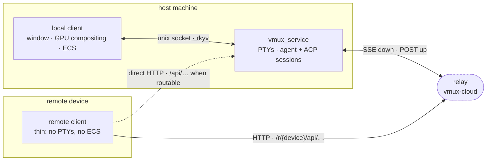
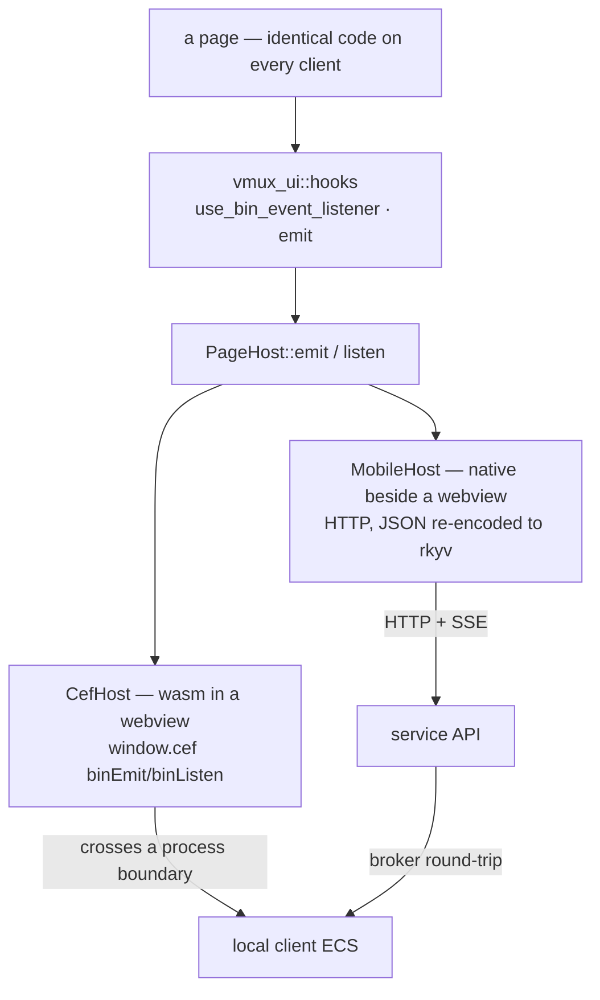

# Topology: one service, many clients

Vmux is not a desktop app that later grew a phone companion. It is **one service** that owns the
work, and **clients** that render it. Which operating system a client runs on, and whether it shares
a machine with the service, changes the transport and nothing else.

Naming the roles rather than the devices is deliberate. Every diagram here holds whether the client
is a laptop, a phone, a tablet, or a watch.

## Three roles

- **Service** — `vmux_service`. One per host machine. Owns the PTYs, the agent sessions, the ACP
  sessions. It outlives every client, so closing a window does not kill a running agent.
- **Client** — anything that renders the workspace and sends intent back. A **local** client shares
  the machine with the service; a **remote** client does not.
- **Relay** — a rendezvous point, and optional. It exists only so a remote client can reach a
  service that is not routable from where it is standing. Its internals live in the `vmux-cloud`
  repository; what matters here is the shape of the two endpoints each side uses.

Neither end of the relay listens for the other. The service dials out and holds a stream open; the
remote client calls in. So a client reaches a host behind NAT without either opening a port. The
dotted path is the same API without the rendezvous — loopback for a simulator, or a LAN address —
and is the exception, because pairing points a client at `{relay}/r/{device_id}` by default.

The relay is **not** a generic proxy. It carries a typed `DesktopCommandKind`, so every route a
remote client can reach exists as an explicit variant on both sides. Add an endpoint to the service
and it is reachable directly but invisible through the relay until a matching variant lands with it.

Nothing is dialled until Remote is switched on. The service checks that before connecting and
rechecks it mid-stream, so a host that never enables Remote costs no traffic.

## Local and remote are the same client, differently plumbed

This is where the layers collapse. A page never names a backend. It emits typed payloads under an
event id and subscribes to ids, and a `PageHost` decides what that physically means.

The asymmetry is not where you would guess. On a local client the page is wasm inside an embedded
browser and every message crosses a real process boundary. On a remote client the page is native
Rust in the same process as its webview and crosses nothing at all — the distance is to the *host*,
not to the renderer.

Two consequences fall out of that, and both are current limits rather than design:

- **`emit` is one-way on remote clients.** A page can read; it cannot push a typed payload back the
  way it does locally. Ids with no route are refused rather than silently accepted, so a half-served
  page reports as much instead of rendering empty.
- **Subscriptions degrade to polling.** The local host pushes on change. HTTP cannot, so
  `MobileHost` re-reads on an interval and only re-emits when the value actually moved.

The **broker round-trip** in the diagram is the other thing worth knowing. The service answers HTTP,
but the workspace shape — installed agents, the active roster — lives in the local client's ECS, in
a different process. So `/api/agents` and `/api/team` are not reads of service state; they are
commands brokered into the local client and relayed back as-is. A remote client can drive sessions
with no window open, but those two routes answer `502` until a local client is there to ask.

## What each link carries

| Link | Transport | Payload |
| --- | --- | --- |
| page ↔ local client | `window.cef` binEmit/binListen | rkyv; page→host adds a `vmux-bin-ipc-v1` envelope, host→page bare |
| local client ↔ service | unix socket | `u32`-length-prefixed rkyv frames, 64 MiB cap |
| remote client ↔ service | HTTP/1.1 + SSE | JSON, re-encoded to rkyv on-device before the page sees it |
| service ↔ relay | HTTPS: held-open SSE down, POST up | JSON `DesktopCommandKind` / `DesktopResponse` |

The gap between the last two rows and the first two is the open question. rkyv everywhere would
remove a re-encode, but a remote client ships on its own schedule and rkyv's archived layout is not
forward-compatible, whereas JSON tolerates a field the other side has not heard of. The relay
already leans on that: an unrecognised command is skipped, not fatal, so one unknown variant does
not tear down every other route.

## HTTP/1.1 today — no h2, no HTTP/3, no QUIC

Worth stating plainly, because "SSE" invites the question.

Both streaming links are **real** `text/event-stream` over **HTTP/1.1**, not long-polling: the
session stream (`GET /api/sessions/{sid}/events`, 15-second keep-alive) and the relay command
stream, each held open until it breaks, with a flat 2-second reconnect.

Nothing negotiates h2. The service runs axum on hyper with HTTP/2 off, cleartext, bound to loopback
— TLS is the relay's job, not the host's. Clients use `reqwest` with `rustls` but without the
`http2` feature, so ALPN offers `http/1.1` and only that. No `quinn`, `h3`, or `s2n-quic` is
compiled anywhere in the workspace.

That is a fine floor for what runs over it: one long stream and small JSON requests, where h2's
multiplexing buys little. It stops being fine when a client is on a mobile network and wants many
concurrent session streams, or wants one stream to survive walking between networks — head-of-line
blocking and connection migration are exactly what QUIC fixes.

When that lands it is the relay link that changes, not the shape above. The client side is a
`reqwest` feature away, though HTTP/3 there is still gated behind `--cfg reqwest_unstable`, and the
relay would have to terminate it. The direct link stays on h1: it is loopback or LAN, where none of
this is worth paying for.

## Which platforms exist today

The shape above is OS-agnostic; the builds are not yet. Being honest about the difference:

| Platform | Role | Status |
| --- | --- | --- |
| macOS | host — service + local client | Primary. Packaged, launchd-managed, shipped. |
| Linux | host | Builds and tests in CI. Not packaged. |
| Windows | host | Not started — no platform code exists. |
| iOS | remote client | Real and buildable via `dx`; no CI job. |
| Android | remote client | Configured in `Dioxus.toml` and the `Makefile`; no platform code yet. |
| iPadOS · watchOS · others | remote client | Nothing platform-specific stands in the way. |

A remote client is strictly a client: the service's server half is compiled out for iOS and wasm
entirely. Adding one is a rendering and input problem, not a protocol problem — the API, the pairing
flow, and `PageHost` are already the whole contract.

Discovery is manual by design: there is no mDNS or zeroconf. A client is paired by scanning a QR
code or pasting the URL it encodes, which carries the endpoint and a bearer token.

## Shared crates

What every client compiles, and what only one does.

- **Everywhere** — `vmux_wire` (plain serde/rkyv models, no Bevy), `vmux_ui` (components, hooks,
  transport), `vmux_chat`, `vmux_start`, and the pages lifted onto the transport so far:
  `vmux_history`, `vmux_service`, `vmux_team`, `vmux_space`.
- **Local client only** — anything that pulls Bevy: the plugins, the compositor, `vmux_browser`.
- **Not shared, by choice** — `vmux_editor`, `vmux_terminal`, `vmux_layout`. They are built on DOM
  measurement or on tiling, which a small screen has no use for.

The recurring trap when adding to the first list: crates gate their desktop half on
`not(target_arch = "wasm32")`, which is **true on iOS**. The gate has to read
`not(any(target_arch = "wasm32", target_os = "ios"))`, and because Cargo resolves dependencies
before any `cfg` in `src` applies, the split has to exist in `Cargo.toml` too.
