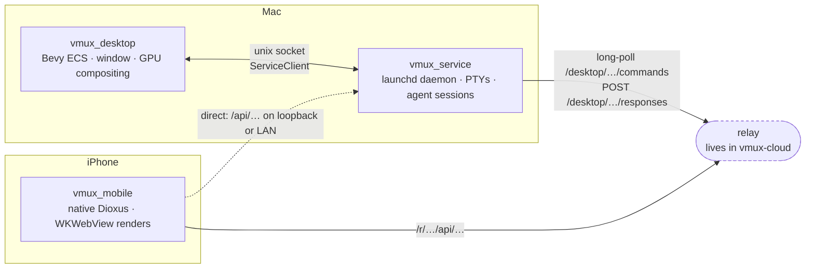
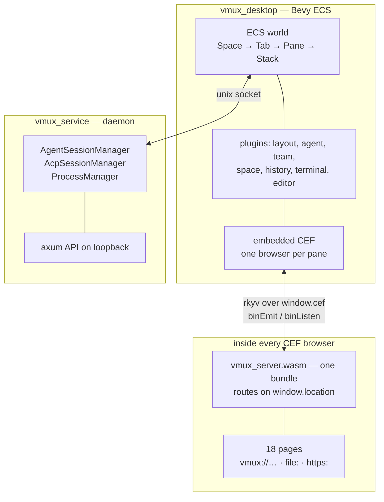
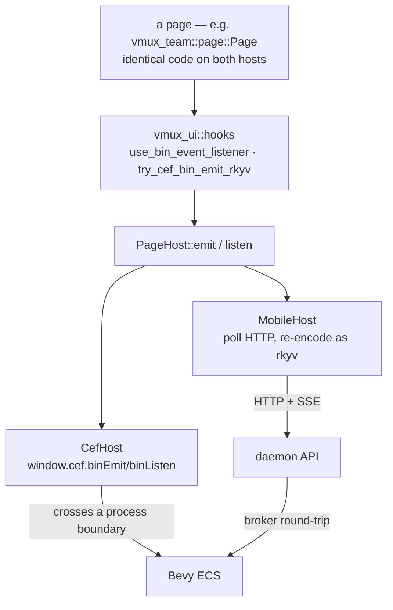

# Topology: desktop, phone, and what sits between them

Where each process runs, what talks to what, and which of those links carry the same payloads.

The relay is drawn as a boundary only. Its internals live in the `vmux-cloud` repository; what
matters here is the shape of the two endpoints each side uses.

## The three deployment units

Neither end listens for the other. The desktop polls out and the phone calls in, so a phone reaches
a Mac behind NAT without either opening a port. The dotted path is the direct one — loopback from
the Simulator, or a LAN address — and needs no relay at all.

The relay is **not** a generic proxy. It carries a typed `DesktopCommandKind`, so every endpoint the
phone can reach exists as an explicit variant on both sides.

## Inside the Mac

Two processes, deliberately. The daemon outlives the window, so closing the app does not kill a
running agent or a PTY.

One wasm bundle serves every page; there is no per-page build. `vmux_server::App` reads
`window.location` and picks from a manifest table, so `vmux://team` and `file:` land in the same
binary. Each pane being its own browser means that bundle is parsed per pane, not once.

## One page, two hosts

The point of the shared-page work: a page never names a backend. It emits typed payloads under an
event id and subscribes to ids, and `PageHost` decides what that physically means.

The broker hop is not incidental. The daemon answers HTTP but the ECS holds the state, and they are
separate processes — so anything ECS-derived costs a request into Bevy and back, which is why
`/api/agents` and `/api/team` are broker commands rather than reads of local state.

## What each link carries

| Link | Transport | Payload |
| --- | --- | --- |
| page ↔ Bevy (desktop) | `window.cef` binEmit/binListen | rkyv; page→host adds a `vmux-bin-ipc-v1` envelope |
| Bevy ↔ daemon | unix socket | rkyv-framed `ClientMessage` / `ServiceMessage` |
| phone ↔ desktop | HTTP + SSE | JSON, re-encoded to rkyv by `MobileHost` before the page sees it |
| desktop ↔ relay | HTTPS long-poll | typed `DesktopCommandKind` / `DesktopResponse` |

The phone never chooses between the relay and a direct connection. It appends paths to whatever
`base_url` pairing gave it, and pairing sets that to `{relay}/r/{device_id}` when a relay is
configured — which it is by default. Direct is the exception now: loopback for the Simulator, or a
LAN address.

That makes `DesktopCommandKind` the real API surface for a phone off the network. Every route the
relay carries exists as a variant on both sides, so an endpoint added to the daemon is reachable
directly but invisible through the relay until a matching variant lands with it.

The asymmetry in the last two rows is the open question: rkyv everywhere would remove a re-encode,
but the phone ships separately from the desktop and rkyv's archived layout is not
forward-compatible, whereas JSON tolerates a field the other side has not heard of.

## Shared crates

What both hosts compile, and what only one does.

- **Both** — `vmux_wire` (plain serde/rkyv models, no Bevy), `vmux_ui` (components, hooks,
  transport), `vmux_chat`, `vmux_start`, and the pages lifted onto the transport so far:
  `vmux_history`, `vmux_service`, `vmux_team`, `vmux_space`.
- **Desktop only** — anything that pulls Bevy: the plugins, the compositor, `vmux_browser`.
- **Not shared by choice** — `vmux_editor`, `vmux_terminal` and `vmux_layout`, which are built on
  DOM measurement or on tiling that a phone has no use for.

The recurring trap when adding to the first list: crates gate their desktop half on
`not(target_arch = "wasm32")`, which is **true on iOS**. The gate has to read
`not(any(target_arch = "wasm32", target_os = "ios"))`, and because Cargo resolves dependencies
before any `cfg` in `src` applies, the split has to exist in `Cargo.toml` too.
