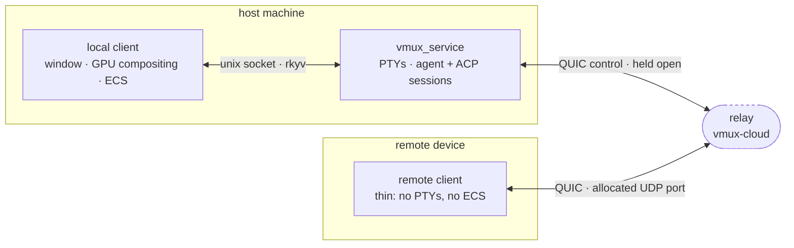
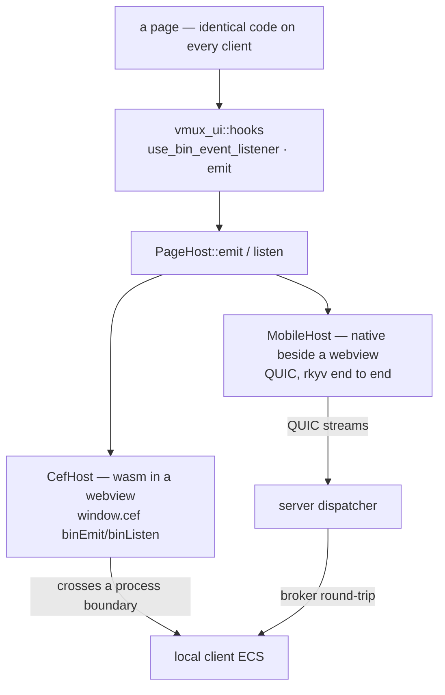

# Topology: one server, many clients

Vmux is not a desktop app that later grew a phone companion. It is **one server** that owns the
work, and **clients** that render it. Which operating system a client runs on, and whether it shares
a machine with the server, changes the transport and nothing else.

Naming the roles rather than the devices is deliberate. Every diagram here holds whether the client
is a laptop, a phone, a tablet, or a watch.

*Server*, not *service*. "Service" is a launchd and systemd word meaning a daemon on this machine,
and that locality is the assumption being broken: the same server runs as a background process on
someone's Mac or as a container in a datacentre. The crate is still named `vmux_service`; renaming
it is pending.

## Three roles

- **Server** — `vmux_service`. One per host machine. Owns the PTYs, the agent sessions, the ACP
  sessions. It outlives every client, so closing a window does not kill a running agent.
- **Client** — anything that renders the workspace and sends intent back. A **local** client shares
  the machine with the server; a **remote** client does not.
- **Relay** — a rendezvous point, and not optional. A host behind NAT cannot be dialled, so every
  remote pairing goes through one. Its internals live in the `vmux-cloud` repository; what matters
  here is that it forwards packets it cannot read.

Neither end of the relay listens for the other. The server dials out and holds one QUIC connection
open; the relay allocates it a UDP port and tells it which. The pairing link names that port, so a
remote client reaches a host behind NAT without either side opening one.

**The relay cannot read any of it.** A remote client's packets belong to a second QUIC session that
terminates on the *host*, and cross the relay as DATAGRAM frames on the control connection. TLS 1.3
is end to end; the relay holds no key for it and links no crate that could decode a payload even
with one. What it does see is metadata — which device talks when, and how much.

Forwarding only works in that direction. The desktop's NAT mapping was opened toward the control
port, and a port-restricted NAT — most consumer routers — drops anything arriving from a different
source port, so replies cannot be sent straight from the allocated port.

Nothing is dialled until Remote is switched on. The server checks that before connecting and a
single watcher closes every live connection the moment it goes off.

## Local and remote are the same client, differently plumbed

This is where the layers collapse. A page never names a backend. It emits typed payloads under an
event id and subscribes to ids, and a `PageHost` decides what that physically means.

The asymmetry is not where you would guess. On a local client the page is wasm inside an embedded
browser and every message crosses a real process boundary. On a remote client the page is native
Rust in the same process as its webview and crosses nothing at all — the distance is to the *host*,
not to the renderer.

Two consequences fall out of that, and both are current limits rather than design:

- **`emit` is one-way on remote clients.** A page can read; it cannot push a typed payload back the
  way it does locally. Ids with no route are refused rather than silently accepted, so a half-served
  page reports as much instead of rendering empty.
- **Subscriptions are still polled.** Nothing about QUIC requires it — a session transcript already
  arrives on a long-lived stream — but the team roster is the only other subscribed id and has no
  server-initiated route yet, so `MobileHost` re-reads it on an interval.

The **broker round-trip** in the diagram is the other thing worth knowing. The server owns the
sessions, but the workspace shape — installed agents, the active roster — lives in the local
client's ECS, in a different process. So `ListAgents` and `ListTeam` are not reads of server
state; they are commands brokered into the local client and relayed back as-is. A remote client can
drive sessions with no window open, but those two answer `NoDesktop` until one is there to ask —
named that way precisely because it resolves on its own, unlike `NotFound`.

## What each link carries

| Link | Transport | Payload |
| --- | --- | --- |
| page ↔ local client | `window.cef` binEmit/binListen | rkyv; page→host adds a `vmux-bin-ipc-v1` envelope, host→page bare |
| local client ↔ server | unix socket | `u32`-length-prefixed rkyv frames, 64 MiB cap |
| remote client ↔ server | QUIC, one bidirectional stream per request | rkyv `SharedMessage` / `SharedResponse`, after a JSON hello |
| server ↔ relay | QUIC control connection | JSON `RelayHello` / `RelayAllocation`, then opaque DATAGRAM frames |

The last row is the one worth reading twice. Only the hello is the relay's business; everything
after it is a remote client's own QUIC session in transit.

The hellos are JSON and the frames after them are rkyv, and that split is deliberate. rkyv encodes
enum variants **positionally**, so a peer one release behind does not fail to decode a reordered
variant — it decodes the wrong one. That is fine on the unix socket, where both sides ship together
and the daemon respawns on an identity mismatch. It is not fine for a phone that updates on its own
schedule, so the frame that decides whether to keep talking is JSON, which tolerates a field the
other side has not heard of.

`ProtocolVersion` guards the rest, and `shared_wire_format.rs` freezes the encoding of every variant
so that reordering one turns a test red rather than a phone silently wrong.

## QUIC, end to end

The remote path was HTTP/1.1 with SSE until it wasn't; both are gone. What replaced them:

- **One transport.** A remote client speaks QUIC and nothing else. There is no HTTP fallback to
  silently answer for a failed connection, which is what made the old failures hard to see.
- **Streams instead of routes.** A request is one bidirectional stream carrying one `SharedMessage`
  and one `SharedResponse`. A subscription is a long-lived stream the client opens and the host
  writes down — client-opened because the relay only forwards what the dialling side started.
- **Certificate pinning.** No CA signs for a Mac, so the host mints its own certificate and the
  pairing QR carries its SHA-256. A remote client trusts exactly that and nothing else — narrower
  than the public root set. A pairing link without a fingerprint is refused rather than downgraded.
- **Head-of-line blocking and migration** come free, which is the reason a phone walking between
  wifi and cellular no longer drops its transcript.

The relay verifies against the public roots by name instead, because its certificate is renewed on
its own schedule and a pinned fingerprint would start rejecting it without warning.

## Which platforms exist today

The shape above is OS-agnostic; the builds are not yet. Being honest about the difference:

| Platform | Role | Status |
| --- | --- | --- |
| macOS | host — server + local client | Primary. Packaged, launchd-managed, shipped. |
| Linux | host | Builds and tests in CI. Not packaged. |
| Windows | host | Not started — no platform code exists. |
| iOS | remote client | Real and buildable via `dx`; no CI job. |
| Android | remote client | Configured in `Dioxus.toml` and the `Makefile`; no platform code yet. |
| iPadOS · watchOS · others | remote client | Nothing platform-specific stands in the way. |

A remote client is strictly a client: the server half of `vmux_service` is compiled out for iOS
and wasm entirely. Adding one is a rendering and input problem, not a protocol problem — the API, the pairing
flow, and `PageHost` are already the whole contract.

Discovery is manual by design: there is no mDNS or zeroconf. A client is paired by scanning a QR
code or pasting the URL it encodes, which carries the endpoint and a bearer token.

## Shared crates

What every client compiles, and what only one does.

- **Everywhere** — `vmux_wire` (plain serde/rkyv models, no Bevy), `vmux_ui` (components, hooks,
  transport), `vmux_chat`, `vmux_start`, and the pages lifted onto the transport so far:
  `vmux_history`, `vmux_service`, `vmux_team`, `vmux_space`.
- **Local client only** — anything that pulls Bevy: the plugins, the compositor, `vmux_browser`.
- **Not shared, by choice** — `vmux_editor`, `vmux_terminal`, `vmux_layout`. They are built on DOM
  measurement or on tiling, which a small screen has no use for.

The recurring trap when adding to the first list used to be gating a desktop half on
`not(target_arch = "wasm32")`, which is **true on iOS**. A build script now emits three aliases so
the gate names what it means instead:

- `web` — wasm32, the browser bundle.
- `ui` — wasm32 *or* iOS: the pages, with no Bevy and no process access.
- `host` — everything else: the desktop app and the daemon.

iOS is native code but is not `host`: it runs the pages, so it is `ui`.

Write `#[cfg(host)]`, not a negation of two target predicates. Cargo's own
`[target.'cfg(...)'.dependencies]` still has to spell the targets out, because dependency
resolution happens before any build script runs — so the split exists in `Cargo.toml` too.
