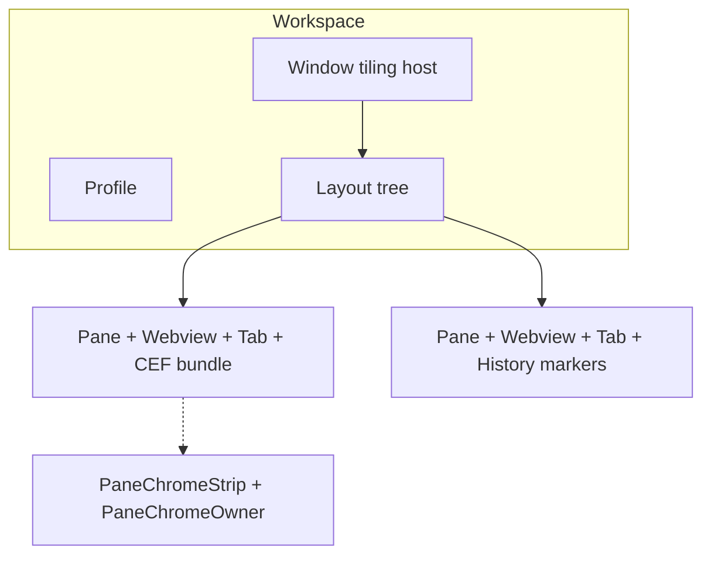

# Bevy component inventory (vmux world)

Living reference for ECS markers and data components that can appear on entities in the vmux desktop stack. Extend this file when you add new `Component` types.

## Scope

- **In scope:** Rust types in this repo that derive `Component` and are used on entities (including `pub(crate)` types from patched CEF crates).
- **Out of scope:** `Resource`s (for example `LastVisitedUrl`, `NavigationHistory`, `PendingNavigationLoads`), Bevy **assets** (for example `WebviewMaterial`), and components defined only under `patches/bevy_cef-0.5.2/examples/`.
- **Third-party / engine:** On the input root entity, leafwing provides `ActionState<KeyAction>` and `InputMap<KeyAction>`. Typical rendering and scene components include `Transform`, `GlobalTransform`, `Mesh3d`, `MeshMaterial3d`, `Camera3d`, `Visibility`, `InheritedVisibility`, `ViewVisibility`, `Name`, `DirectionalLight`, and related Bevy types — not enumerated here.

## Entity roles (high level)



- **Main pane leaf:** `Pane` + `Webview` + `Tab`, CEF components (`WebviewSource`, `WebviewSize`, `ZoomLevel`, `AudioMuted`, `PreloadScripts`, optional `CefKeyboardTarget`), mesh/material, often `Active`, `PaneLastUrl`.
- **History pane leaf:** same base plus `History` (and optionally `HistoryPaneStandby`, `HistoryPaneNeedsUrl`, `HistoryPaneOpenedAt`).
- **Chrome strip:** separate entity with `PaneChromeStrip` + `PaneChromeOwner(pane)` (+ loading bar uses `PaneChromeLoadingBar`).

## Inventory by crate

### vmux_core

| Component         | Location                    |
| ----------------- | --------------------------- |
| `VmuxWorldCamera` | `crates/vmux_core/src/world_camera.rs` |
| `AppInputRoot`    | `crates/vmux_core/src/input_root.rs`   |
| `VmuxPrefixState` | `crates/vmux_core/src/input_root.rs`   |
| `Active`          | `crates/vmux_core/src/active.rs`       |

### vmux_layout

| Component | Location |
| --------- | -------- |
| `Pane`, `PaneChromeStrip`, `PaneChromeOwner`, `PaneChromeNeedsUrl` | `crates/vmux_layout/src/lib.rs` |
| `Webview`, `History`, `HistoryPaneStandby`, `HistoryPaneNeedsUrl`, `HistoryPaneOpenedAt` | same |
| `Workspace`, `Window` (tiling host; not the OS `bevy::window::Window`), `Profile`, `Tab` | same |
| `PaneLastUrl` | same |
| `Layout` | same |

### vmux_layout::loading_bar

| Component | Location |
| --------- | -------- |
| `PaneChromeLoadingBar` | `crates/vmux_layout/src/loading_bar.rs` |

### vmux_command (command palette; private structs)

All in `crates/vmux_command/src/lib.rs` (palette UI spawn):

`CommandPaletteUiCamera`, `CommandPaletteRoot`, `CommandPaletteBackdrop`, `CommandPaletteQueryText`, `CommandPaletteQueryPlaceholder`, `CommandPaletteQuerySelectionHighlight`, `CommandPaletteCaret`, `CommandPaletteListScroll`, `CommandPaletteRow`, `PaletteRowIcon`, `PaletteRowFavicon`, `PaletteRowPrimary`, `PaletteRowSecondary`, `PaletteRowEnterHint`, `PaletteNavEnterHint`.

### vmux_webview

| Component | Location |
| --------- | -------- |
| `WebviewLoadWatchdog` (`pub(crate)`) | `crates/vmux_webview/src/load_watchdog.rs` |

### vmux_server

| Component | Location |
| --------- | -------- |
| `DioxusUiWarmupWebview` | `crates/vmux_server/src/dioxus_warmup.rs` |

### Patched bevy_cef (`patches/bevy_cef-0.5.2`)

From `patches/bevy_cef-0.5.2/src/common/components.rs`:

- **Public / webview:** `CefKeyboardTarget`, `WebviewSource` (enum `Component` with `#[require(WebviewSize, ZoomLevel, AudioMuted, PreloadScripts)]`), `WebviewSize`, `HostWindow`, `ZoomLevel`, `AudioMuted`, `PreloadScripts`
- **Internal:** `ResolvedWebviewUri` (`pub(crate)`), `WebviewSurface` (`pub(crate)`)

Localhost / assets:

- `InlineHtmlId` (`pub(crate)`) — `patches/bevy_cef-0.5.2/src/common/localhost/responser.rs`
- `CefResponseHandle` — `patches/bevy_cef-0.5.2/src/common/localhost/asset_loader.rs`

### Patched bevy_cef_core (`patches/bevy_cef_core-0.5.2`)

| Component | Location |
| --------- | -------- |
| `Responser` | `patches/bevy_cef_core-0.5.2/src/browser_process/localhost.rs` |

### vmux_history_poc binary only

Used only when running `vmux_history_poc` (`crates/vmux_history_poc/src/main.rs`), **not** the main `vmux_desktop` graph:

- `HistoryPocUiReady`, `HistoryPocHistorySent`
- A **local** `History { url: String }` — not the same as `vmux_layout::History` (zero-sized marker on the tiled history pane).

## Common bundles (illustrative)

- **Main CEF pane:** `Pane`, `Webview`, `Tab`, `WebviewSource`, `WebviewSize`, `ZoomLevel`, `AudioMuted`, `PreloadScripts`, `Mesh3d`, `MeshMaterial3d<WebviewExtendStandardMaterial>`, `PaneLastUrl`, plus Bevy `Transform` / `Visibility` as needed. `CefKeyboardTarget` marks which webview receives keyboard focus when present.
- **Dioxus warmup webview:** `DioxusUiWarmupWebview { surface }`, `Name`, `Visibility::Hidden`, `WebviewSize`, `ZoomLevel`, `PreloadScripts`, `WebviewSource` — see `dioxus_ui_warmup_bundle` in `vmux_server`.

`WebviewMaterial` is the **extension** inside `WebviewExtendStandardMaterial`; it is an asset type, not a `Component` by itself.

## Maintenance

When adding components, refresh this list:

```bash
rg 'derive\(.*Component' crates patches/bevy_cef-0.5.2/src patches/bevy_cef_core-0.5.2/src
```

Exclude `patches/bevy_cef-0.5.2/examples/` unless you intentionally document example-only types.
