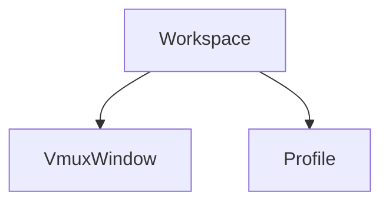

# Layout naming reference (vmux + tmux + Arc + i3)

Reference for naming and hierarchy: **vmux (current)** vs **vmux (new)** target model, then external products for comparison. Not an implementation checklist by itself.

## vmux (current)

Shipped layout/session model (see [`vmux_layout`](../../crates/vmux_layout/src/lib.rs)). **`Root`** remains a **type alias** for [`Workspace`] for older call sites.

**Runtime (Bevy ECS)**

| Name | Purpose |
|------|---------|
| **`Workspace`** | Top-level entity; **children**: one [`VmuxWindow`] (carries [`Layout`]) + one [`Profile`]. |
| **`VmuxWindow`** | Tiling host (named to avoid clashing with Bevy’s [`bevy::window::Window`]); owns **`Layout`**. |
| **`Profile`** | Marker for browser-style profile / identity scope (ex-session). |
| **`Layout`** | **`root`**: [`LayoutNode`](../../crates/vmux_layout/src/lib.rs) (binary split tree); **`revision`**; **`zoom_pane`**. |
| **`LayoutNode`** | **`Split`**: `axis`, **`ratio`**, left/right; **`Leaf(Entity)`**: **pane** entity. |
| **`Pane`** | Tile leaf (chrome + layout); pairs with **`Tab`** on the same entity (v1). |
| **`Tab`** | Navigable surface marker (v1 **colocated** on the pane leaf with **`Webview`**). |
| **`Webview`** | Primary **CEF** surface. |
| **`History`** | History UI pane variant (`Pane` + `Webview` + `History`). |
| **`Active`** | Focused pane ([`vmux_core`](../../crates/vmux_core)). |
| **`PaneLastUrl`**, **`WebviewSource`** | Navigation URL / load source; feed session rebuild. |

**Persistence** — see [`vmux_session`](../../crates/vmux_session/src/lib.rs), [`SessionLayoutSnapshot`](../../crates/vmux_layout/src/lib.rs):

| Name | Purpose |
|------|---------|
| **`SessionLayoutSnapshot`** | Resource: **`layout_ron`** serializes a **`SavedLayoutNode`** tree (URLs + flags like `history_pane` per leaf). |
| **`LastVisitedUrl`** | Legacy/global last URL resource (migration paths). |

## vmux (new)

**Implemented baseline:** [`Workspace`] → [`VmuxWindow`] + [`Profile`]; [`Tab`] marker on pane leaves (same entity as **`Pane` + `Webview`** for now). **Future:** child **`Tab`** entities under **`Pane`** for multi-tab per tile.

```text
Workspace
├── VmuxWindow   (Layout: Pane leaves)
└── Profile
```

Per-pane leaf (v1): **`Pane` + `Tab` + `Webview`** (+ **`History`** when applicable) on one entity.



## tmux: built-in pane layouts (`select-layout`)

These are the **preset names** tmux uses for **arranging panes within a window** (not session/window/pane hierarchy). See `tmux(1)` → **select-layout**.

| Name | Purpose |
|------|---------|
| `even-horizontal` | Distribute panes **evenly in a row** (side-by-side columns). |
| `even-vertical` | Distribute panes **evenly in a column** (stacked rows). |
| `main-horizontal` | **Larger main pane on top**; other panes share the band below. |
| `main-vertical` | **Larger main pane on the left**; other panes share the column to the right. |
| `tiled` | **Grid-like** tiling of all panes (approximate equal areas). |

**Related (not layout presets):**

| Concept | Purpose |
|---------|---------|
| **Session** | Top-level container; holds windows; clients attach/detach. |
| **Window** | One full-screen **tab** in a session; holds one pane tree (splits). |
| **Pane** | One terminal surface inside a window; leaf of the split tree. |
| **Zoom** (`resize-pane -Z`) | Maximizes one pane within its window (others hidden), not a named `select-layout` preset. |

## Arc browser: how layout is organized (product names)

Arc’s model is **browser-centric**, not terminal-centric. Names below come from **Arc Help Center** and public docs; exact UX changes with Arc versions.

| Name | Purpose |
|------|---------|
| **Space** | Distinct browsing **context**: own pinned/unpinned tabs, theme, icon—like separate “areas” for work vs personal. |
| **Profile** | **Isolated browser profile** (cookies, logins, history, extensions, etc.); can apply across one or more Spaces. |
| **Sidebar** | Left rail: **Favorites**, Space sections, tabs, folders—primary navigation surface. |
| **Favorites** | Up to a small set of **global shortcuts** (icon row); behavior differs from normal tabs (e.g. Peek for external links per Arc docs). |
| **Folder** | **Groups tabs** inside a Space (organizational, not a split layout). |
| **Split View** | **Two (or more) tabs visible at once** in one window: Arc documents **Horizontal Split View** (side-by-side) and **Vertical Split View** (top-and-bottom). Creating a split often appears as **its own tab** in the sidebar you can return to. |
| **Pinned / Unpinned** | Tab **persistence** within a Space (pinned vs ephemeral “today” style lists). |
| **Little Arc** | **Small auxiliary window** for quick lookups / links from other apps; constrained compared to main window (per Arc Help Center). |

**Rough analogy (loose, not 1:1):**

| Arc | Rough tmux analogue |
|-----|---------------------|
| Space | Session or “project” workspace |
| Tab (in sidebar) | Window (one “screen” of content) |
| Split View | One window whose **layout** is split between tabs/panes |
| Profile | Separate OS-like “user” / storage partition—not tmux’s default model |

## i3: tiling model (`i3` / sway-compatible concepts)

i3 organizes the screen as a **tree of containers**. Terminology follows **i3 User’s Guide** / `i3(1)`. This is **WM-level** (X11/Wayland windows), not in-terminal like tmux.

**Hierarchy:**

| Name | Purpose |
|------|---------|
| **Workspace** | Virtual desktop; holds one **root container** tree. Switching workspaces changes which tree is visible. Often named `1`…`10` or custom labels. |
| **Container** | Inner node of the layout tree: holds **children** (more containers and/or windows). Split direction is **horizontal** or **vertical** (i3: next split uses current **default_orientation** / commands like `split h` / `split v`). |
| **Window** | **Leaf** of the tree: an actual X11/Wayland **client window** (terminal, browser, etc.). |

**Layout modes** (per container, especially after `layout` commands):

| Name | Purpose |
|------|---------|
| **default** | Normal **tiling**: children arranged by split direction (columns vs rows). Often described as splith / splitv behavior when creating new splits. |
| **stacked** | Children **stacked**; only one visible at full size in that area; **focus** switches which is shown (like a deck of cards). |
| **tabbed** | Like stacked but with a **tab bar** to pick the focused child. |

**Other important names:**

| Name | Purpose |
|------|---------|
| **Floating** | A window **not** tiled in the tree; positioned above tiles (modal dialogs, picture-in-picture style). |
| **Fullscreen** | One window takes the whole workspace (or monitor, depending on config). |
| **Scratchpad** | Special hidden workspace; windows moved **to scratchpad** are not on normal workspaces until shown again (`scratchpad show`). |

**Rough analogy (loose, not 1:1):**

| i3 | Rough tmux analogue |
|----|---------------------|
| Workspace | Session window / “desktop” for one layout (tmux has **sessions** + **windows**; i3 workspace is closer to **one full-screen tmux window** or OS virtual desktop). |
| Split container | tmux **split** (non-leaf node in layout tree). |
| Tiled window | tmux **pane** (leaf with a shell/app). |
| Tabbed / stacked container | tmux has **one** visible pane per window region unless zoom; i3 **tabbed** is multiple leaves in one tile with tabs. |

## Cross-product alignment notes (for later design)

- **vmux:** **`Workspace`** → **`VmuxWindow`** (**`Layout`**) + **`Profile`**; **`Tab`** marker on pane leaves (v1 colocated with **`Webview`**).
- tmux **window** ≈ one **layout tree** + one visible tile set → aligns with **`VmuxWindow`**.
- tmux **`select-layout` names** describe **preset arrangements** of panes; vmux uses arbitrary **binary splits** (`LayoutAxis` + `ratio`)—preset names could map to generators or saved layouts later.
- Arc **Split View** is a **product feature name** for multi-pane browsing; future **child `Tab` entities** would match per-tile tab stacks more closely.
- i3 **workspace** is **not** the same as tmux **session**; **`Workspace`** / **`Profile`** map loosely to i3 / Arc naming, not tmux session detach.
- i3 **tabbed/stacked** layouts are **multi-leaf in one region**; multi-tab per pane is **not** implemented yet beyond the **`Tab`** component marker.
